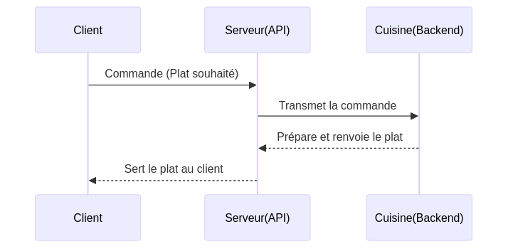
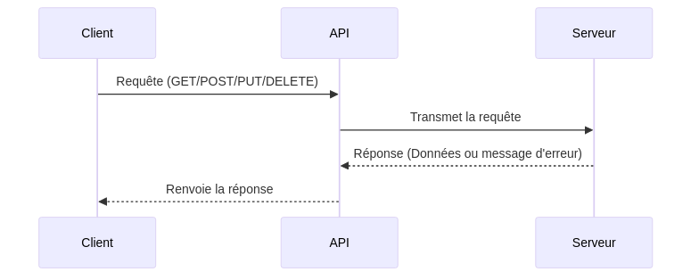
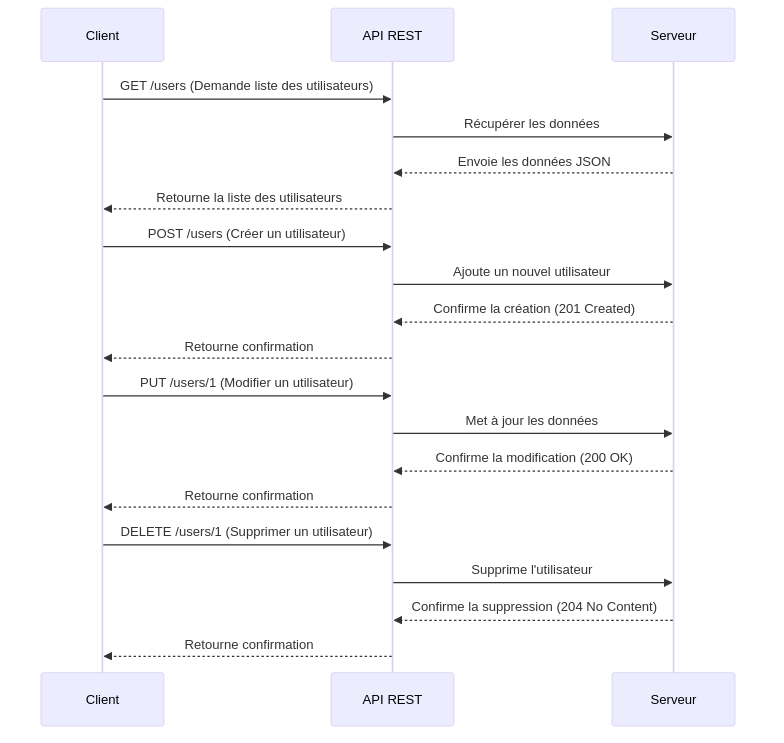
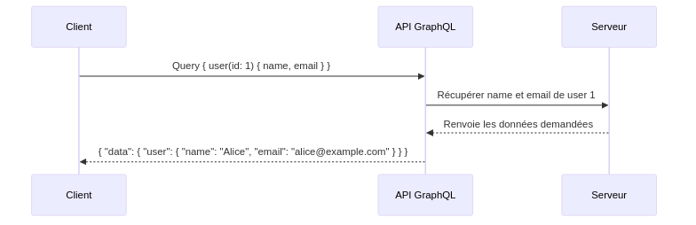

:titre: API
:module: Frontend Svelte
:duree: 60
:description: Ce module aborde les concepts fondamentaux des API, les types d'API (REST, GraphQL, etc.) et la manipulation des requêtes HTTP. On y voit également comment utiliser JSON Server pour créer une API REST locale.
include::../../../../adoc/libs/header-module.adoc[]

ifeval::["{visible-on-html}" !=  "yes"]
:docinfo: shared
:docinfodir: ../../../adoc/libs
endif::[]

== Objectifs pédagogiques

// tag::objectifs[]
* Comprendre le concept d'API
* Découvrir les types d'API (REST, GraphQL, etc.)
* Savoir manipuler des requêtes HTTP
// end::objectifs[]

// tag::deroulement[]

== Introduction

API = Application Programming Interface

* permet à des logiciels de communiquer entre eux
* agit comme intermédiaire entre les différentes parties d'un programme
* facilite l'échange de données

=== Analogie



=== Schéma



== Intérêt des API

* **Accéder à des services tiers** sans les coder soi-même
** météo, géolocalisation, traduction, etc.

* **Échanger des données** entre applications
** synchronisation de données, intégration de services tiers

* Créer des **applications modulaires**
** découpler les parties d'une application

* Accéder aux données **en temps réel**
** actualisation des données sans rechargement de page

== Types d'API

* **API REST**
** basée sur HTTP

* **API GraphQL**
** requêtes personnalisées

* **API SOAP**
** basée sur XML

* **API RPC**
** appels de procédures distantes

=== API REST



[NOTE.speaker]
====
**Explication :**

* `GET` : Récupère des données (ex : liste des utilisateurs).
* `POST` : Crée une nouvelle ressource (ex : ajouter un utilisateur).
* `PUT` : Met à jour une ressource existante (ex : modifier un profil).
* `DELETE` : Supprime une ressource (ex : supprimer un compte).
====

=== API GraphQL



[NOTE.speaker]
====
Explication du schéma

* ✅ Une seule requête : Le client envoie une query avec uniquement les champs dont il a besoin.
* ✅ Réponse optimisée : L’API GraphQL ne retourne que les données demandées, évitant les retours inutiles.
* ✅ Contrairement à REST où plusieurs endpoints sont nécessaires (GET /users, GET /users/1, etc.), GraphQL utilise une seule URL (/graphql).
====

=== REST vs GraphQL

**REST (plusieurs appels pour récupérer différentes infos)**

* 1️⃣ GET /users/1 → Récupère toutes les infos d’un utilisateur, même si on n’a besoin que du nom et email.
* 2️⃣ GET /users/1/posts → Récupère les posts de l’utilisateur via un second appel.

**GraphQL (un seul appel suffit)**

```graphql
query {
  user(id: 1) {
    name
    email
    posts {
      title
    }
  }
}
```

== Exemples d'utilisation d'API

* ⛅ https://openweathermap.org/api[OpenWeatherMap]
* 💰 https://stripe.com/docs/api[Stripe]
* 👤 https://developers.google.com/identity/protocols/oauth2[OAuth Google]
* 🌐 https://cloud.google.com/translate/docs[Google Translate]

...Bref, à peu près tout est disponible en API !

== Les requêtes HTTP

[cols="1,1,1"]
|===
| Méthode | Description	| Exemple
a| **GET** | Récupérer des données | Récupérer la liste des utilisateurs
a| **POST** | Envoyer des données | Ajouter un nouvel utilisateur
a| **PUT** | Modifier une ressource | Mettre à jour les infos d’un utilisateur
a| **DELETE** | Supprimer une ressource	| Supprimer un utilisateur
|===

=== Les statuts HTTP

**Les API renvoient un code de statut HTTP pour indiquer le résultat d'une requête.**

[cols="1,1"]
|===
| Code |	Signification
a| **200** OK	| Succès de la requête
a| **201** Created |	Ressource créée avec succès
a| **400** Bad Request |	Mauvaise requête (paramètres invalides)
a| **401** Unauthorized |	Accès non autorisé (ex : token invalide)
|===

include::../../../../adoc/libs/slide-notitle.adoc[]

[cols="1,1"]
|===
| Code |	Signification
a| **403** Forbidden	 | Accès interdit
a| **404** Not Found |	Ressource introuvable
a| **500** Internal Server Error |	Erreur serveur
|===

=== Les formats de données

Les API échangent généralement des données en **JSON** ou **XML**.

* **JSON** (JavaScript Object Notation) : le plus utilisé

```json
{
  "id": 1,
  "name": "Alice",
  "email": "alice@example.com"
}
```

* **XML** (eXtensible Markup Language) : moins courant mais encore utilisé

```xml
<user>
  <id>1</id>
  <name>Alice</name>
  <email>alice@example.com</email>
</user>
```

=== Les endpoints d'une API

Un **endpoint** est une URL qui permet d’accéder à une ressource.

[cols="1,1"]
|===
| Endpoint |	Action
a| **GET** `/users` |	Liste des utilisateurs
a| **GET** `/users/1` |	Infos de l'utilisateur avec ID 1
a| **POST** `/users` |	Ajouter un utilisateur
a| **PUT** `/users/1` |	Modifier un utilisateur
a| **DELETE** `/users/1` |	Supprimer un utilisateur
|===

=== Les headers HTTP

**Les headers permettent d’envoyer des informations supplémentaires**

[cols="1,1,1"]
|===
| Header	| Description	| Exemple
a| **Content-Type**	| Type des données envoyées a|	`application/json`
a| **Authorization** |	Clé API ou token d’authentification a|	`Bearer XXXXXX`
a| **Accept** |	Format souhaité en réponse a|	`application/json`
|===

Il en existe bien d'autres, comme `User-Agent`, `Cookie`, etc.

// tag::demo[]

== Démonstration

Manipulation d'API

[NOTE.speaker]
====

**Outil** : [Thunder Client](https://marketplace.visualstudio.com/items?itemName=rangav.vscode-thunder-client) ou [Postman](https://www.postman.com/) ou [Insomnia](https://insomnia.rest/)

* On va d'abord utiliser l'API [JSONPlaceholder](https://jsonplaceholder.typicode.com/).

* Tester une requête GET pour récupérer des données.

* C'est bien mais on ne peut pas faire de POST, PUT ou DELETE sur cette API.

* Utilisons [JSON Server](https://www.npmjs.com/package/json-server) pour créer notre propre API REST.

* On crée un fichier `db.json` avec des données comme ci-dessous :

```json
{
  "users": [
    { "id": 1, "name": "Alice" },
    { "id": 2, "name": "Bob" }
  ]
}
```

* On lance JSON Server avec la commande `npx json-server --watch db.json`.

* On teste les requêtes GET, POST, PUT et DELETE sur notre API.

* ⚠️ JSON Server n'est pas un backend à utiliser en production, c'est juste pour tester des requêtes.

====

// end::demo[]

// tag::exercice[]

== Exercice

* Créer un fichier `db.json` avec des données de votre choix (ex : des articles de blog)
* Lancer JSON Server pour simuler une API REST
* Tester les requêtes GET, POST, PUT et DELETE sur votre API

// end::exercice[]

// end::deroulement[]

== Conclusion
// tag::conclusion[]
* Les API permettent de communiquer entre applications
* Les API REST sont basées sur HTTP
* On peut utiliser JSON Server pour créer une API REST locale
// end::conclusion[]