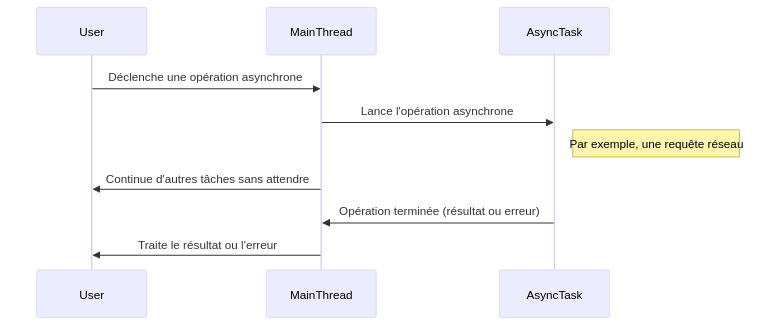

:titre: Asynchrone
:module: Frontend Svelte
:duree: 60
:description: Ce module aborde le concept d'asynchrone en JavaScript, les Promises, la syntaxe async/await et leur utilisation dans un contexte Svelte.
include::../../../../adoc/libs/header-module.adoc[]

ifeval::["{visible-on-html}" !=  "yes"]
:docinfo: shared
:docinfodir: ../../../adoc/libs
endif::[]

== Objectifs pédagogiques

// tag::objectifs[]
* Comprendre le concept d'asynchrone en JavaScript.
* Apprendre à utiliser les Promises.
* Maîtriser la syntaxe async/await.
* Appliquer ces concepts dans un contexte Svelte.
// end::objectifs[]

// tag::deroulement[]

== Introduction à l'asynchrone

* permet d'exécuter des tâches sans bloquer le flux principal d'exécution du programme
* utile pour les opérations longues comme les appels réseau ou les accès à la base de données
* le reste du programme continue de fonctionner pendant l'attente de la réponse

=== Quel intérêt ?

* **Performances améliorées** :
** les tâches lourdes ou longues ne bloquent pas l'interface utilisateur
** l'application reste réactive et fluide

* **Expérience utilisateur** :
** les utilisateurs n'attendent pas inutilement
** les tâches asynchrones sont transparentes pour eux

* **Gestion des ressources** :
** les ressources système sont utilisées de manière plus efficace
** les tâches sont exécutées en parallèle

=== Exemple du quotidien

**Cuisiner un repas :**

* **Synchrone** : Vous préparez chaque ingrédient un par un, en attendant que chaque étape soit terminée avant de commencer la suivante.

* **Asynchrone** : Vous lancez plusieurs préparations en parallèle (par exemple, cuire des pâtes pendant que vous préparez une sauce), ce qui optimise le temps total de préparation.

=== Schéma



[NOTE.speaker]
====
**Explication du diagramme :**

* **Déclenchement de l'opération asynchrone** : L'utilisateur (ou une partie du programme) déclenche une opération asynchrone, comme une requête réseau.
* **Lancement de l'opération** : Le MainThread (fil principal d'exécution) lance l'opération asynchrone et la délègue à AsyncTask.
* **Continuation des tâches** : Pendant que l'opération asynchrone est en cours, le MainThread continue d'exécuter d'autres tâches sans attendre la fin de l'opération asynchrone.
* **Fin de l'opération asynchrone** : Une fois l'opération terminée, AsyncTask notifie le MainThread du résultat ou d'une éventuelle erreur.
* **Traitement du résultat** : Le MainThread traite le résultat de l'opération asynchrone et peut mettre à jour l'interface utilisateur ou effectuer d'autres actions en conséquence.
====

// tag::demo[]

=== Démonstration

Premiers pas en asynchrone

[NOTE.speaker]
====

```js
console.log("Début du programme");

// Fonction asynchrone qui simule une tâche longue
async function tacheAsynchrone() {
    console.log("Tâche asynchrone commence...");

    // Simule une opération qui prend du temps
    await new Promise(resolve => setTimeout(resolve, 2000));

    console.log("Tâche asynchrone terminée");
}

// Appel de la fonction asynchrone
tacheAsynchrone();

console.log("Fin du programme");
```

* Exécuter ce code dans la console du navigateur pour constater que le message "Fin du programme" s'affiche avant la fin de la tâche asynchrone.

**Explication du code :**

* **Début du programme** : Le programme commence par afficher "Début du programme".
* **Tâche asynchrone** : La fonction tacheAsynchrone est définie comme une fonction asynchrone (async). Elle simule une tâche longue en utilisant setTimeout pour attendre 2 secondes.
* **Appel de la fonction asynchrone** : La fonction tacheAsynchrone est appelée, mais grâce à async/await, elle ne bloque pas l'exécution du reste du code.
* **Fin du programme** : Pendant que la tâche asynchrone est en cours, le programme continue et affiche "Fin du programme".
* **Tâche asynchrone terminée** : Après 2 secondes, la tâche asynchrone se termine et affiche "Tâche asynchrone terminée".

====
// end::demo[]

== Concept de Promise

* **Promise** : objet JavaScript qui représente la réussite ou l'échec d'une opération asynchrone. Elle permet de travailler avec des valeurs qui ne sont pas encore disponibles.

* **États d'une Promise** :
** **Pending** : État initial, ni réussi ni échoué.
** **Fulfilled** : L'opération s'est terminée avec succès.
** **Rejected** : L'opération a échoué.

=== Exemple simple

```js
let maPromise = new Promise((resolve, reject) => {
    let success = true; // Simule une condition de succès

    if (success) {
        resolve("Opération réussie !");
    } else {
        reject("Opération échouée !");
    }
});
```

=== Création de Promises

* Créer une Promise avec le constructeur `new Promise()`.
* Passer une fonction avec deux paramètres : `resolve` et `reject`.
* Appeler `resolve()` pour indiquer que l'opération a réussi.

=== Exemple de Promise qui réussit

```js
function fetchData() {
    return new Promise((resolve, reject) => {
        setTimeout(() => {
            const data = { name: "Alice", age: 30 };
            resolve(data); // Simule une opération réussie
        }, 2000);
    });
}

// .then() permet de récupérer le résultat de la Promise
fetchData().then(data => console.log(data));
```

=== Exemple de Promise qui échoue

```js
function fetchData() {
    return new Promise((resolve, reject) => {
        setTimeout(() => {
            reject("Erreur : impossible de récupérer les données");
        }, 2000);
    });
}

// .catch() permet de gérer les erreurs
fetchData().catch(error => console.error(error));
```

=== Chaînage de Promises

* Utiliser `.then()` pour chaîner les Promises et traiter les résultats.
* Utiliser `.catch()` pour gérer les erreurs.

```js
// Exemple d'utilisation de .then et .catch

fetchData()
    .then(data => {
        console.log(data);
        return fetchMoreData(); // Appel d'une autre Promise
    })
    // fetchMoreData() réussit ? => affiche les données
    .then(moreData => console.log(moreData))
    // il y a une erreur dans fetchMoreData() ? => affiche l'erreur
    .catch(error => console.error(error));
```

// tag::exercice[]

=== Exercice

* Créez une fonction fetchUserData qui retourne une `Promise`.
* Utilisez `setTimeout` pour simuler un délai de réponse de l'API.
** Si l'utilisateur existe, résolvez la Promise avec les données de l'utilisateur.
** Si l'utilisateur n'existe pas, rejetez la Promise avec un message d'erreur.
* Appelez la fonction `fetchUserData` avec un `userId` valide.
** Utilisez `.then()` pour traiter les données de l'utilisateur lorsque la Promise est résolue.
** Utilisez `.catch()` pour gérer les erreurs si la Promise est rejetée.
* Testez la fonction avec différents `userId` pour voir comment elle gère les cas de succès et d'échec.
** Essayez avec un userId valide et un userId invalide.

[NOTE.speaker]
====
```js
function fetchUserData(userId) {
    return new Promise((resolve, reject) => {
        setTimeout(() => {
            const users = {
                1: { name: "Alice", age: 30 },
                2: { name: "Bob", age: 25 }
            };

            if (users[userId]) {
                resolve(users[userId]);
            } else {
                reject("Utilisateur non trouvé");
            }
        }, 2000); // Simule un délai de 2 secondes
    });
}

fetchUserData(1)
    .then(user => {
        console.log("Données de l'utilisateur:", user);
    })
    .catch(error => {
        console.error("Erreur:", error);
    });

fetchUserData(3)
    .then(user => {
        console.log("Données de l'utilisateur:", user);
    })
    .catch(error => {
        console.error("Erreur:", error);
    });

```
====

// end::exercice[]

== Syntaxe `async/await`

* manière plus lisible et expressive de travailler avec des Promises
* permet d'écrire du code asynchrone de manière synchrone

=== Exemple simple

```js
async function fetchData() {
    let response = await fetch('https://api.example.com/data');
    let data = await response.json();
    console.log(data);
}
```

=== Comparatif avec le chaînage

[cols="1,1"]
|===
| **Avec then/catch**
| **Avec async/await**

a|
```js
function fetchData() {
    fetch('https://api.example.com/data')
        .then(response => response.json())
        .then(data => {
            console.log(data);
        })
        .catch(error => {
            console.error("Erreur:", error);
        });
}
```
a|
```js
async function fetchData() {
    try {
        let response = await fetch('https://api.example.com/data');
        let data = await response.json();
        console.log(data);
    } catch (error) {
        console.error("Erreur:", error);
    }
}
```

|===

[NOTE.speaker]
====

**Explication :**

* **Lisibilité** : Le code avec async/await est plus linéaire et plus facile à suivre.
* **Maintenance** : Plus facile à maintenir et à déboguer grâce à une structure plus claire.
====

=== Gestion des erreurs avec `try/catch`

* Utiliser `try` pour entourer le code qui peut générer une erreur.
* Utiliser `catch` pour gérer les erreurs.

```js
async function fetchData() {
    try {
        let response = await fetch('https://api.example.com/data');
        if (!response.ok) {
            throw new Error("Réponse réseau incorrecte");
        }
        let data = await response.json();
        console.log(data);
    } catch (error) {
        console.error("Erreur:", error);
    }
}
```

[NOTE.speaker]
====
**Explication** :

* **Gestion des erreurs** : Montre comment gérer les erreurs de manière centralisée avec try/catch.
* **Erreurs spécifiques** : Peut également inclure des vérifications spécifiques (par exemple, vérifier response.ok).
====

// tag::exercice[]

=== Exercice

* Reprenez l'exercice précédent et transformez le en syntaxe `async/await` et `try/catch`

* Quelle solution préférez-vous ? `async/await` ou `then/catch` ?

[NOTE.speaker]
====

```js
function fetchUserData(userId) {
    return new Promise((resolve, reject) => {
        setTimeout(() => {
            const users = {
                1: { name: "Alice", age: 30 },
                2: { name: "Bob", age: 25 }
            };

            if (users[userId]) {
                resolve(users[userId]);
            } else {
                reject("Utilisateur non trouvé");
            }
        }, 2000); // Simule un délai de 2 secondes
    });
}

async function getUserData(userId) {
    try {
        const user = await fetchUserData(userId);
        console.log("Données de l'utilisateur:", user);
    } catch (error) {
        console.error("Erreur:", error);
    }
}

// Appels de la fonction asynchrone
getUserData(1);
getUserData(3);
```

====

// end::exercice[]

=== `then/catch` vs `async/await`

* **`then/catch`** :
** Plusieurs niveaux d'imbrication pour les traitements successifs.
** Gestion des erreurs avec `.catch()`.
** Plus de contrôle sur le flux d'exécution.

* **`async/await`** :
** Syntaxe plus lisible et synchrone.
** Gestion des erreurs avec `try/catch`.
** Plus facile à lire et à maintenir.

== Asynchrone dans Svelte

* Svelte prend en charge les Promises et l'asynchrone.
* Utilisons `await` dans les fonctions pour attendre le résultat d'une Promise.

=== Exemple

```svelte
<script>
    let data = [];

    async function fetchData() {
        const response = await fetch('https://api.example.com/data');
        data = await response.json();
    }

    fetchData();
</script>

<main>
    {#if data.length === 0}
        <p>Chargement des données...</p>
    {:else}
        <ul>
            {#each data as item}
                <li>{item.name}</li>
            {/each}
        </ul>
    {/if}
</main>
```

[NOTE.speaker]
====
**Explication :**

* `async/await` : Utilisé pour récupérer les données de manière asynchrone.
* **Réactivité** : Svelte met automatiquement à jour l'interface utilisateur lorsque les données changent.

====

// tag::demo[]

=== Démonstration

Utilisation de l'asynchrone dans Svelte

[NOTE.speaker]
====

```svelte
<script>
    let posts = [];

    async function loadPosts() {
        const response = await fetch('https://jsonplaceholder.typicode.com/posts');
        posts = await response.json();
    }

    loadPosts();
</script>

<main>
    {#if posts.length === 0}
        <p>Chargement des posts...</p>
    {:else}
        <ul>
            {#each posts as post}
                <li>{post.title}</li>
            {/each}
        </ul>
    {/if}
</main>
```

====

// end::demo[]

// end::deroulement[]

== Conclusion
// tag::conclusion[]
* L'asynchrone est un concept clé en programmation JavaScript.
* Les Promises permettent de gérer les opérations asynchrones de manière efficace.
* La syntaxe `async/await` simplifie l'écriture de code asynchrone.
* Svelte facilite l'utilisation de l'asynchrone dans les composants.
// end::conclusion[]