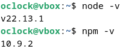
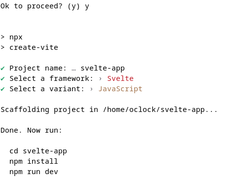
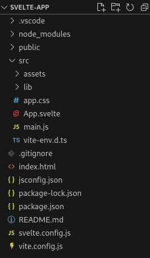
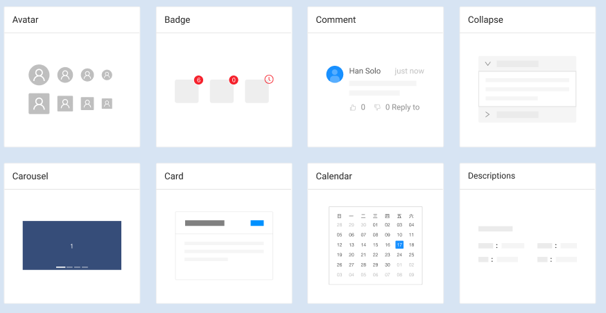
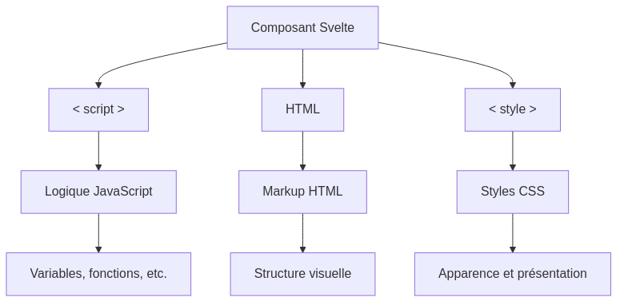

:titre: Mise en place de l'environnement
:module: Frontend Svelte
:duree: 120
:description: Ce module a pour objectif de présenter le framework Svelte et de montrer comment mettre en place un projet Svelte avec Vite.
include::../../../../adoc/libs/header-module.adoc[]

ifeval::["{visible-on-html}" !=  "yes"]
:docinfo: shared
:docinfodir: ../../../adoc/libs
endif::[]

== Objectifs pédagogiques

// tag::objectifs[]
* Savoir mettre en place un projet Svelte
* Comprendre la structure d'un projet Svelte
* Découvrir le concept de composant en Svelte
// end::objectifs[]

// tag::deroulement[]

== Node.js

* pour utiliser Svelte, il est nécessaire d'avoir Node.js installé sur sa machine
* Node.js est un environnement d'exécution JavaScript côté serveur
* il est basé sur le moteur JavaScript V8 de Google
* il permet notamment l'utilisation de npm, le gestionnaire de paquets de Node.js
* Svelte dépend de plusieurs paquets npm pour fonctionner

=== Vérifier l'installation de Node.js

* ouvrir un terminal

```
node -v
npm -v
```

* si les commandes renvoient une version, Node.js est installé
* sinon il faut procéder à leur installation



=== Installer Node.js et NPM

* se rendre sur le site de Node.js : link:https://nodejs.org/en/[https://nodejs.org/en/]
* télécharger la version LTS (Long Term Support) pour Windows ou Mac
* pour Linux, utiliser le gestionnaire de paquets de sa distribution

* vérifier l'installation avec les commandes précédentes

== Suggestions d'extensions VS Code

* https://marketplace.visualstudio.com/items?itemName=svelte.svelte-vscode[Extension officielle Svelte pour VS Code] : permet d'avoir une coloration syntaxique et des fonctionnalités spécifiques pour Svelte
* Prettier avec le plugin https://www.npmjs.com/package/prettier-plugin-svelte[prettuier-plugin-svelte] : permet de formater le code Svelte automatiquement

== Mise en place d'un projet Svelte

* pour créer un projet Svelte, on utilise un bundler : Vite
* en accéléré, un bundler permet de compiler les fichiers sources en un seul fichier : on peut voir ça comme un outil qui va rassembler tous les fichiers nécessaires à l'exécution de l'application
* Vite est un bundler qui se base sur les modules ES6, ce qui le rend très rapide

```
npm create vite@latest
```

=== Etapes de création du projet

* Accepter l'ajout du package `create-vite` en tapant `y`
* Choisir un nom pour le projet : `svelte-app`
* Choisir le framework "Svelte"
* Choisir JavaScript
* le projet est créé dans un dossier `svelte-app`

include::../../../../adoc/libs/slide-notitle.adoc[]



=== Dossier de projet

* faire un `cd svelte-app` pour se rendre dans le dossier du projet
* ouvrir le projet dans VS Code avec `code .`
* installer les dépendances avec `npm install`
* lancer le serveur de développement avec `npm run dev`
* confirmer que le projet est bien lancé en ouvrant un navigateur à l'adresse http://localhost:5173

=== Structure du projet



On obtient cette structure de dossiers et fichiers.

=== Détail de la structure

```bash
.
├── index.html          # Fichier HTML principal qui charge l'application Svelte
├── jsconfig.json       # Fichier de configuration pour le support JavaScript dans les éditeurs (comme VSCode)
├── node_modules        # Répertoire contenant toutes les dépendances du projet installées via npm
├── package.json        # Fichier de configuration du projet, contenant les scripts et dépendances npm
├── package-lock.json   # Fichier généré automatiquement pour verrouiller les versions des dépendances
├── public              # Répertoire pour les fichiers statiques accessibles par le navigateur
│   └── vite.svg        # Exemple de fichier statique (peut inclure des images, icônes, etc.)
├── README.md           # Fichier de documentation du projet, contenant des informations sur l'installation et l'utilisation
├── src                 # Répertoire contenant le code source de l'application
│   ├── app.css         # Fichier CSS global pour des styles partagés dans toute l'application
│   ├── App.svelte      # Composant racine de l'application
│   ├── assets          # Répertoire pour les ressources spécifiques de l'application (images, polices, etc.)
│   ├── lib             # Répertoire pour les bibliothèques ou modules réutilisables au sein du projet
│   ├── main.js         # Point d'entrée JavaScript qui initialise l'application
│   └── vite-env.d.ts   # Fichier de types pour Vite, utile pour TypeScript et l'auto-complétion dans les IDE
├── svelte.config.js    # Fichier de configuration pour Svelte, définissant les options de compilations
└── vite.config.js      # Fichier de configuration pour Vite, définissant les options de build et de serveur de développement
```

== Fichier `App.svelte`

* le fichier `App.svelte` est le composant racine de l'application
* il contient le code HTML, CSS et JavaScript nécessaire pour afficher l'application
* c'est un fichier Svelte, qui utilise la syntaxe spécifique de ce framework

// tag::demo[]

=== Démonstration

Modifions le fichier App.svelte

[NOTE.speaker]
====

* Nettoyer le fichier `App.svelte` pour retirer le contenu par défaut

* Ajouter un titre `h1` avec le texte "Hello, Svelte!"

* Montrer que la modification est automatiquement prise en compte dans le navigateur

* Retirer les fichiers qui ne sont plus utilisés dans `App.svelte`

====

// end::demo[]

// tag::exercice[]

== Exercice

Premiers pas en Svelte :

* Mettre en place un projet Svelte avec Vite
* S'assurer qu'il fonctionne en affichant l'application dans le navigateur
* Modifier le composant `App.svelte` pour afficher un titre et un paragraphe de bienvenue

// end::exercice[]

== Concept de composant

* un composant est une unité de code réutilisable qui encapsule une partie de l'interface utilisateur
* il peut contenir du HTML, du CSS et du JavaScript
* les composants peuvent être imbriqués les uns dans les autres pour créer des interfaces complexes

**Vous avez déjà répété plusieurs fois le même morceau de HTML ?** => le composant permet d'éviter la répétition

=== Exemples de composants



Des composants issus de la librairie UI open source https://www.figma.com/community/file/831698976089873405/ant-design-open-source[Ant Design]

== Structure d'un composant Svelte

* un composant Svelte est composé de trois parties : HTML, CSS et JavaScript
* ces trois parties sont regroupées dans un seul fichier `.svelte`
* la syntaxe Svelte permet de définir ces parties de manière concise et expressive

include::../../../../adoc/libs/slide-notitle.adoc[]



[NOTE.speaker]
====

**Observations** :

* ça ressemble à ce qu'on a fait jusqu'ici, on est pas trop déstabilisés
* la subtilité ici c'est qu'on a affaire à un composant : on va pouvoir réutiliser ce code ailleurs dans l'application
* dans un composant, Svelte nous permet de bénéficier de la réactivité : si une variable change, le composant est automatiquement mis à jour : ce n'est pas du HTML tout simple
====

// tag::demo[]

== Démonstration

Un premier composant

[NOTE.speaker]
====

* Cet exemple est un peu complexe pour des débutants mais permet de montrer quelques possibilités intéressantes

* Créer un fichier `Welcome.svelte`

```html
<script>
  // Variable réactive pour stocker le nom saisi par l'utilisateur
  let name = '';
</script>

<div>
  <label for="nameInput">Entrez votre nom :</label>
  <input id="nameInput" type="text" bind:value={name} placeholder="Votre nom" />

  {#if name}
    <div class="welcome-message">
      Bonjour, {name} !
    </div>
  {/if}
</div>

<style>
  .welcome-message {
    margin-top: 20px;
    font-size: 1.2em;
    color: #007acc;
  }
</style>
```

* Importer le composant dans `App.svelte` et l'utiliser

* Montrer le fonctionnement du composant et l'intérêt d'un composant Svelte.

* Le but n'est pas de comprendre tout le code écrit mais de voir l'intérêt de Svelte

====

// end::demo[]

== Syntaxe d'un composant

```html
<script>
// Ici on définit les variables et fonctions JavaScript
</script>

<!-- Ici on définit la structure HTML du composant -->

<style>
/* Ici on définit les styles CSS du composant */
</style>
```

=== Utiliser un composant dans un autre

Imaginons la structure suivante dans le dossier `src` :

```bash
src
├── App.svelte
├── components
│   ├── Hello.svelte
```

Pour importer le composant `Hello.svelte` dans `App.svelte`, on utilise la syntaxe suivante :

```html
<script>
import Hello from './components/Hello.svelte';
</script>

<Hello />
```

// tag::exercice[]

== Exercice

* Créer un composant `Hello.svelte` qui affiche un message de bienvenue personnalisé
* Faire en sorte que ce composant s'affiche dans le navigateur sans toucher à la structure des fichiers
* Ajouter des styles CSS pour personnaliser l'affichage du composant

// end::exercice[]

// end::deroulement[]

== Conclusion
// tag::conclusion[]
* Nous avons vu comment mettre en place un environnement de développement pour Svelte
* Nous avons créé un projet Svelte avec Vite et exploré sa structure
* Nous avons découvert le concept de composant en Svelte et créé un premier composant
* Nous avons importé et utilisé ce composant dans notre application
// end::conclusion[]