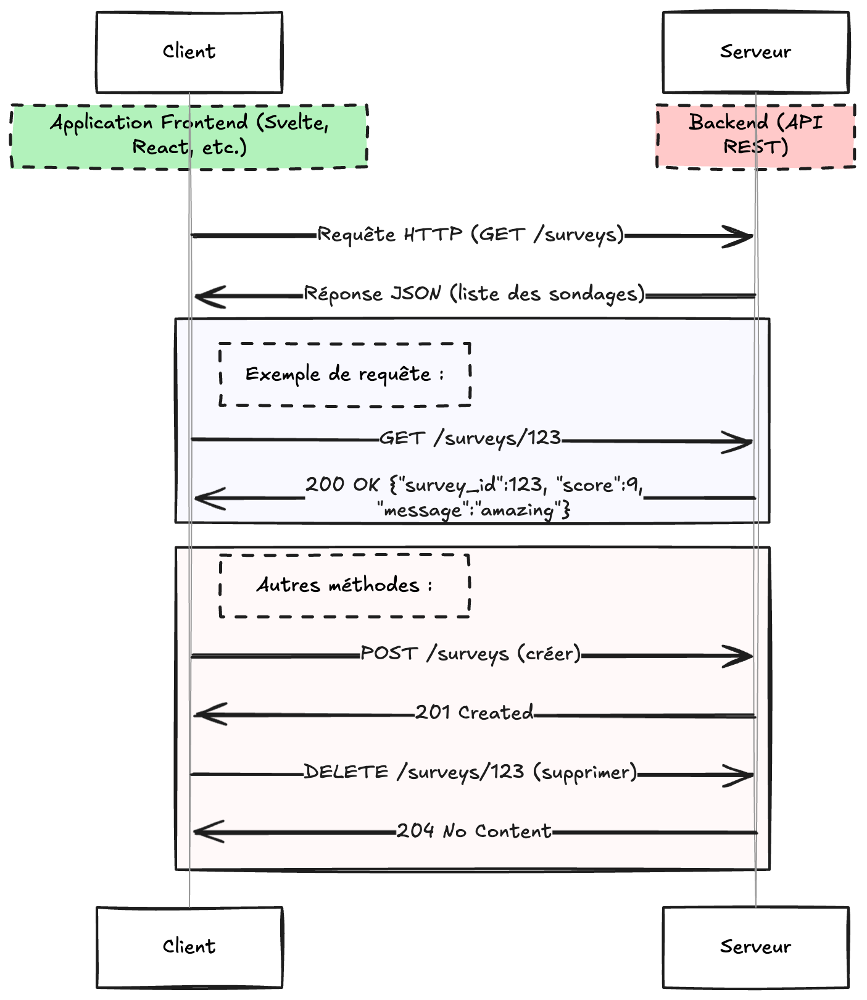

:titre: Introduction aux API REST
:module: Concepts Web
:duree: 60
:description: Comprendre les bases des API REST pour préparer leur intégration dans une application Svelte.
include::../../../../adoc/libs/header-module.adoc[]

ifeval::["{visible-on-html}" !=  "yes"]
:docinfo: shared
:docinfodir: ../../../adoc/libs
endif::[]

// tag::objectifs[]
* Définir ce qu'est une API REST
* Identifier les principes fondamentaux de REST
* Comprendre les méthodes HTTP et les codes de statut
* Manipuler les concepts de ressources et d'endpoints
// end::objectifs[]

// tag::deroulement[]
== Qu'est-ce qu'une API REST ?

=== Définitions clés

* **API** (Application Programming Interface) : 
  - Interface permettant à des systèmes de communiquer entre eux
  - Exemple : Un service météo qui fournit des données à une app mobile

* **REST** (Representational State Transfer) :
  - Style d'architecture pour les systèmes distribués
  - S'appuie sur le protocole HTTP
  - Comparaison courante : "Le REST est au web ce que le SQL est aux bases de données"

[NOTE.speaker]
====
Utiliser l'analogie du restaurant :
- Client = application frontend
- Serveur = API
- Menu = documentation API
- Commande = requête HTTP
====

=== Les 6 contraintes REST

1. Architecture client-serveur
2. Stateless (sans état)
3. Cacheable (mise en cache possible)
4. Interface uniforme
5. Système en couches
6. Code à la demande (optionnel)

== Les méthodes HTTP

[cols="1,3,2", options="header"]
|===
| Méthode | Objectif | Exemple d'usage
| GET | Récupérer une ressource | Obtenir la liste des utilisateurs
| POST | Créer une ressource | Ajouter un nouvel utilisateur
| PUT | Mettre à jour une ressource | Modifier toutes les données d'un utilisateur
| PATCH | Mettre à jour partiellement | Modifier juste l'email d'un utilisateur
| DELETE | Supprimer une ressource | Supprimer un utilisateur
| OPTIONS | Obtenir les options | Voir les méthodes autorisées
|===

// tag::demo[]
=== Démonstration : Requête GET manuelle

```http
GET https://jsonplaceholder.typicode.com/users/1 HTTP/1.1
Accept: application/json
```

[NOTE.speaker]
====
- Utiliser Postman/Insomnia pour montrer la requête/réponse
- Expliquer la structure de la réponse JSON
- Montrer les headers de réponse (Content-Type, Status Code)
====
// end::demo[]

== Codes de statut HTTP

[cols="1,3", options="header"]
|===
| Code | Signification
| 200 OK | Requête réussie
| 201 Created | Ressource créée
| 400 Bad Request | Requête mal formulée
| 401 Unauthorized | Authentification nécessaire
| 404 Not Found | Ressource introuvable
| 500 Internal Server Error | Erreur serveur
|===

=== Bonnes pratiques

* Utiliser les codes HTTP appropriés
* Versionner les API (`/api/v1/resource`)
* Documentation claire (OpenAPI/Swagger)
* Sécurité (HTTPS, JWT, OAuth2)

== Structure des endpoints RESTful

=== Exemples de routes

[cols="2,3", options="header"]
|===
| Endpoint | Description
| `GET /users` | Liste tous les utilisateurs
| `POST /users` | Crée un utilisateur
| `GET /users/42` | Récupère l'utilisateur #42
| `PUT /users/42` | Met à jour l'utilisateur #42
| `DELETE /users/42` | Supprime l'utilisateur #42
|===

// tag::exercice[]
== Exercice : Concevoir des endpoints

* Créer la structure REST pour un système de blog :
  - Articles
  - Commentaires
  - Catégories
  - Auteurs

[NOTE.speaker]
====
Solutions attendues :
- `GET /articles`
- `POST /articles/{id}/comments`
- `PATCH /categories/{id}`
- etc.
====
// end::exercice[]

// end::deroulement[]

== Conclusion
// tag::conclusion[]
* Compréhension des principes fondamentaux des API REST
* Maîtrise du vocabulaire et des concepts clés
* Capacité à concevoir des endpoints RESTful
// end::conclusion[]