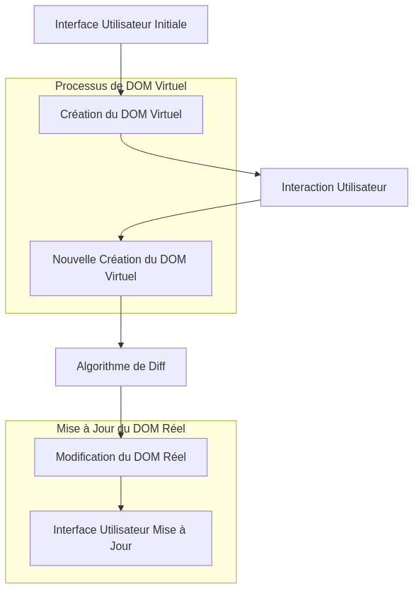
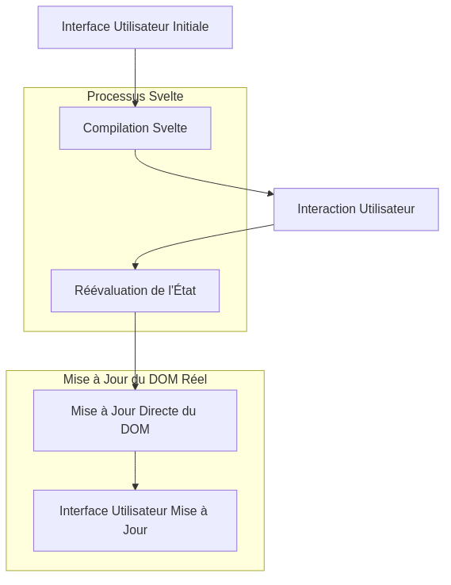

:titre: Présentation de Svelte
:module: Frontend Svelte
:duree: 30
:description: Ce module présente les principes de base de Svelte, un framework JavaScript moderne pour la création d'interfaces utilisateur.
include::../../../../adoc/libs/header-module.adoc[]

ifeval::["{visible-on-html}" !=  "yes"]
:docinfo: shared
:docinfodir: ../../../adoc/libs
endif::[]

== Objectifs pédagogiques

// tag::objectifs[]
* *Comprendre* les principes de base de Svelte
* *Comparer* Svelte avec d'autres frameworks JavaScript
* *Comprendre* l'intérêt d'utiliser un framework
// end::objectifs[]

// tag::deroulement[]

== Qu'est-ce que Svelte ?


* framework JavaScript moderne pour construire des interfaces utilisateur

=== Qu'est-ce qu'un framework ?

* permet de structurer et d'organiser le code
* fournit des outils pour faciliter le développement
* fournit des composants prêts à l'emploi

=== Quels sont les principaux frameworks JS ?

* React : https://reactjs.org/
* Svelte : https://svelte.dev/
* Vue : https://vuejs.org/
* Angular : https://angular.io/

=== Pourquoi choisir Svelte ?

* moins de code à écrire
* meilleures performances à l'exécution
* pas de virtual DOM (on en parle juste après)
* expérience de développement simplifiée

=== Comparaison

[cols="1,4,4,4,4", options="header"]
|===
| | React | Svelte | Vue | Angular

| Performance
| Bonne
| Très bonne
| Bonne
| Bonne

| Virtual DOM
| Oui
| Non
| Oui
| Non

| Complexité
| Modérée, nécessite l'apprentissage de JSX et du Virtual DOM
| Faible à modérée, syntaxe simple et directe
| Faible à modérée, syntaxe intuitive
| Élevée, nécessite l'apprentissage de TypeScript

|===

=== Qu'est-ce que le virtual DOM ?

* technique utilisée par React et Vue
* représente une copie de l'arbre DOM
* permet de comparer les changements et de les appliquer

=== Schéma du processus de virtual DOM



[NOTE.speaker]
====
**Explication des termes :**

* **Interface Utilisateur Initiale (A)** : L'interface utilisateur rendue initialement dans le navigateur.
* **Création du DOM Virtuel (B)** : Un DOM virtuel est créé lors du démarrage de l'application, servant de copie légère du DOM réel.
* **Interaction Utilisateur (C)** : L'utilisateur effectue des actions qui peuvent changer l'état de l'application.
* **Nouvelle Création du DOM Virtuel (D)** : Un nouveau DOM virtuel est généré pour représenter l'état modifié de l'application.
* **Algorithme de Diff (E)** : Cet algorithme compare l'ancien et le nouveau DOM virtuel pour déterminer les changements nécessaires.
* **Modification du DOM Réel (F)** : Seules les parties modifiées du DOM réel sont mises à jour.
* **Interface Utilisateur Mise à Jour (G)** : L'utilisateur voit la version actualisée de l'interface utilisateur.
====

=== Schéma du processus sans virtual DOM



[NOTE.speaker]
====
**Explication des termes :**

* **Interface Utilisateur Initiale (A)** : L'interface utilisateur rendue initialement dans le navigateur.
* **Compilation Svelte (B)** : Svelte compile les composants en JavaScript optimisé qui cible directement le DOM.
* **Interaction Utilisateur (C)** : L'utilisateur effectue des actions qui peuvent changer l'état de l'application.
* **Réévaluation de l'État (D)** : L'état de l'application est réévalué en fonction des interactions.
* **Mise à Jour Directe du DOM (E)** : Le DOM est mis à jour directement sans étape intermédiaire de Virtual DOM.
* **Interface Utilisateur Mise à Jour (F)** : L'utilisateur voit la version actualisée de l'interface utilisateur.
====

== Exemple de syntaxe Svelte simple

[source,svelte]
----
<script>
  let count = 0;

  function handleClick() {
    count += 1;
  }
</script>

<button on:click={handleClick}>
  Clicked {count} {count === 1 ? 'time' : 'times'}
</button>
----

[NOTE.speaker]
====
**Explication du code :**

* Dans le même fichier on peut combiner HTML et JavaScript
* Dans l'exemple de code il s'agit d'un bouton qui incrémente un compteur à chaque clic
* Pas besoin d'en savoir davantage pour l'instant, on verra les détails après
====

== Pourquoi choisir un framework plutôt que du vanilla JS ?

* gain de temps : réutilisation de composants
* maintenabilité : structure claire et organisée, parfait pour le travail en équipe
* performances : optimisation du code et du rendu
* écosystème : outils et librairies prêts à l'emploi

// tag::demo[]

== Démonstration

Création d'un projet Svelte simple

[NOTE.speaker]
====
* Créer un nouveau projet Svelte

```bash
npm create vite@latest
```

* Sélectionner le template `svelte`
* Rester en mode JavaScript (pas TypeScript)
* Ne pas installer d'outil supplémentaire

* Lancer le projet avec `npm run dev`
* Ouvrir le navigateur sur `http://localhost:5173`

* Ne pas rentrer dans les détails des fichiers, mais remarquer que le framework s'occupe de préparer notre environnement de travail.
====

// end::demo[]

// end::deroulement[]

== Conclusion
// tag::conclusion[]
* Svelte est un framework moderne pour la création d'interfaces utilisateur
* Il se distingue par sa simplicité, ses performances et son absence de virtual DOM
* Comparé à React et Vue, il offre une expérience de développement plus fluide
* Il est recommandé pour des applications simples à complexes
// end::conclusion[]