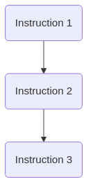
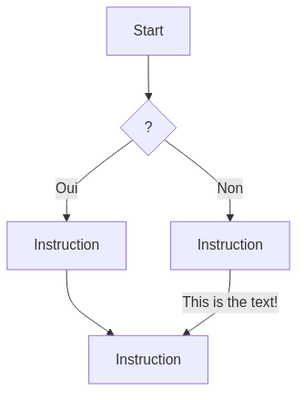
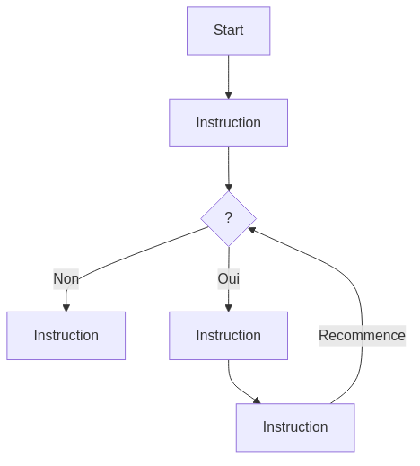

:titre: Introduction
:module: Algorithmique
:duree: 180
:description: Découverte de l'algorithmique pure et de ses concepts fondamentaux.
include::../../../../adoc/libs/header-module.adoc[]

ifeval::["{visible-on-html}" !=  "yes"]
:docinfo: shared
:docinfodir: ../../../../adoc/libs
endif::[]

// tag::objectifs[]
// Sous forme de liste à puce, en utilisant la taxonomie de Bloom
* Comprendre les concepts fondamentaux de l'algorithmique.
* Savoir identifier et formuler des problèmes à résoudre par des algorithmes.
* Apprendre à concevoir des algorithmes simples et efficaces.
* Être capable de traduire des algorithmes en code dans un langage de programmation.
// end::objectifs[]

// tag::deroulement[]
== Qu’est ce qu’un algorithme

.Définition du Larousse
Un algorithme est un ensemble de règles opératoires
dont l’application permet de résoudre un problème
énoncé au moyen d’un nombre fini d’opérations. Un
algorithme peut être traduit, grâce à un langage de
programmation, en un programme exécutable par un
ordinateur. 

[NOTE.speaker]
--
Wikipedia : Un algorithme est une suite finie et non ambiguë
d’opérations ou d'instructions permettant de résoudre
un problème ou d'obtenir un résultat
--

=== Description

* Un algorithme est défini pas-à pas (séquence) ; chaque pas ou étape doit être précis et faisable.
* Tous les algorithmes peuvent être réalisés à partir de
    ** séquences : suite ordonnée d’instructions
    ** sélections : tests, si … sinon …
    ** répétitions : boucles 
* Les algorithmes peuvent être exprimés avec
    ** le langage naturel
    ** le pseudo code et les diagrammes fonctionnels
    ** un langage de programmation

== Séquencement

Une Séquence c’est une suite d’instructions que l’ordinateur exécute une par une dans l’ordre où elles sont écrites



[NOTE.speaker]
--
Diagramme d’une Séquence, chaque rectangle correspond à une instruction. 
--

=== Sélection

La Sélection utilise une condition booléenne (vraie ou fausse) pour décider de la suite ou de la branche des instructions à exécuter



[NOTE.speaker]
--
Diagramme de sélection
le losange exprime une condition
le cercle un connecteur
--

=== Répétition

La répétition (ou itération) c’est la répétition de la partie d’un algorithme. On peut préciser le nombre de répétitions
ou effectuer la répétition tant qu’une condition est remplie.



[NOTE.speaker]
--
Diagramme de Boucle
On sort de la boucle en fonction du résultat du test
--

== Langage naturel

.Définition
* Utilisation d'une langue humaine pour décrire les étapes d'un algorithme.
* Facile à comprendre, mais peut manquer de précision.

.Exemple
. Prendre deux nombres en entrée.
. Ajouter les deux nombres.
. Afficher le résultat.

[NOTE.speaker]
--
Ligne 1 : Description de l'action de demander à l'utilisateur deux nombres.

Ligne 2 : Indication que ces deux nombres doivent être additionnés.

Ligne 3 : Instruction d'afficher la somme calculée.
--

== Pseudo code

.Définition
* Description structurée d'un algorithme utilisant une syntaxe simplifiée.
* Plus précis que le langage naturel, mais indépendant d'un langage de programmation spécifique.

.Exemple
```
Début
  Entrée : nombre1, nombre2
  somme <- nombre1 + nombre2
  Sortie : somme
Fin
```

[NOTE.speaker]
--
Début : Marque le début de l'algorithme.

Entrée : nombre1, nombre2 : Indique les données d'entrée attendues.

somme <- nombre1 + nombre2 : Instruction de calcul de la somme des deux nombres.

Sortie : somme : Instruction pour afficher le résultat.

Fin : Marque la fin de l'algorithme.
--

== Exemple concret

Un algorithme est comme une recette de cuisine. Prenons l’exemple de la préparation d’un plat de pâte.

=== Première proposition

[%step]
* remplir la casserole d’eau 
* mettre sur le feu 
* mettre les pâtes dans la casserole
* laisser cuire
* égoutter les pâtes

[%step]
image::https://media1.tenor.com/m/Ts1zvA6fXJkAAAAd/bored-chef-priyanka.gif[]

=== Deuxième proposition

[%step]
* Remplir la casserole d’eau 
* Mettre du sel
* mettre sur le feu
* attendre que l’eau bout  
* mettre les pâtes dans la casserole
* suivant le type de pâtes, définir le temps de cuisson 
* égoutter les pâtes
* Ajouter de la sauce

[%step]
image::https://media1.tenor.com/m/pR73B9N4ERIAAAAd/can-yaman-dececco.gif[]

=== Moralité

On ne réalise jamais un script dès le premier essai. Le script parfait du premier coup n'existe pas (surtout sur des scripts un peu avancés…).

* Ce sont les phases de tests qui nous permettent d’avancer dans notre réflexion et d’améliorer notre algorithme.
* Il faut donc y aller étape par étape et tester chaque ligne de notre script.

[NOTE.speaker]
--
vérification des prérequis : ai-je une casserole ? De l’eau ? Du sel ? Des pâtes ? Une gazinière ?
--
// end::deroulement[]

// tag::demo[]
== Démonstration

[NOTE.speaker]
--
*Objectif* : Concevoir un algorithme simple pour calculer la moyenne d'une liste de nombres et rechercher la valeur maximale dans cette liste, en utilisant les concepts de séquence, sélection et répétition.

*Algorithme de Calcul de la Moyenne*

.Étapes de l'algorithme langage naturel
* Initialisation :
    ** Définir une liste de nombres.
    ** Initialiser une variable pour stocker la somme des nombres.
* Séquence de Calcul :
    ** Parcourir la liste et ajouter chaque nombre à la somme.
* Calcul de la Moyenne :
    ** Diviser la somme par le nombre d'éléments dans la liste.

.Pseudo-code de l'algorithme de calcul de la moyenne :
```
Début
  Initialiser LISTE à [4, 8, 6, 5, 3, 7]
  Initialiser SOMME à 0
  Initialiser N à longueur de LISTE
  
  Pour chaque NOMBRE dans LISTE
    SOMME = SOMME + NOMBRE
  Fin pour
  
  MOYENNE = SOMME / N
  
  Afficher "Moyenne : " + MOYENNE
Fin
```

*Algorithme de Recherche de la Valeur Maximale*

.Étapes de l'algorithme
* Initialisation :
    ** Définir la liste de nombres.
    ** Initialiser une variable pour stocker la valeur maximale, initialement le premier élément de la liste.
* Répétition avec Sélection :
    ** Parcourir la liste à partir du deuxième élément.
    ** Comparer chaque élément avec la valeur maximale actuelle et mettre à jour si l'élément est plus grand.

.Pseudo-code de l'algorithme de recherche de la valeur maximale
```
Début
  Initialiser LISTE à [4, 8, 6, 5, 3, 7]
  Initialiser MAX à LISTE[0]
  
  Pour i de 1 à longueur de LISTE - 1
    Si LISTE[i] > MAX
      MAX = LISTE[i]
    Fin Si
  Fin pour
  
  Afficher "Valeur maximale : " + MAX
Fin
```

*Explication et Importance des Algorithmes*

.Algorithme de Calcul de la Moyenne
* *Séquence* : Suivre une séquence d'instructions pour accumuler la somme des nombres.
* *Répétition* : Utiliser une boucle pour parcourir chaque élément de la liste.
* *Clarté* : Chaque étape est clairement définie, rendant l'algorithme facile à suivre et à comprendre.

.Algorithme de Recherche de la Valeur Maximale
* *Sélection* : Utiliser une condition pour comparer les valeurs et déterminer la valeur maximale.
* *Répétition* : Parcourir la liste une seule fois, ce qui est optimal en termes de complexité temporelle O(n).
* *Simplicité* : L'algorithme est simple à comprendre et à mettre en œuvre, rendant son utilisation pratique dans divers contextes.

Ces algorithmes de base sont essentiels pour de nombreuses opérations de traitement de données et servent de fondement à des algorithmes plus complexes.
Ils illustrent des concepts fondamentaux en algorithmique, comme le parcours de liste, l'accumulation de valeurs et la comparaison d'éléments.
En maîtrisant ces concepts, on peut écrire des algorithmes robustes et les implémenter dans n'importe quel langage de programmation.
--
// end::demo[]

// tag::exercice[]
== Exercice

*Objectif* : Écrire un algorithme en pseudo-code qui effectue un compte à rebours à partir d'un nombre donné jusqu'à zéro, en affichant chaque nombre.

.Étapes
* Initialisation :
** Demander à l'utilisateur de saisir un nombre entier positif.
* Répétition :
** Utiliser une boucle pour afficher chaque nombre en partant du nombre donné jusqu'à zéro.

---

*Objectif* : Écrire un algorithme qui choisit aléatoirement une blague de développeur à afficher.

.Étapes
* Initialisation :
** Créer une liste de blagues de développeurs
* Sélection :
** Choisir une blague aléatoire dans la liste et l'afficher
// end::exercice[]

== Conclusion

// tag::conclusion[]
* L'algorithme est une compétence fondamentale en programmation et en scripting
* Permet de structurer et résoudre des problèmes de manière efficace. 
* L'utilisation du langage naturel et du pseudo-code facilite la compréhension et la transition vers le code de programmation réel. 
* En maîtrisant ces concepts, on peut écrire des algorithmes robustes et les implémenter dans n'importe quel langage de programmation.
// end::conclusion[]
