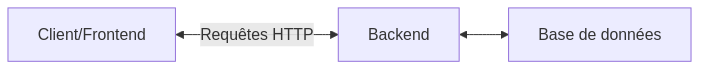

:titre: Introduction au backend
:module: Backend
:duree: 120
:description: Comprendre le rôle du backend dans une architecture web et les concepts fondamentaux associés.
include::../../../../adoc/libs/header-module.adoc[]

ifeval::["{visible-on-html}" !=  "yes"]
:docinfo: shared
:docinfodir: ../../../../adoc/libs
endif::[]

// tag::objectifs[]
* *Comprendre* l'architecture web : Frontend, Backend, Base de données
* *Expliquer* le concept d'API et son rôle dans la communication web
* *Identifier* les différents types de requêtes HTTP et leur utilisation
* *Décrire* les principales tâches du backend
// end::objectifs[]

// tag::deroulement[]
== Architecture web : Frontend vs Backend vs Base de données

L'architecture web moderne se compose généralement de trois parties principales :

1. *Frontend* : L'interface utilisateur, ce que l'utilisateur voit et avec quoi il interagit.
2. *Backend* : Le "cerveau" de l'application, gère la logique et les données.
3. *Base de données* : Stocke et organise les données de l'application.

== Qu'est-ce qu'une API ?

API signifie "Application Programming Interface". C'est un ensemble de règles et de protocoles permettant à différentes applications de communiquer entre elles.

=== Rôle de l'API

- Permet au frontend de communiquer avec le backend
- Définit les points d'entrée (endpoints) et les méthodes pour accéder aux données ou fonctionnalités

== Communication entre le frontend et le backend via HTTP

HTTP (Hypertext Transfer Protocol) est le protocole standard pour la communication sur le web.

=== Principaux types de requêtes HTTP

1. *GET* : Récupérer des données
2. *POST* : Envoyer des données pour création
3. *PUT* : Mettre à jour des données existantes
4. *DELETE* : Supprimer des données

=== Exemple de requête GET :

[source,http]
----
GET /api/users HTTP/1.1
Host: example.com
----

=== Exemple de requête POST :

[source,http]
----
POST /api/users HTTP/1.1
Host: example.com
Content-Type: application/json

{
  "name": "John Doe",
  "email": "john@example.com"
}
----

== Les tâches du backend

* *Gestion des données* :
   - Stockage et récupération des données dans la base de données
   - Traitement et transformation des données

* *Authentification* :
   - Vérification de l'identité des utilisateurs
   - Gestion des sessions utilisateur

== Les tâches du backend (suite)

* *Autorisation* :
   - Contrôle des accès aux ressources
   - Définition des permissions utilisateur

* *Logique métier* :
   - Implémentation des règles et processus spécifiques à l'application

* *Intégration avec des services externes* :
   - APIs tierces, services de paiement, etc.

// end::deroulement[]

// tag::demo[]
== Démonstration : Communication client-serveur via HTTP

[NOTE.speaker]
--
Objectif : Expliquer la communication entre un client (navigateur) et un serveur backend à l'aide de requêtes HTTP simples.

1. Utilisez un outil comme Postman ou cURL pour démontrer les requêtes HTTP.

2. Exemple de requête GET :
+
[source,bash]
----
curl https://api.github.com/users/octocat
----
Expliquez la structure de la réponse JSON.

3. Exemple de requête POST (création d'un nouveau post sur JSONPlaceholder) :
+
[source,bash]
----
curl -X POST -H "Content-Type: application/json" -d '{"title":"Nouveau post","body":"Contenu du post","userId":1}' https://jsonplaceholder.typicode.com/posts
----
Montrez la réponse du serveur avec l'ID du nouveau post créé.

4. Discutez de la façon dont ces requêtes seraient utilisées dans une application web réelle :
   - GET pour récupérer des données à afficher
   - POST pour soumettre un formulaire
   - PUT pour mettre à jour un profil utilisateur
   - DELETE pour supprimer un élément

5. Soulignez l'importance de la sécurité (HTTPS, authentification) dans ces communications.
--
// end::demo[]

// tag::exercice[]
== Exercice pratique : Analyse d'une API simple

=== Objectif
Comprendre la structure et le fonctionnement d'une API RESTful simple.

[NOTE.speaker]
--
* Étapes

1. Visitez l'API publique JSONPlaceholder : https://jsonplaceholder.typicode.com/

2. Explorez les différents endpoints disponibles (posts, comments, albums, etc.)

3. Utilisez Postman ou cURL pour effectuer les requêtes suivantes :

   a. GET tous les posts
   b. GET un post spécifique (par exemple, id = 1)
   c. POST un nouveau post
   d. PUT pour mettre à jour un post existant
   e. DELETE un post

4. Pour chaque requête, notez :
   - L'URL utilisée
   - Le type de requête (GET, POST, etc.)
   - Les données envoyées (le cas échéant)
   - La réponse reçue

5. Réflexion :
   - Comment ces différentes requêtes pourraient-elles être utilisées dans une application de blog ?
   - Quelles seraient les responsabilités du frontend et du backend dans ce contexte ?

* Exemple de requête

[source,bash]
----
curl https://jsonplaceholder.typicode.com/posts/1
----

--

=== Questions de réflexion

1. Comment l'API gère-t-elle les différentes ressources (posts, comments, etc.) ?
2. Quels avantages voyez-vous à utiliser une structure API comme celle-ci ?
3. Quels défis pourriez-vous rencontrer en intégrant cette API dans une application frontend ?

// end::exercice[]

== Conclusion

// tag::conclusion[]
* Vous avez découvert les composants principaux d'une architecture web moderne
* Vous comprenez le rôle crucial du backend dans le traitement et la gestion des données
* Vous avez exploré les bases de la communication HTTP entre le frontend et le backend
* Vous avez identifié les principales responsabilités du backend, y compris la gestion des données et la sécurité
* Ces connaissances vous fourniront une base solide pour approfondir le développement backend
// end::conclusion[]
