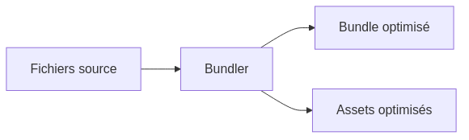

:titre: Outils de bundling, gestion des dépendances
:module: Build
:duree: 120
:description: Comprendre et utiliser les outils de bundling, gérer les dépendances avec npm et optimiser le code frontend
include::../../../../adoc/libs/header-module.adoc[]

ifeval::["{visible-on-html}" !=  "yes"]
:docinfo: shared
:docinfodir: ../../../../adoc/libs
endif::[]

// tag::objectifs[]
* *Définir* les termes "bundling", "minification" et "transpilation"
* *Utiliser* npm pour gérer les dépendances d'un projet
* *Utiliser* Vite pour créer et configurer un nouveau projet Svelte
* *Exécuter* les commandes de base pour le développement et la production avec Vite
* *Analyser* les résultats d'un build optimisé
// end::objectifs[]

// tag::deroulement[]
== Introduction à la gestion des dépendances avec npm

=== Qu'est-ce que npm ?

npm (Node Package Manager) est le gestionnaire de paquets par défaut pour l'écosystème JavaScript et Node.js. Il permet de gérer les dépendances d'un projet, d'installer des packages, et d'exécuter des scripts.

=== Initialisation d'un projet avec npm

Pour initialiser un nouveau projet avec npm :

[source,bash]
----
npm init -y
----

Cette commande crée un fichier `package.json` qui contient les métadonnées du projet et la liste des dépendances.

=== Installation des dépendances

Pour installer une dépendance :

[source,bash]
----
npm install <package-name>
----

Pour installer une dépendance de développement :

[source,bash]
----
npm install --save-dev <package-name>
----

=== Le fichier package.json

Le fichier `package.json` est crucial pour la gestion des dépendances. Voici un exemple simplifié :

[source,json]
----
{
  "name": "mon-projet",
  "version": "1.0.0",
  "dependencies": {
    "svelte": "^3.0.0"
  },
  "devDependencies": {
    "vite": "^2.0.0"
  },
  "scripts": {
    "dev": "vite",
    "build": "vite build"
  }
}
----

== Introduction aux outils de bundling

Les outils de bundling jouent un rôle crucial dans le développement frontend moderne. Ils permettent d'optimiser et de préparer le code pour la production en effectuant diverses tâches essentielles.

=== Qu'est-ce que le bundling ?

Le bundling est le processus qui consiste à regrouper plusieurs fichiers de code source (JavaScript, CSS, etc.) en un seul fichier (ou un petit nombre de fichiers) pour optimiser le chargement et l'exécution d'une application web.

=== Présentation de Vite

https://vitejs.dev/[Vite] est un outil de build moderne qui se distingue par sa rapidité et sa simplicité d'utilisation.

Principales caractéristiques de Vite :

* Démarrage rapide du serveur de développement
* Build de production optimisé
* Support natif des modules ES
* Configuration minimale requise

=== Minification

La minification est le processus de réduction de la taille des fichiers en supprimant les caractères inutiles sans affecter la fonctionnalité.

Exemple avec UglifyJS :

[source,javascript]
----
// Avant minification
function greet(name) {
    console.log("Hello, " + name + "!");
}

// Après minification
function greet(n){console.log("Hello, "+n+"!")}
----

=== Transpilation avec Babel

https://babeljs.io/[Babel] est un transpileur JavaScript qui permet d'utiliser les fonctionnalités les plus récentes du langage tout en assurant la compatibilité avec les anciens navigateurs.

Exemple de transpilation :

[source,javascript]
----
// Code source (ES6+)
const greet = (name) => {
    console.log(`Hello, ${name}!`);
};

// Code transpilé (ES5)
var greet = function greet(name) {
    console.log("Hello, " + name + "!");
};
----

== Linting avec ESLint

https://eslint.org/[ESLint] est un outil d'analyse statique de code qui permet d'identifier et de corriger les problèmes dans le code JavaScript. Il aide à maintenir un code cohérent et à éviter les erreurs courantes.

=== Installation et configuration

[source,bash]
----
# Installation d'ESLint
npm install --save-dev eslint

# Initialisation de la configuration
npx eslint --init
----

=== Exemple de configuration

Le fichier `.eslintrc.json` définit les règles de linting :

[source,json]
----
{
  "env": {
    "browser": true,
    "es2021": true
  },
  "extends": "eslint:recommended",
  "parserOptions": {
    "ecmaVersion": "latest",
    "sourceType": "module"
  },
  "rules": {
    "indent": ["error", 2],
    "quotes": ["error", "single"],
    "semi": ["error", "always"],
    "no-unused-vars": "warn"
  }
}
----

=== Exemple de correction automatique

[source,javascript]
----
// Code avec problèmes
function  maFonction( ) {
    var x = "hello"
    console.log(x)
}

// Code après correction ESLint
function maFonction() {
  const x = 'hello';
  console.log(x);
}
----

[NOTE.speaker]
--
ESLint peut être configuré pour :
- Détecter les erreurs potentielles
- Appliquer des conventions de style
- Identifier les problèmes de performance
- S'intégrer avec les éditeurs de code
--

=== Intégration avec Vite

Pour intégrer ESLint dans un projet Vite :

[source,bash]
----
npm install --save-dev vite-plugin-eslint
----

Configuration dans `vite.config.js` :

[source,javascript]
----
import { defineConfig } from 'vite';
import eslint from 'vite-plugin-eslint';

export default defineConfig({
  plugins: [
    eslint({
      cache: false,
      include: ['src/**/*.js', 'src/**/*.svelte'],
      exclude: ['node_modules/**'],
    })
  ]
});
----

[TIP]
====
Ajoutez un script dans votre `package.json` pour faciliter le linting :
[source,json]
----
{
  "scripts": {
    "lint": "eslint src --ext .js,.svelte",
    "lint:fix": "eslint src --ext .js,.svelte --fix"
  }
}
----
====

== Cycle de build avec Svelte et Vite

Voici comment un projet Svelte est "bundlé" avec Vite pour préparer une version optimisée pour la production.

=== Étapes du build

1. *Compilation Svelte* : Les composants Svelte sont compilés en JavaScript vanilla.
2. *Bundling* : Vite regroupe les fichiers et leurs dépendances.
3. *Minification* : Le code JavaScript et CSS est minifié.
4. *Splitting de code* : Vite génère des chunks séparés pour optimiser le chargement.
5. *Génération de sourcemaps* : Pour faciliter le débogage en production.

[NOTE.speaker]
--
Lors du processus de build, un fichier sourcemap est généré pour chaque fichier JavaScript ou CSS minifié. Ce fichier sourcemap contient des informations de mapping qui indiquent comment les lignes et les colonnes du code minifié correspondent aux lignes et colonnes du code source original.
--

=== Structure de la build

Après le build, vous trouverez les fichiers optimisés dans le dossier `dist` :

[source]
----
dist/
├── assets/
│   ├── index-1234abcd.js
│   ├── index-5678efgh.css
│   └── vendor-90abcdef.js
├── index.html
└── favicon.ico
----

* Les fichiers dans `assets/` sont nommés avec des hashes pour la gestion du cache.
* `index.html` est le point d'entrée qui charge les assets.

// end::deroulement[]

// tag::demo[]
== Démonstration 1 : Création et configuration d'un projet Svelte avec Vite

[NOTE.speaker]
--
1. Créer un nouveau projet : `npm create vite@latest my-svelte-project -- --template svelte`
2. Naviguer dans le projet : `cd my-svelte-project`
3. Installer les dépendances : `npm install`
4. Examiner le fichier `package.json` et expliquer les dépendances et scripts
5. Lancer le serveur de développement : `npm run dev`
6. Montrer la structure du projet et expliquer les fichiers clés
--

== Démonstration 2 : Gestion des dépendances avec npm

[NOTE.speaker]
--
1. Installer une nouvelle dépendance : `npm install lodash`
2. Installer une dépendance de développement : `npm install --save-dev jest`
3. Montrer les changements dans `package.json`
4. Expliquer la différence entre `dependencies` et `devDependencies`
5. Démontrer l'utilisation de `npm update` pour mettre à jour les dépendances
--

== Démonstration 3 : Build de production et analyse

[NOTE.speaker]
--
1. Exécuter le build de production : `npm run build`
2. Examiner le contenu du dossier `dist`
3. Utiliser un outil comme `rollup-plugin-visualizer` pour analyser la taille des bundles
* Installation (si nécessaire) :
+
[source,bash]
----
npm i rollup-plugin-visualizer
----
* Configuration :
+
[source,javascript]
----
// @file vite.config.js
import { defineConfig } from 'vite'
import { svelte } from '@sveltejs/vite-plugin-svelte'
import { visualizer } from 'rollup-plugin-visualizer';

// https://vitejs.dev/config/
export default defineConfig({
    plugins: [
        svelte(),
        visualizer({
            emitFile: true, // créer le fichier dans `./dist/assets/` ? (si NON à la racine)
            // template: 'treemap', // template de sortie (list, sunburst, network…)
            sourcemap: true,
        }),
    ],
    build: {
        sourcemap: true,
    },
})
----
* Utilisation : relancer le build de production → `npm run build`
* Résultats fournis :
** Visualisation graphique de la taille de chaque module
** Pourcentage et taille exacte de chaque dépendance
** Informations sur les duplications ou gros modules

4. Lancer le serveur de preview : `npm run preview` → http://localhost:4173/stats.html
--

// end::demo[]

// tag::exercice[]
== Exercice 1 : Gestion des dépendances

1. Initialisez un nouveau projet npm
2. Installez la dépendance `axios`
3. Installez la dépendance de développement `eslint`
4. Créez un script npm pour lancer eslint
5. Mettez à jour toutes les dépendances à leur dernière version

== Exercice 2 : Optimisation d'un projet Svelte

1. Créez un nouveau projet Svelte avec Vite
2. Ajoutez un composant qui utilise une bibliothèque externe (par exemple, Chart.js)
3. Effectuez un build de production
4. Analysez la taille du bundle avec `source-map-explorer`
5. Identifiez les opportunités d'optimisation (par exemple, lazy loading du composant Chart.js)

// end::exercice[]

== Conclusion

// tag::conclusion[]
* npm est un outil essentiel pour la gestion des dépendances dans les projets JavaScript
* Les outils de bundling comme Vite sont cruciaux pour optimiser les applications frontend modernes
* La minification, la transpilation et le code splitting sont des techniques clés pour améliorer les performances
* L'analyse continue des performances et l'optimisation du code sont essentielles pour maintenir une application efficace
* La maîtrise de ces concepts permet aux développeurs et aux DevOps d'assurer des déploiements performants et une bonne expérience utilisateur
// end::conclusion[]
