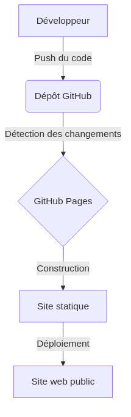

:titre: Déploiement d'Applications Svelte sur GitHub Pages
:module: Frontend Deployment
:duree: 120
:description: Maîtriser le déploiement d'applications Svelte sur GitHub Pages avec des pratiques CI/CD
include::../../../../adoc/libs/header-module.adoc[]

ifeval::["{visible-on-html}" !=  "yes"]
:docinfo: shared
:docinfodir: ../../../../adoc/libs
endif::[]

// tag::objectifs[]
* *Comprendre* le fonctionnement de GitHub Pages
* *Configurer* un dépôt GitHub pour héberger une application statique
* *Analyser* les principes de base de CI/CD pour le déploiement frontend
* *Appliquer* le déploiement d'une application Svelte sur GitHub Pages
* *Évaluer et résoudre* les problèmes courants liés au déploiement
// end::objectifs[]

// tag::deroulement[]
== Introduction à GitHub Pages

GitHub Pages est un service d'hébergement gratuit fourni par GitHub pour les sites web statiques.

=== Caractéristiques principales

* Hébergement gratuit pour les projets open source
* Intégration native avec les dépôts GitHub
* Support des domaines personnalisés
* Génération automatique de sites à partir de fichiers Markdown (avec Jekyll)

== Fonctionnement de GitHub Pages



=== Types de sites GitHub Pages

1. *Site de projet* : Lié à un projet spécifique (branche `gh-pages` ou `/docs` dans la branche principale)
2. *Site d'utilisateur ou d'organisation* : Lié à un compte GitHub (dépôt spécial nommé `username.github.io`)

== Configuration d'un dépôt pour GitHub Pages

=== Étapes de configuration

1. Aller dans les paramètres du dépôt (Settings)
2. Naviguer vers la section "Pages"
3. Choisir la source (branche et dossier)
4. Sauvegarder les changements

== Introduction aux pratiques CI/CD pour le frontend

* ⚠️ *CI/CD est un sujet vaste et complexe, vous aurez une saison entière sur le sujet*
+
🎉 *voyez ça comme un avant-goût*

=== Qu'est-ce que CI/CD ?
* *CI (Intégration Continue)* : Automatisation de l'intégration des changements de code
* *CD (Déploiement Continu)* : Automatisation du déploiement des applications

=== Avantages du CI/CD pour le frontend

* Détection précoce des erreurs
* Déploiements plus fréquents et plus fiables
* Amélioration de la qualité du code
* Réduction du temps entre le développement et la mise en production

== Déploiement d'une application Svelte sur GitHub Pages

=== Étapes clés

1. Configurer le projet Svelte pour GitHub Pages
2. Installer et configurer gh-pages
3. Créer un script de déploiement
4. Configurer GitHub Actions pour le CI/CD

=== Configuration du projet

Modifiez le fichier `vite.config.js` :

[source,javascript]
----
import { defineConfig } from 'vite'
import { svelte } from '@sveltejs/vite-plugin-svelte'

export default defineConfig({
  plugins: [svelte()],
  base: '/nom-du-repo/',
})
----

=== Script de déploiement

Ajoutez dans `package.json` :

[source,json]
----
{
  "scripts": {
    "deploy": "npm run build && npx gh-pages -d dist"
  }
}
----

=== Configuration GitHub Actions

Créez `.github/workflows/deploy.yml` :

[source,yaml]
----
name: Deploy to GitHub Pages

on:
  push:
    branches:
      - main

jobs:
  deploy:
    runs-on: ubuntu-latest
    steps:
      - uses: actions/checkout@v2
      - name: Setup Node
        uses: actions/setup-node@v2
        with:
          node-version: '16'
      - run: npm ci
      - run: npm run build
      - name: Deploy
        uses: peaceiris/actions-gh-pages@v3
        with:
          github_token: ${{ secrets.GITHUB_TOKEN }}
          publish_dir: ./dist
----

== Résolution des problèmes courants

1. *Problèmes de chemins relatifs* : Utilisez `import.meta.env.BASE_URL`
2. *Erreurs 404* : Configurez la redirection vers `index.html`
3. *Problèmes de cache* : Utilisez le cache-busting de Vite

// end::deroulement[]

// tag::demo[]
== Démonstration 1 : Configuration initiale

[NOTE.speaker]
--
1. Créer un nouveau dépôt GitHub
2. Cloner le dépôt localement
3. Initialiser un projet Svelte avec Vite
+
`npm create vite@latest . -- --template svelte`
+
`npm install`

4. Configurer `vite.config.js` pour GitHub Pages
* Ouvrez le fichier `vite.config.js` dans votre éditeur
* Ajoutez la configuration de base pour GitHub Pages :
+
```javascript
import { defineConfig } from 'vite'
import { svelte } from '@sveltejs/vite-plugin-svelte'

export default defineConfig({
  plugins: [svelte()],
  base: '/mon-projet-svelte/', // Remplacez par le nom de votre dépôt
})
```
5. Faire un premier commit et push
--

== Démonstration 2 : Déploiement manuel et automatique

[NOTE.speaker]
--
1. Installer gh-pages et configurer le script de déploiement

* Installez gh-pages comme dépendance de développement :
+
[source,bash]
----
npm install gh-pages --save-dev
----
* Ouvrez `package.json` et ajoutez le script de déploiement :
+
[source,json]
----
"scripts": {
  ...
  "deploy": "npm run build && gh-pages -d dist"
}
----

2. Effectuer un déploiement manuel avec `npm run deploy`

* Exécutez la commande de déploiement :
+
[source,bash]
----
npm run deploy
----
* Cette commande va construire votre projet et le déployer sur la branche gh-pages

3. Configurer GitHub Actions pour le déploiement automatique

* Créez un dossier `.github/workflows` à la racine de votre projet
* Créez un fichier `deploy.yml` dans ce dossier avec le contenu suivant :
+
[source,yaml]
----
name: Deploy to GitHub Pages

on:
  push:
    branches: [main]

jobs:
  build-and-deploy:
    runs-on: ubuntu-latest
    steps:
      - uses: actions/checkout@v2
      - name: Install and Build
        run: |
          npm ci
          npm run build
      - name: Deploy
        uses: JamesIves/github-pages-deploy-action@4.1.5
        with:
          branch: gh-pages
          folder: dist
----

4. Faire une modification, commit et push pour déclencher le déploiement automatique

5. Vérifier le déploiement sur GitHub Pages
* Allez sur la page de votre dépôt GitHub
* Cliquez sur l'onglet "Actions" pour voir le workflow en cours d'exécution
* Une fois terminé, allez dans "Settings" > "Pages"
* Vérifiez que la source est définie sur la branche gh-pages
* Cliquez sur le lien fourni pour voir votre site déployé (généralement de la forme https://votre-nom-utilisateur.github.io/mon-projet-svelte/)
--

// end::demo[]

// tag::exercice[]
== Exercice 1 : Déploiement d'une application Svelte personnalisée

1. Forkez le template Svelte Vite de base
2. Ajoutez une fonctionnalité simple (ex: compteur, liste de tâches)
3. Configurez le projet pour GitHub Pages
4. Déployez manuellement avec `gh-pages`
5. Vérifiez le déploiement

== Exercice 2 : Mise en place du CI/CD

1. Configurez GitHub Actions pour votre projet
2. Modifiez votre application (ex: changez le style, ajoutez une nouvelle fonctionnalité)
3. Committez et poussez vos changements
4. Vérifiez que le déploiement automatique s'est bien déroulé

// end::exercice[]

== Conclusion

// tag::conclusion[]
* GitHub Pages offre une solution simple et gratuite pour héberger des applications Svelte
* L'utilisation de gh-pages et de GitHub Actions simplifie grandement le processus de déploiement
* La résolution des problèmes courants est essentielle pour un déploiement réussi
* La maîtrise de ces techniques est cruciale pour les DevOps travaillant sur des projets frontend
* Continuez à explorer d'autres options de déploiement (Netlify, Vercel) pour élargir vos compétences
// end::conclusion[]
