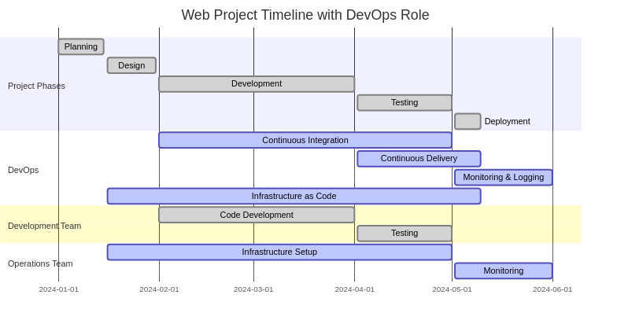

:titre: Présentation du métier de DevOps
:module: Devops
:duree: 45
:description: Comprendre les principes fondamentaux du DevOps.
include::../../../../adoc/libs/header-module.adoc[]

ifeval::["{visible-on-html}" !=  "yes"]
:docinfo: shared
:docinfodir: ../../../../adoc/libs
endif::[]

== Objectifs pédagogiques
// tag::objectifs[]
* Comprendre le rôle de DevOps
* Connaître les technologies associées
// end::objectifs[]

// tag::deroulement[]
== Le métier de DevOps

image::https://i.giphy.com/llKJGxQ1ESmac.webp[]

== Qu'est-ce que le DevOps ?

* DevOps = Développement + Opérations
* s'occupe (entre autres) de livrer un projet web
* le DevOps permet de faciliter la communication entre les différents acteurs
* il permet à tout le monde de pouvoir travailler ensemble efficacement

=== Rôle du DevOps dans un projet web

== Principales missions

- Améliorer la collaboration entre les équipes de développement et
d’opérations.
- Réduire les délais de développement et de déploiement des logiciels.
- Augmenter la fréquence des mises à jour et des déploiements.
- Assurer une meilleure stabilité et fiabilité des systèmes en
production.
- Automatiser les tâches répétitives pour libérer du temps pour des
activités à plus forte valeur ajoutée.
- Faciliter le déploiement continu et l’intégration continue.

=== Différence entre un dev et un ops

* Développeur = responsable de la création de fonctionnalités et la rédaction de code
* Opérations = déploiement, maintenance et gestion des infrastructures
* Le DevOps comble le fossé entre les deux domaines

== Historique

* émergence au début des années 2000 en réponse à des besoins de livraison rapide de logiciels
* s'inspire des pratiques agiles, de l'intégration continue et de la livraison continue
* est devenu de plus en plus populaire avec la croissance des entreprises axées sur la technologie
* a permis d'avoir un rôle pivot entre les équipes de développement et les équipes d'opération

=== Pourquoi les entreprises en ont besoin ?

* environnement concurrentiel où les mises à jour fréquentes des logiciels sont essentielles
* le DevOps permet aux entreprises de rester agiles et réactives
* il réduit les temps d'arrêt, améliore la qualité des logiciels, favorise l'innovation continue
* il permet de répondre aux demandes du marché et satisfaire les clients

=== Exemples de jobs

- **Ingénieur DevOps** : Responsable de l'automatisation, de la mise en œuvre et de la gestion des flux de travail DevOps.
- **Architecte DevOps** : Conçoit et met en œuvre des infrastructures évolutives et résilientes pour les déploiements continus.
- **Administrateur Système DevOps** : Gère les systèmes, les réseaux et les environnements de développement.
- **Spécialiste en Sécurité DevOps** : Garantit la sécurité des applications et des infrastructures tout au long du cycle de vie.
- **Automaticien de tests** : En charge de créer des tests automatisés pour des produits

=== Et après ?

* Cybersécurité
* Cloud
* Management
* Consulting
* ...

== Les principes fondamentaux du DevOps

* 👥 Collaborer
* 🤖 Automatiser
* 🔍 Superviser
* 🔒 Sécuriser

=== 👥 Collaborer

- Communication fluide entre les équipes : éliminer les silos et
favoriser le partage d’informations.
- Encourager le travail d’équipe : développeurs, testeurs et opérations
travaillent ensemble vers un objectif commun.

=== 🤖 Automatiser

- Automatisation des tests : automatiser les tests unitaires, les tests
d’intégration et les tests de bout en bout.
- Automatisation du déploiement : automatiser le déploiement des
applications et des infrastructures.
- Utilisation d’outils d’automatisation : outils d’intégration continue,
de déploiement continu, etc.

=== 🔍 Superviser

- Surveiller les performances et l’état des applications en production.
- Collecter des métriques pour identifier les goulots d’étranglement et
les problèmes de performance.
- Utiliser les retours d’information pour améliorer continuellement les
processus.

=== 🔒 Sécuriser

- Intégrer la sécurité aux étapes de développement
- Automatiser le plus possible les processus et le déploiement afin
d’éviter les erreurs humaines

== Technologies

image::https://media4.giphy.com/media/v1.Y2lkPTc5MGI3NjExOXIzMWllcHIxNjVpOGVveHN0dzlmenE3YXdqc3g2dzM4cHVxNHJtbCZlcD12MV9pbnRlcm5hbF9naWZfYnlfaWQmY3Q9Zw/CTX0ivSQbI78A/giphy.webp[]

=== Git : Le super-héros du contrôle de version

- permet de garder une trace de toutes les modifications apportées au code
- comme un assistant qui prend des instantanés à chaque changement
- en cas de problème, `git` peut remonter dans le temps et corriger les erreurs

image::https://media1.giphy.com/media/v1.Y2lkPTc5MGI3NjExNmZoNTBhNHNnNThwcmhjZDRhOTFwYTJtNW9teThjN2hkNTU3b2xoaiZlcD12MV9pbnRlcm5hbF9naWZfYnlfaWQmY3Q9Zw/3oriePl4NgrM8rTfq0/giphy.webp[]

=== Jenkins : L’automate qui fait tout

- exécute toutes sortes de tâches pour nous

Exemple : 

- on envoie notre code à git
- Jenkins démarre automatiquement des tests pour vérifier qu'il fonctionne bien
- il peut même déployer notre code sur un serveur pour le rendre public

=== Docker : la boîte magique

* peut contenir toutes les choses nécessaire pour que notre application fonctionne :
** le code lui-même
** les bibliothèques
** et même le système d'exploitation !
* permet de s'assurer que notre application fonctionne partout !

=== Kubernetes : le chef d'orchestre

- s'assure que chaque boîte Docker est bien placée et que tout fonctionne en harmonie
- si une boîte échoue soudainement, Kubernetes peut la remplacer rapidement sans que personne ne s'en aperçoive

=== Ansible : le magicien de l'automatisation

- peut faire des choses ennuyeuses pour nous comme configurer des serveurs ou installer des logiciels
- il est rapide et agit en autonomie
- permet de se concentrer sur des tâches plus amusantes et créatives

== Maintien du projet

* une fois mis en production, le travail n'est pas fini :
** faire des mises à jour régulièrement
** maintenir la sécurité
** ajouter de nouvelles fonctionnalités

image::https://media0.giphy.com/media/v1.Y2lkPTc5MGI3NjExbXVhcTZxaHRxNTA3dzI2NGZ5eXowbXF4enZkOWJnbnpieHMyMDNmNyZlcD12MV9pbnRlcm5hbF9naWZfYnlfaWQmY3Q9Zw/H0cMw23bQmjXhXA6db/giphy.webp[]

// end::deroulement[]

== Conclusion
// tag::conclusion[]
* Compréhension du rôle de DevOps
* Connaissance des technologies associées
// end::conclusion[]