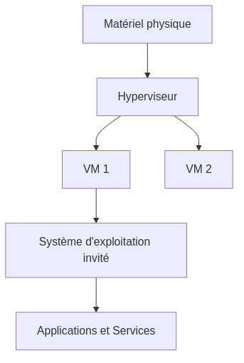
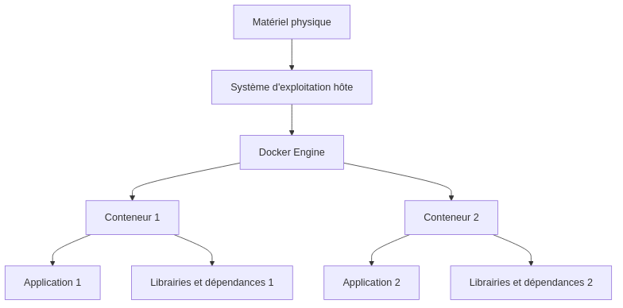
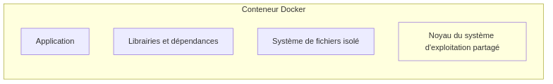
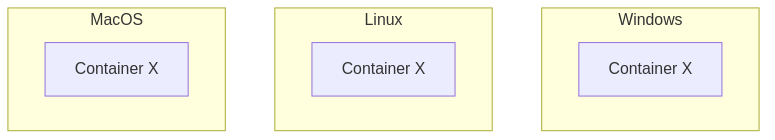

:titre: Introduction
:module: Docker
:duree: 60
:description: Les apprenants découvrent ce qu'est Docker et comment il fonctionne. Ils l'utilisent dans les devcontainers sans comprendre les détails.
include::../../../../adoc/libs/header-module.adoc[]

ifeval::["{visible-on-html}" !=  "yes"]
:docinfo: shared
:docinfodir: ../../../../adoc/libs
endif::[]

== Objectifs pédagogiques

// tag::objectifs[]
// Sous forme de liste à puce, en utilisant la taxonomie de Bloom
* *Comprendre* ce qu'est Docker
// end::objectifs[]

// tag::deroulement[]
== Histoire

Docker a été initialement développé, pour un projet interne de l’*entreprise française dotCloud*, par Solomon Hykes et avec les contributions d’autres employés de cette entreprise.

À partir de *mars 2013*, Docker est distribué en tant que projet *open source* (en partie sous licence Apache 2.0 et en partie sous licence propriétaire).

Docker est *gratuit* à utiliser, mais certaines fonctionnalités avancées sont payantes.

== Concept de conteneurisation

Docker est la plateforme de conteneurisation la plus populaire.

* Un conteneur est une unité logicielle légère qui contient tout le nécessaire pour exécuter une application : code, runtime, bibliothèques, fichiers de configuration, etc. 
* Il est isolé du système hôte et des autres conteneurs.
* Il est portable et peut être exécuté sur n'importe quel système compatible avec Docker.

[NOTE.speaker]
--
Les conteneurs sont une forme de virtualisation légère qui permet d'exécuter des applications dans des environnements isolés. Ils ont complètement révolutionné le développement et le déploiement d'applications.
--

== Différence entre conteneurs et machines virtuelles

Les conteneurs et les machines virtuelles (VM) sont deux technologies de virtualisation qui permettent d'exécuter plusieurs applications sur un même serveur.

[NOTE.speaker]
--
Une VM est une machine virtuelle qui simule un ordinateur physique et exécute un système d'exploitation complet.
--

* Les VM virtualisent le matériel physique, tandis que les conteneurs virtualisent l'OS.
* Les VM sont plus lourdes et nécessitent un hyperviseur, tandis que les conteneurs sont plus légers et partagent le noyau de l'OS hôte.
* Les VM sont plus isolées et sécurisées, tandis que les conteneurs sont plus rapides et plus faciles à gérer.

[NOTE.speaker]
--
Les conteneurs sont plus légers et plus rapides que les VM, mais ils sont aussi moins isolés et sécurisés. Il est important de comprendre les différences entre les deux technologies pour choisir la meilleure solution en fonction des besoins.
--

=== VM

[NOTE.speaker]
--
Ce diagramme montre un serveur physique sur lequel un hyperviseur est installé. L'hyperviseur gère plusieurs machines virtuelles, chacune avec son propre système d'exploitation invité et des applications/services spécifiques.
--

=== Conteneur

[NOTE.speaker]
--
Ce diagramme montre un serveur physique exécutant un système d'exploitation hôte avec un moteur Docker. Le Docker Engine gère plusieurs conteneurs, chaque conteneur ayant ses propres applications et dépendances, mais partageant le noyau du système d'exploitation de l'hôte.
--

== Isolation des applications et des dépendances

Les conteneurs permettent d'isoler les applications et leurs dépendances

* Chaque conteneur a son propre environnement d'exécution, indépendant des autres conteneurs.
* Les dépendances sont encapsulées dans le conteneur, ce qui évite les conflits et les problèmes de compatibilité.

[NOTE.speaker]
--
Le déploiement et la gestion des applications sont grandement simplifiés.
--

== Portabilité des conteneurs

Les conteneurs sont portables et peuvent être exécutés sur n'importe quel système compatible avec Docker.

*Portable* : un conteneur peut être créé et testé localement, puis déployé sur un serveur de production sans modification.

== Images Docker : création, partage et optimisation

Un conteneur est une instance d'une image Docker. Une image Docker est un modèle de conteneur qui contient :

* le code
* les dépendances 
* les configurations nécessaires

[NOTE.speaker]
--
Une instance est une occurrence spécifique d'une image. À partir d'une image, on peut créer plusieurs instances de conteneurs.
-- 

== Écosystème

=== Dockerfile : syntaxe et création d’images personnalisées

Un Dockerfile est un fichier texte qui contient les instructions pour créer une image Docker.

* La configuration se base sur une image (ex. Ubuntu, Alpine, etc.).
** `FROM` : spécifie l'image de base
* Chaque instruction ajoute une couche à l'image.
** `RUN` : exécute une commande
* Une commande peut être exécutée au démarrage du conteneur.
** `CMD` : définit la commande par défaut

link:https://github.com/nodejs/docker-node/blob/0c0069246367ac5ac0fc6bca141fb04faaca2f4b/22/alpine3.20/Dockerfile[Exemple de Dockerfile]

[NOTE.speaker]
-- 
On peut également définir des arguments, des variables d'environnement, des volumes, des ports, etc.
--

=== Registres Docker

DockerHub est l'équivalent de GitHub pour les images Docker. On peut y trouver des images prêtes à l'emploi ou y publier ses propres images.

link:https://hub.docker.com/_/node[Exemple d'images officielles Node.js sur DockerHub]

[NOTE.speaker]
--
Il existe d'autres registres Docker, publics ou privés, qui permettent de stocker et de partager des images Docker. Exemple : Amazon ECR, Google Container Registry, etc.
--

=== Orchestration avec Docker Compose

Docker Compose est un outil qui permet de définir et de gérer des applications multi-conteneurs.

Un fichier `compose.yml` définit :

* les services (liste des conteneurs)
** front
** back
** bdd
* les réseaux
* les volumes

[NOTE.speaker]
--
Docker compose n'est pas un outil de production, bien que compatible. Il est principalement utilisé pour le développement et les tests. Dans le cas de l'orchestration en production, on utilisera Docker Swarm ou Kubernetes.
--

== Sécurité avec Docker

Docker permet d'isoler les applications et les dépendances dans des conteneurs. Cependant, il est important de suivre les bonnes pratiques de sécurité :

* Utiliser des images officielles
* Mettre à jour régulièrement les images
* Limiter les privilèges des conteneurs
* Utiliser des variables d'environnement pour les secrets
* Scanner les images pour détecter les vulnérabilités

[NOTE.speaker]
--
Ce point est avancé et sera abordé plus en détail dans un autre module.
--

== Avantages

* Rapidité : démarrage instantané des conteneurs
* Légèreté : partage du noyau de l'OS hôte
* Portabilité : exécution sur n'importe quel système compatible
* Isolation : indépendance des applications et des dépendances
* Sécurité : isolation des conteneurs

== Cas d’usage

* Développement : environnement de développement isolé
* Tests : exécution des tests dans un environnement contrôlé
* Production : déploiement d'applications dans des conteneurs

[NOTE.speaker]
--
Docker est la pierre angulaire de l'infrastructure moderne et se retrouve dans toutes les couches du cycle de vie d'une application.
--
// end::deroulement[]

// tag::demo[]
== Démonstration

[NOTE.speaker]
--
Lancement de l'image https://hub.docker.com/_/hello-world[hello-world] :

* Voir en detail la page DockerHub
* Lancer l'image en local : `docker run hello-world`
* Décrire les étapes dans le terminal
* Regarder le Dockerfile
* Regarder les images présentes sur la machine : `docker images`
** `docker ps -a` → affiche les conteneurs
--
// end::demo[]

== Conclusion

// tag::conclusion[]
* Docker est une plateforme de conteneurisation populaire qui permet d'exécuter des applications dans des environnements isolés.
* Les conteneurs sont légers, portables et sécurisés.
* Docker simplifie le développement, les tests et le déploiement d'applications.
* C'est un incontournable pour un DevOps.
// end::conclusion[]
