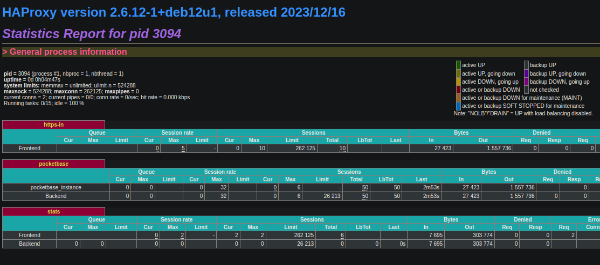

:titre: HAProxy
:module: Flux entrants
:duree: 120
:description: Utiliser HAProxy pour faire du load balancing
include::../../../../adoc/libs/header-module.adoc[]

ifeval::["{visible-on-html}" !=  "yes"]
:docinfo: shared
:docinfodir: ../../../adoc/libs
endif::[]

== Objectifs pédagogiques
// tag::objectifs[]
* Savoir utiliser et configurer HAProxy
* Mettre en application le load balancing
* Comprendre le fonctionnement global de HAProxy
// end::objectifs[]

// tag::deroulement[]

== Premiers pas avec HAProxy

* Installer HAProxy

```sh
sudo apt update && sudo apt upgrade

sudo apt install haproxy
```

* Vérifier le bon fonctionnement de HAProxy

```sh
haproxy -v

sudo systemctl status haproxy
```

=== Configuration de HAProxy

* Éditer le fichier de configuration

```sh
sudo nano /etc/haproxy/haproxy.cfg
```

Sections principales du fichier de configuration :

* `global` : paramètres globaux (logs, utilisateurs, etc.)
* `defaults` : paramètres par défaut pour les sections frontend et backend, ainsi que les timeouts et options logs
* `frontend` : définit comment HAProxy va écouter les requêtes entrantes
* `backend` : définit comment HAProxy va traiter les requêtes et les rediriger vers les serveurs

=== Exemple de configuration

```sh
global
    log /dev/log local0
    log /dev/log local1 notice
    chroot /var/lib/haproxy
    stats socket /run/haproxy/admin.sock mode 660 level admin
    stats timeout 30s
    user haproxy
    group haproxy
    daemon

defaults
    log     global
    option  httplog
    option  dontlognull
    timeout connect 5000ms
    timeout client  50000ms
    timeout server  50000ms

frontend http_front
    bind *:80
    default_backend servers

backend servers
    balance roundrobin # changer ceci pour 'leastconn' ou 'source' selon les besoins
    server server1 192.168.1.1:80 check
    server server2 192.168.1.2:80 check
```

[NOTE.speaker]
--
* `frontend http_front` : Écoute sur le port 80 pour les connexions HTTP entrantes.
* `default_backend servers` : Redirige le trafic vers le backend nommé "servers".
* `backend servers` : Contient deux serveurs (server1 et server2) avec l'algorithme de répartition de charge roundrobin. On peut changer l'algorithme en fonction des besoins.
--

=== Vérification et démarrage

* Vérifier la configuration

```sh
sudo haproxy -c -f /etc/haproxy/haproxy.cfg
```

* Redémarrer HAProxy

```sh
sudo systemctl restart haproxy
```

== Scénarios avancés de load balancing avec HAProxy

* algorithmes de répartition de charge
* configuration des sticky sessions
* offloading SSL

=== Algorithmes de répartition de charge

* `roundrobin` : répartition équitable entre les serveurs
* `leastconn` : répartition vers le serveur avec le moins de connexions
* `source` : répartition basée sur l'adresse IP source

=== Configuration des sticky sessions

* Permet de rediriger les requêtes du même client vers le même serveur
* Utile pour les applications nécessitant une session persistante

* Utiliser la directive `cookie` dans le backend HAProxy

```sh
backend app_servers
    balance roundrobin
    cookie SERVERID insert indirect nocache
    server server1 192.168.1.1:80 check cookie s1
    server server2 192.168.1.2:80 check cookie s2
```

[NOTE.speaker]
--
**Explication** : Ici, un cookie nommé SERVERID est inséré dans la réponse HTTP. Les requêtes suivantes du même utilisateur seront dirigées vers le serveur associé à ce cookie.
--

=== Offloading SSL

* HAProxy peut être utilisé pour décharger le chiffrement SSL des serveurs
* Utilisation de SNI (Server Name Indication) pour rediriger le trafic vers le bon serveur

* Configuration de HAProxy pour offloading SSL

```sh
frontend https_front
    bind *:443 ssl crt /etc/haproxy/certs/mydomain.pem
    default_backend app_servers

backend app_servers
    balance roundrobin
    server server1 192.168.1.1:80 check
    server server2 192.168.1.2:80 check
```

[NOTE.speaker]
--
**Explication** : Le fichier de certificat SSL/TLS (mydomain.pem) est utilisé pour chiffrer les connexions entrantes sur le port 443. HAProxy gère le déchiffrement, puis transmet le trafic en clair aux serveurs backend.
--

== Surveillance et optimisation de HAProxy

HAProxy embarque un tableau de bord de monitoring pour suivre les statistiques et les performances.

=== Interface de statistiques

* Activer l'interface de statistiques dans le fichier de configuration

Il suffit d'ajouter une section `listen` ou `frontend` :

```sh
listen stats
    bind *:8404
    stats enable
    stats uri /haproxy?stats
    stats refresh 10s
    stats auth admin:password
```

* Accéder à l'interface de statistiques à l'adresse `http://IP_HAPROXY:8404/haproxy?stats`

[NOTE.speaker]
--
Explication :
* `*bind :8404` : L'interface de statistiques est accessible via le port 8404.
* `stats uri /haproxy?stats` : Définit l'URL où accéder aux statistiques.
* `stats auth admin:password` : Ajoute une authentification basique pour sécuriser l'accès.
--

=== Interprétation des statistiques



[NOTE.speaker]
--
* Connexions actives : Vérifiez le nombre de connexions actives pour chaque serveur.
* Taux d'erreurs : Surveillez les erreurs pour identifier les serveurs problématiques.
* Temps de réponse : Analysez la latence pour détecter les goulots d'étranglement.
--

=== Logs et diagnostics

Exemple de configuration :

```sh
global
    log /dev/log local0
    log /dev/log local1 notice
    chroot /var/lib/haproxy
    user haproxy
    group haproxy
    daemon

defaults
    log global
    option httplog
    option dontlognull
    timeout connect 5000ms
    timeout client  50000ms
    timeout server  50000ms
```

[NOTE.speaker]
--
**Utilisation des logs :**

* Analyse des erreurs : Identifiez les erreurs 4xx et 5xx pour comprendre les problèmes côté client ou serveur.
* Suivi des performances : Surveillez les temps de réponse et les anomalies dans les logs pour détecter les problèmes de performance.
--

=== Tuning des performances

**Ajustements courants :**

* Timeouts : Ajustez les valeurs de timeout pour éviter les connexions inutiles ou bloquées.
** `timeout connect` : Temps d'attente pour établir une connexion avec le serveur backend.
** `timeout client` et `timeout server` : Temps d'attente pour les échanges de données avec le client et le serveur.
* Maxconn : Ajustez le nombre maximum de connexions simultanées acceptées.
** `frontend maxconn` : Contrôle les connexions entrantes.
** `server maxconn` : Limite les connexions par serveur backend.

include::../../../../adoc/libs/slide-notitle.adoc[]

* Threading : Activez le support multithreading pour exploiter au mieux les ressources CPU.
* Ajoutez `nbthread` dans la section `global` pour spécifier le nombre de threads.

[NOTE.speaker]
--
**Conseils supplémentaires :**

* Effectuez des tests de charge pour identifier les points faibles.
* Surveillez les métriques de performance de manière continue pour ajuster les paramètres en fonction des évolutions du trafic.
--

// tag::demo[]

== Démonstration

Mettre en place un load balancer "à la main" avec HAProxy.

[NOTE.speaker]
--

Pour cette démo il faut avoir **3 VM Debian prêtes à l'emploi**. Pas besoin de beaucoup de ressources, 1GB de RAM / VM suffit.

**1 VM va servir de load balancer, les 2 autres seront les serveurs web.**

Il est important que les 3 VM soient sur le **même réseau**, sur VirtualBox par exemple, il suffit d'activer le mode pont (ou bridge) pour chaque VM.

**Configuration des serveurs web**

* Installer `curl` : `sudo apt install curl`

* Installer `pnpm` : `curl -fsSL https://get.pnpm.io/install.sh | sh -`

* Sourcer le fichier `.bashrc` : `source ~/.bashrc`

* Créer une application React : `pnpm create vite`
** Taper le nom du projet `app` et sélectionner `React` puis `Typescript`

* Se rendre dans l'app : `cd app` et modifier le fichier `src/App.tsx` et y ajouter dans le titre de la page "Serveur A"

* Installer les dépendances : `pnpm install` et lancer le serveur de développement : `pnpm dev`

* Vérifier sur la machine hôte qu'on a bien accès à l'application en allant sur `http://IP_SERVEUR:5173`

* Répéter ce processus pour la 2ème VM mais en modifiant le titre de la page en "Serveur B"

**Configuration du load balancer**

* Installer HAProxy : `sudo apt update && sudo apt upgrade && sudo apt install haproxy`

* Éditer le fichier de configuration : `sudo nano /etc/haproxy/haproxy.cfg`

* Ajouter la configuration suivante :

```sh
global
    log /dev/log local0
    log /dev/log local1 notice
    chroot /var/lib/haproxy
    stats socket /run/haproxy/admin.sock mode 660 level admin
    stats timeout 30s
    user haproxy
    group haproxy
    daemon

defaults
    log     global
    option  httplog
    option  dontlognull
    timeout connect 5000ms
    timeout client  50000ms
    timeout server  50000ms

frontend http_front
    bind *:80
    default_backend servers

backend servers
    balance roundrobin
    server server1 IP_SERVEUR_A:5173 check
    server server2 IP_SERVEUR_B:5173 check
```

* Vérifier la configuration : `sudo haproxy -c -f /etc/haproxy/haproxy.cfg`

* Redémarrer HAProxy : `sudo systemctl restart haproxy`

* Vérifier que le load balancer fonctionne en allant sur `http://IP_LOAD_BALANCER`

* Tester la répartition de charge en rafraîchissant la page plusieurs fois, vous devriez voir les titres des serveurs changer.
--

// end::demo[]

// end::deroulement[]

== Conclusion
// tag::conclusion[]
* HAProxy est un outil puissant pour le load balancing et la gestion du trafic.
* La configuration de HAProxy nécessite une compréhension approfondie des concepts de frontend, backend, et des algorithmes de répartition de charge.
* Les fonctionnalités avancées telles que les sticky sessions et l'offloading SSL permettent de répondre à des besoins spécifiques.
* La surveillance et l'optimisation de HAProxy sont essentielles pour garantir des performances optimales et une haute disponibilité.
// end::conclusion[]