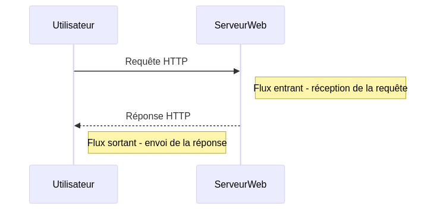
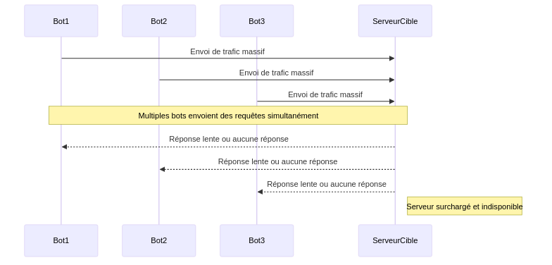
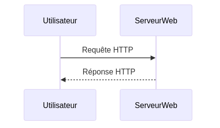
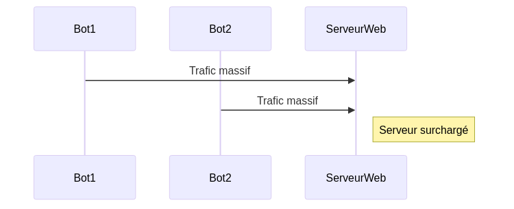
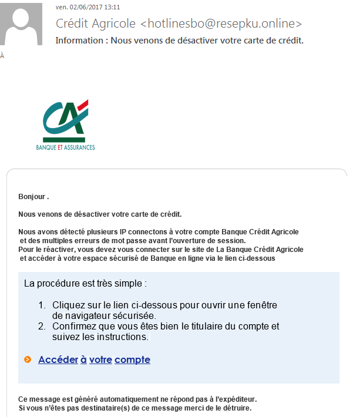

:titre: Introduction aux flux entrants
:module: Réseau
:duree: 60
:description: Ce module présente les flux entrants dans un réseau, les différents types de flux et les mécanismes de sécurité pour les protéger.
include::../../../../adoc/libs/header-module.adoc[]

ifeval::["{visible-on-html}" !=  "yes"]
:docinfo: shared
:docinfodir: ../../../../adoc/libs
endif::[]

== Objectifs pédagogiques

// tag::objectifs[]
* Comprendre la notion de flux entrants dans un réseau
* Identifier les différents types de flux entrants
* Connaître les principaux mécanismes de sécurité pour protéger les flux entrants
// end::objectifs[]

// tag::deroulement[]

== Les flux entrants

* désignent l'ensemble des données qui arrivent dans un réseau ou une partie d'un réseau depuis l'extérieur
* sont cruciaux pour toutes sortes d'applications, qu'elles soient web, cloud ainsi que les réseaux d'entreprise
* permettent aux utilisateurs d'accéder à des services, de télécharger des fichiers, de regarder des vidéos, etc.

=== Exemples de flux entrants

* Un utilisateur accédant à un site web envoie une requête au serveur du site. La requête, ainsi que les données associées qui entrent dans le réseau de l'hébergeur, constituent un flux entrant.
* Les emails entrants reçus par un serveur de messagerie.
* Les données de capteurs envoyées à un serveur central dans un réseau IoT.

include::../../../../adoc/libs/slide-notitle.adoc[]

== Flux sortants

* se réfèrent au trafic qui quitte un réseau vers l'extérieur
* incluent les réponses aux requêtes, les envois de données, les mises à jour, etc.
* sont essentiels pour fournir des services et des informations aux utilisateurs extérieurs ou à d'autres systèmes

=== Exemples de flux sortants

* Les pages web envoyées par le serveur en réponse aux requêtes des utilisateurs.
* Les emails envoyés depuis un serveur de messagerie vers des destinataires extérieurs.
* Les données transmises par un serveur vers des appareils clients, comme des mises à jour logicielles.

== Différence entre flux entrants et sortants

[NOTE.speaker]
--
Explication du diagramme :

**Utilisateur** : Représente la personne ou le système qui interagit avec le serveur web.
**ServeurWeb** : Représente le serveur qui reçoit et répond aux requêtes HTTP.

* **Flux entrant** :

** L'utilisateur envoie une requête HTTP au serveur web.
** Le serveur web reçoit cette requête. Ce processus est désigné comme un "flux entrant" car les données de la requête entrent dans le serveur.

* **Flux sortant** :

** Après avoir traité la requête, le serveur web envoie une réponse HTTP à l'utilisateur.
** L'envoi de cette réponse constitue un "flux sortant", car les données quittent le serveur pour atteindre l'utilisateur.

Ce diagramme met clairement en évidence les deux types de flux en termes de direction des données par rapport au serveur web.
--

== Surveillance des flux

* l'analyse de paquets de données permet d'identifier des signatures de menaces inconnues
** du type : virus, vers, malwares...
* l'analyse en profondeur des paquets (DPI) permet :
** d'examiner l'entête et le contenu des paquets
** de détecter des comportements ou des contenus suspects

== Filtrage des flux

=== Pares-feux

* la mise en place de pares-feux (_firewalls_) permet de bloquer les flux entrants non autorisés
** via des règles prédéfinies
** en fonction de l'adresse IP, du port, du protocole, etc.
* les pare-feux de nouvelle génération (NGFW) intègrent :
** l'inspection des applications
** la détection des menaces

include::../../../../adoc/libs/slide-notitle.adoc[]

image::./assets/pare-feu-ac.png[]

=== Systèmes de détection et de prévention d'intrusion (IDS/IPS)

* **IDS (Intrusion Detection System)** : surveille le trafic réseau et génère des alertes en cas d'activité suspecte
* **IPS (Intrusion Prevention System)** : bloque automatiquement le trafic suspect

=== Listes de contrôle d'accès (ACL)

* permettent de contrôler le trafic entrant et sortant en fonction de critères tels que :
** l'adresse IP
** le port
** le protocole

== Gestion des accès

On doit contrôler qui peut envoyer des données vers les infrastructures internes

=== Politiques d'accès

* définissent les règles d'accès aux ressources
* permettent de limiter les risques de fuites de données
* doivent être basées sur le principe du moindre privilège

[NOTE.speaker]
--
Le principe du moindre privilège consiste à accorder aux utilisateurs uniquement les droits et les permissions nécessaires pour effectuer leur travail. Cela permet de limiter les risques de fuites de données et de compromission des systèmes.
--

=== Contrôles d'accès basés sur les rôles (RBAC)

* attribuent des droits en fonction du rôle de l'utilisateur
* permettent de gérer les accès de manière centralisée
* facilitent la gestion des droits et des permissions

=== Technologies pour gérer les flux entrants

* **listes blanches et noires** : permettent de bloquer ou d'autoriser des adresses IP, des ports, des protocoles, etc.
* **Contrôles d'accès réseau (NAC)** : vérifient la conformité des appareils avant de leur accorder l'accès au réseau
* **VPN (Virtual Private Network)** : permettent de sécuriser les communications entre des réseaux distants
* **DMZ (zone démilitarisée)** : segmentent les réseaux internes et externes pour renforcer la sécurité
* **IAM (Identity and Access Management)** : gèrent les identités et les accès des utilisateurs

=== Objectifs

* réduire les menaces
* protéger les données sensibles
* garantir la disponibilité des services
* respecter les réglementations en matière de sécurité

== Chiffrement et authentification

Ils assurent que les données transmises sont sécurisées et que seules les entitées autorisées peuvent y accéder

=== Importance du chiffrement

* protège les données contre l'interception et la lecture par des tiers
* garantit l'intégrité des données
* assure la confidentialité des communications

=== Protocoles HTTPS et SSL/TLS

* **HTTPS (HyperText Transfer Protocol Secure)** : protocole de communication sécurisé sur Internet, protège contre l'interception de données
* **SSL/TLS (Secure Sockets Layer/Transport Layer Security)** : protocoles de chiffrement pour sécuriser les communications

=== Importance de l'authentification forte

* vérifie l'identité des utilisateurs et des systèmes
* empêche l'accès non autorisé aux données et aux services
* renforce la sécurité des réseaux et des applications

=== Mécanismes d'authentification

* **Authentification multi-facteurs** : combine plusieurs méthodes pour vérifier l'identité de l'utilisateur
* **Certificats numériques** : garantissent l'authenticité des entités et des communications

== Exemples d'attaques sur les flux entrants

=== Attaques par déni de service (DDoS)

* visent à saturer les ressources d'un serveur ou d'un réseau
* empêchent les utilisateurs légitimes d'accéder aux services
* peuvent causer des pertes financières et une mauvaise réputation

include::../../../../adoc/libs/slide-notitle.adoc[]

=== Injection de malwares

* consiste à insérer des logiciels malveillants dans un réseau ou un système
* peut entraîner des vols de données, des dommages aux systèmes et des pertes financières

=== Exploitation de vulnérabilités

* les failles de sécurité dans les logiciels et les systèmes peuvent être exploitées par des attaquants
* permettent d'accéder à des données sensibles, de prendre le contrôle de systèmes, etc.

=== Phishing et ingénierie sociale

* techniques visant à tromper les utilisateurs pour obtenir des informations sensibles
* peuvent conduire à des vols d'identité, des fraudes financières, etc.

// tag::demo[]

== Démonstration

https://cloudflare.com/fr-fr/learning/ddos/famous-ddos-attacks/[Article sur les attaques DDoS]

[NOTE.speaker]
--
On recommande de lire l'article ci-dessus mais voici un résumé :

* En octobre 2024, Cloudflare a atténué la plus grande attaque DDoS jamais enregistrée.
** L'attaque a atteint un pic de 5,6 térabits par seconde.
** Cette attaque faisait partie d'une campagne hyper-volumétrique.

* En octobre 2023, Google a subi une attaque exploitant une faille du protocole HTTP/2.
** L'attaque a atteint 398 millions de requêtes par seconde.
** Les attaquants annulaient immédiatement les requêtes envoyées pour saturer les serveurs.

* En 2016, l'attaque contre Dyn a causé des perturbations majeures sur Internet.
** Des services comme Netflix et PayPal ont été affectés.
** L'attaque a utilisé le botnet Mirai, exploitant des appareils IoT mal sécurisés.

* En 2018, GitHub a été ciblé par une attaque utilisant le système memcached.
** Cette attaque a amplifié le trafic par un facteur d'environ 50 000.

* En 2013, Spamhaus a subi une attaque massive qui a perturbé Londres.
** L'attaque visait à neutraliser le filtrage des courriers indésirables.

* Ces incidents montrent l'ampleur des menaces DDoS.
* Les entreprises comme Cloudflare et Google développent des solutions d'atténuation.
* Même des attaques DDoS de moindre envergure peuvent causer des interruptions.
* Il est crucial pour les entreprises de renforcer leur résilience face à ces menaces.

Bien sûr, plus on est un acteur important, plus on est susceptible d'être attaqué, et plus les équipes sont denses et préparées pour contrer ces attaques.
--

// end::demo[]

// tag::exercice[]

== Exercice

Dans les slides suivants, il faut reconnaître les différents types de flux entrants et/ou d'attaques courantes.

Mettez votre réponse dans le chat :)

include::../../../../adoc/libs/slide-notitle.adoc[]

[NOTE.speaker]
--
Requête web standard
--

include::../../../../adoc/libs/slide-notitle.adoc[]

[NOTE.speaker]
--
Attaque DDoS
--

include::../../../../adoc/libs/slide-notitle.adoc[]

[NOTE.speaker]
--
Phishing email
--

// end::exercice[]

// end::deroulement[]

== Conclusion
// tag::conclusion[]
* Compréhension de la notion de flux entrants dans un réseau
* Capacité à identifier les différents types de flux entrants
* Connaissance des principaux mécanismes de sécurité pour protéger les flux entrants
// end::conclusion[]