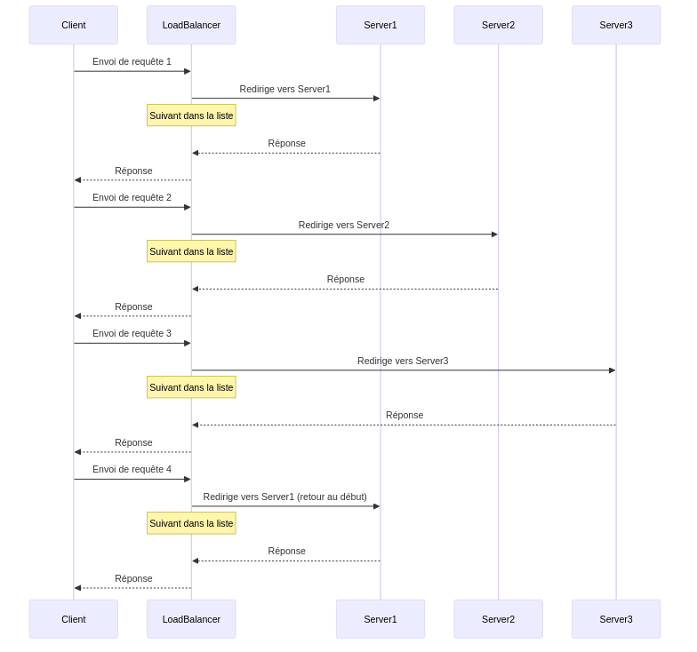
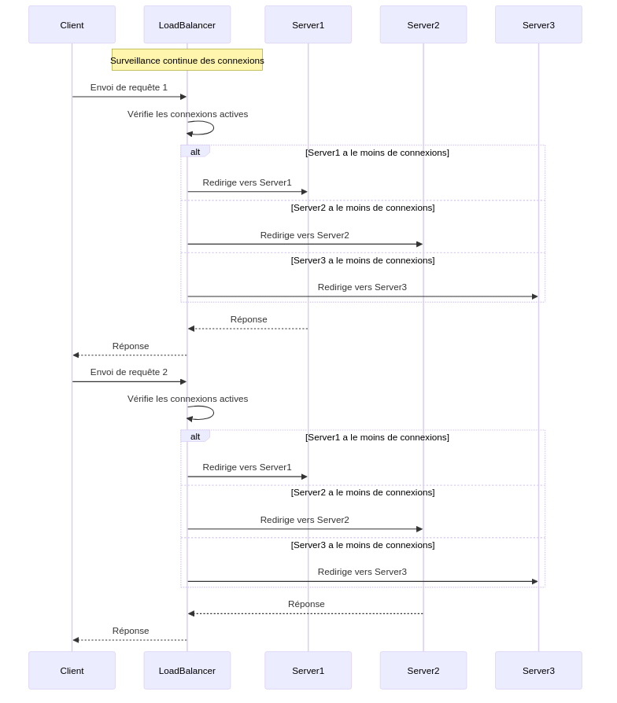
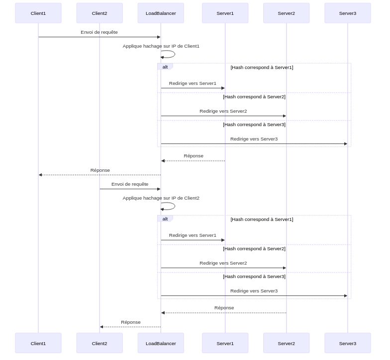

:titre: Load Balancing
:module: Flux entrants
:duree: 30
:description: Comprendre la répartition de charge
include::../../../../adoc/libs/header-module.adoc[]

ifeval::["{visible-on-html}" !=  "yes"]
:docinfo: shared
:docinfodir: ../../../adoc/libs
endif::[]

== Objectifs pédagogiques
// tag::objectifs[]
* Comprendre les principes de la répartition de charge
* Connaître les différents types d'algorithmes de répartition
* Découvrir les avantages du load balancing pour la gestion des flux entrants
// end::objectifs[]

// tag::deroulement[]

== Introduction au load balancing

* technique essentielle qui vise à distribuer le trafic réseau de manière équilibrée sur plusieurs serveurs
* permet d'assurer une performance optimale
* maximise l'utilisation des ressources disponibles
* évite la surcharge d'un serveur et donc les temps de réponse trop longs

== Types de répartition

=== Round Robin

[cols="1,1,1"]
|===
| Principe | Avantages | Inconvénients

a|
* méthode simple et efficace qui distribue les requêtes de manière équitable
* chaque serveur reçoit une requête à tour de rôle
* revient au premier serveur une fois que tous les serveurs ont été sollicités
a|
* facile à mettre en place
* ne nécessite pas de maintenance particulière
a|
* ne prend pas en compte la charge des serveurs
* ne garantit pas une répartition équitable si les serveurs n'ont pas les mêmes capacités

|===

include::../../../../adoc/libs/slide-notitle.adoc[]

[NOTE.speaker]
--
**Explications :**

* Client : L'entité qui envoie les requêtes.
* LoadBalancer : Le répartiteur de charge qui distribue les requêtes selon la méthode Round Robin.
* Servers (Server1, Server2, Server3) : Les serveurs disponibles pour traiter les requêtes.
* Cycle : Chaque requête est dirigée vers le serveur suivant dans l'ordre, et une fois le dernier serveur atteint, le cycle recommence avec le premier serveur.

**Avantages et Limitations :**

* Avantages : Simple à implémenter, ne nécessite pas de suivi continu des charges des serveurs.
* Limitations : Ne prend pas en compte la charge actuelle ou les performances des serveurs, ce qui peut entraîner une répartition inégale si les capacités des serveurs varient.
--

=== Least Connections

[cols="1,1,1"]
|===
| Principe | Avantages | Inconvénients

a|
* distribue les requêtes vers le serveur ayant le moins de connexions en cours
* permet de minimiser la charge des serveurs en temps réel
a|
* adapté aux environnements où les serveurs ayant des capacités différentes
* ou lorsque le temps de traitement des requête varie considérablement
a|
* nécessite un suivi régulier de la charge des serveurs
* peut être plus complexe à mettre en place

|===

include::../../../../adoc/libs/slide-notitle.adoc[]

[NOTE.speaker]
--
**Explications :**

* Client : L'entité qui envoie les requêtes.
* LoadBalancer : Le répartiteur de charge qui surveille en temps réel le nombre de connexions actives sur chaque serveur.
* Servers (Server1, Server2, Server3) : Les serveurs disponibles pour traiter les requêtes.
* Surveillance continue : Le LoadBalancer surveille le nombre de connexions actives sur chaque serveur pour déterminer lequel a le moins de connexions.

**Avantages et Limitations :**

* Avantages : Idéal pour des environnements où les serveurs ont des capacités différentes ou des temps de traitement variables, permettant une répartition plus équilibrée.
* Limitations : Nécessite une surveillance continue des connexions, ajoutant de la complexité à la configuration et potentiellement à la maintenance.
--

=== IP Hashing

[cols="1,1,1"]
|===
| Principe | Avantages | Inconvénients

a|
* distribue les requêtes en fonction de l'adresse IP du client
* un algorithme de hachage est utilisé pour déterminer le serveur à utiliser
a|
* permet de conserver la session d'un client sur le même serveur
* utile pour les applications nécessitant une session persistante
a|
* moins flexible que les autres méthodes
* peut nécessiter un recalcul de l'algorithme de hachage si un serveur est ajouté ou retiré

|===

include::../../../../adoc/libs/slide-notitle.adoc[]

[NOTE.speaker]
--
**Explications :**

* Client1 et Client2 : Les entités qui envoient des requêtes.
* LoadBalancer : Le répartiteur de charge qui utilise l'adresse IP du client pour déterminer le serveur de destination via un algorithme de hachage.
* Servers (Server1, Server2, Server3) : Les serveurs disponibles pour traiter les requêtes.
* Hachage : Un algorithme de hachage est appliqué à l'adresse IP du client pour assurer la persistance des sessions en dirigeant toujours les requêtes d'un même client vers le même serveur.

**Avantages et Limitations :**

* Avantages : Maintient la persistance des sessions, essentiel pour les applications nécessitant un état de session stable.
* Limitations : Moins flexible pour l'ajout ou le retrait de serveurs, car cela nécessite un recalcul du hachage pour tous les clients, ce qui peut perturber la persistance des sessions.
--

== Avantages du load balancing pour la gestion des flux entrants

=== Scalabilité

[cols="1,1"]
|===

| Ajout de serveurs
| Adaptation dynamique

a|
* permet d'ajouter des serveurs pour gérer une charge croissante
* évite la surcharge des serveurs existants
a|
* ajuste automatiquement la répartition des requêtes en fonction de la charge
* garantit une performance optimale

|===

=== Haute disponibilité

[cols="1,1"]
|===

| Redondance
| Surveillance et détection de pannes

a|
* assure la continuité du service en cas de panne d'un serveur
* les autres serveurs prennent le relais
* évite les temps d'indisponibilité
a|
* surveille en temps réel l'état des serveurs
* détecte les pannes et les déconnexions
* réagit rapidement pour rétablir le service

|===

=== Optimisation des performances

[cols="1,1"]
|===

| Réduction de la charge
| Utilisation efficace des ressources

a|
* répartit équitablement les requêtes pour éviter la surcharge
* améliore la réactivité et la vitesse de réponse
a|
* maximise l'utilisation des ressources disponibles
* évite les temps morts et les ralentissements

|===

=== Equilibrage de charge

[cols="1,1"]
|===

| Répartition équitable
| Flexibilité des algorithmes

a|
* assure une distribution équilibrée des requêtes
* minimise les goulets d'étranglement
a|
* permet de choisir l'algorithme le plus adapté (round robind, least connections, IP hashing)
* en fonction des besoins et des contraintes

|===

== Quelques outils de load balancing

=== HAProxy

[cols="1,1,1"]
|===

| Présentation | Caractéristiques | Cas d'utilisation

a|
* logiciel open-source de répartition de charge
* équilibrage de charge TCP et HTTP
* haute disponibilité et tolérance aux pannes
a|
* supporte plusieurs algorithmes de répartition
* configuration flexible et puissante
* surveillance en temps réel
a|
* sites web à fort trafic
* applications nécessitant une haute disponibilité
* environnements cloud et conteneurisés

|===

=== Nginx

[cols="1,1,1"]
|===

| Présentation | Caractéristiques | Cas d'utilisation

a|
* serveur web open-source
* fonctionnalités de répartition de charge
* capable de gérer un grand nombre de connexions simultanées
a|
* supporte les protocoles HTTP, TCP et UDP
* mise en cache intégrée
* configuration simple et flexible
a|
* applications web à fort trafic
* applications nécessitant un reverse proxy et une mise en cache

|===

=== Apache Traffic Server

[cols="1,1,1"]
|===

| Présentation | Caractéristiques | Cas d'utilisation

a|
* serveur proxy et cache open-source
* hautement évolutif et performant
a|
* mise en cache
* supporte le reverse proxy
* extensible via des plugins
* utilisé par des grandes entreprises
a|
* applications nécessitant une mise en cache efficace
* sites web à fort trafic

|===

=== Amazon Elastic Load Balancing

[cols="1,1,1"]
|===

| Présentation | Caractéristiques | Cas d'utilisation

a|
* service de répartition de charge géré par AWS
* distribue le trafic sur plusieurs instances EC2
a|
* intégration avec d'autres services AWS
* supporte les répartitions de charge ALB, NLB et CLB
* surveillance et gestion automatisée
a|
* applications hébergées sur AWS
* architectures cloud évolutives

|===

=== Microsoft Azure Load Balancer

[cols="1,1,1"]
|===

| Présentation | Caractéristiques | Cas d'utilisation

a|
* service de répartition de charge géré par Microsoft Azure
* distribue le trafic sur plusieurs machines virtuelles
a|
* support TCP et UDP
* haute disponibilité et tolérance aux pannes
* intégration avec d'autres services Azure
* surveillance et gestion automatisée
a|
* applications hébergées sur Azure
* architectures cloud évolutives

|===

// end::deroulement[]

== Conclusion
// tag::conclusion[]
* La répartition de charge est une technique essentielle pour garantir la performance et la disponibilité des applications.
* Différents types d'algorithmes de répartition permettent d'adapter la distribution des requêtes aux besoins spécifiques.
* Les outils de load balancing tels que HAProxy, Nginx, Apache Traffic Server, Amazon ELB et Azure Load Balancer offrent des fonctionnalités avancées pour gérer le trafic réseau.
* On va utiliser HAProxy car il est open-source, flexible et puissant, et adapté à une grande variété de cas d'utilisation.
// end::conclusion[]