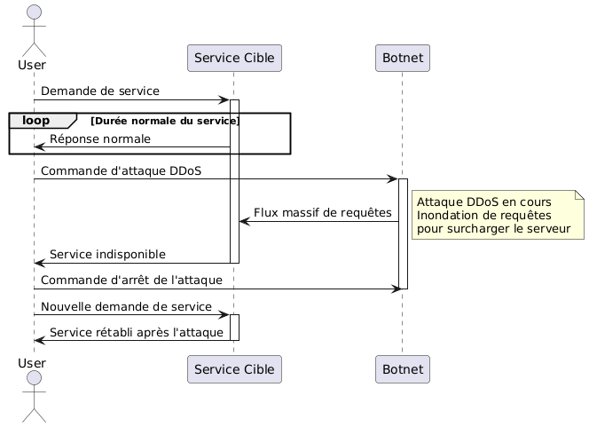

:titre: Bases de la sécurité réseau
:module: Flux entrants
:duree: 150
:description: Connaître les principes de base de la sécurité réseau et les outils pour sécuriser un réseau.
include::../../../../adoc/libs/header-module.adoc[]

ifeval::["{visible-on-html}" !=  "yes"]
:docinfo: shared
:docinfodir: ../../../adoc/libs
endif::[]

== Objectifs pédagogiques
// tag::objectifs[]
* Comprendre l’importance de la sécurité réseau
* Connaître les principales menaces et attaques envers un réseau
* Comprendre les outils de réseau sous Linux
// end::objectifs[]

// tag::deroulement[]
== Comprendre la sécurité réseau

=== Importance de la sécurité réseau

* **protection des données sensibles** : les données peuvent être interceptées, modifiées ou supprimées par des individus non autorisés
* **confidentialité** : pour protéger la vie privée des utilisateurs et préserver la réputation des organismes
* **maintien de la disponibilité des services** : un service mis hors d’usage peut être préjudiciable pour une organisation
* **intégrité des données** : pour éviter que les données ne soient altérées dans leur transport

=== Menaces et attaques courantes

* **déni de service (DDoS)** : vise à submerger un serveur, un service ou une infrastructure réseau pour le rendre indisponible
* **phishing** : e-mails ou sites malveillants destinés à récolter des informations personnelles ou sensibles (mots de passe, carte bancaire, etc.)
* **force brute** : tente de deviner les identifiants d’accès en essayant toutes les combinaisons possibles
* **déni de service distribué (DDoS)** : les attaques distribuées utilisent plusieurs machines pour coordonner une attaque DDoS, augmentant sa puissance et étant plus difficile à neutraliser

=== Représentation d’une attaque DDoS



[NOTE.speaker]
--
* **Demande de service** : L'utilisateur envoie une demande de service au service cible.
* **Réponse normale** : En situation normale, le service cible répond à la demande de l'utilisateur et la boucle continue tant que le service est demandé et disponible.

La boucle indique la durée normale pendant laquelle le service fonctionne sans interruption.

* **Commande d'attaque DDoS** : À un certain moment, une commande d'attaque DDoS est envoyée au botnet.
* **Flux massif de requêtes** : Le botnet commence à envoyer un flux massif de requêtes au service cible dans le but de le surcharger.
* **Service indisponible** : Le service cible devient indisponible en raison de la surcharge causée par le botnet.
* **Commande d'arrêt de l'attaque** : Une commande est envoyée au botnet pour arrêter l'attaque DDoS.
* **Nouvelle demande de service** : Après l'arrêt de l'attaque, l'utilisateur envoie une nouvelle demande de service au service cible.
* **Service rétabli après l'attaque** : Le service cible est à nouveau disponible et répond à la demande de l'utilisateur.
--

=== Représentation d’une attaque phishing

image::./assets/01-phishing.png[]

[NOTE.speaker]
--
* **Clic sur un lien suspect** : L'utilisateur clique sur un lien qui semble suspect.
* **Affiche une page de connexion falsifiée** : Le site web de phishing affiche une page de connexion qui imite le site légitime.
* **Soumission de ses identifiants** : L'utilisateur, croyant que la page est légitime, soumet ses identifiants (nom d'utilisateur, mot de passe, etc.).
* **Capture des identifiants** : Le site web de phishing capture les identifiants soumis par l'utilisateur.
* **Redirection vers le site réel** : Après avoir capturé les identifiants, le site web de phishing redirige l'utilisateur vers le site réel, pour éviter de susciter des soupçons.
--

// tag::demo[]
== Démonstration

**Attaque par force brute**

[NOTE.speaker]
--
Utiliser hydra pour montrer l’attaque brute force sur le SSH d’un serveur ou une VM Linux

`hydra -l user -P /path/to/password/list.txt ssh://<IP_VM>`
--
// end::demo[]

== Outils de réseau Linux

=== Principaux outils de diagnostic réseau Linux

* ping
* traceroute
* ip
* netstat

[NOTE.speaker]
--
* **Ping** : Utilisé pour vérifier la connectivité réseau entre deux machines en envoyant des paquets ICMP et en mesurant le temps de réponse, essentiel pour diagnostiquer les problèmes de connectivité.
* **Traceroute** : Permet de tracer le chemin pris par les paquets à travers le réseau en identifiant chaque saut intermédiaire (routeur) jusqu'à atteindre la destination, utile pour localiser les goulots d'étranglement et les interruptions.
* **Ip** : Commande polyvalente pour configurer les interfaces réseau, consulter les tables de routage IP et les informations d'adresse IP, essentielle pour gérer la configuration réseau sur Linux.
* **Netstat** : Fournit des informations détaillées sur les connexions réseau actives, les tables de routage, les statistiques d'interface et les ports en écoute, facilitant le diagnostic des problèmes de performance et de sécurité réseau.
--

=== `ping`

[cols="2,8"]
|===

a| **Définition**
a|
Commande utilisée pour tester la connectivité réseau entre deux hôtes en envoyant des paquets ICMP Echo Request et en attendant les réponses ICMP Echo Reply.

a| **Utilisation**
a|
Sert à vérifier si un hôte distant est accessible via le réseau et pour mesurer le temps nécessaire pour envoyer et recevoir des paquets.

a| **Syntaxe**
a|
```shell
ping [options] destination
```

|===

// tag::demo[]
=== Démonstration

**Utilisation de la commande ping**

[NOTE.speaker]
--
* Faire un ping de google.com
* Expliquer les valeurs retournées par le ping
--
// end::demo[]

=== `traceroute`

[cols="2,8"]
|===

a| **Définition**
a|
Permet de suivre le chemin qu'un paquet IP prend pour atteindre une destination en listant tous les sauts (routeurs) intermédiaires traversés.

a| **Utilisation**
a|
Diagnostiquer les problèmes de routage réseau en identifiant les étapes entre l'ordinateur local et une destination spécifique.

a| **Syntaxe**
a|
```shell
traceroute [options] destination
```

|===

// tag::demo[]
=== Démonstration

**Utilisation de la commande traceroute**

[NOTE.speaker]
--
* Faire un traceroute de google.com
* Expliquer les valeurs retournées par le traceroute
--
// end::demo[]

=== `ip`

[cols="2,8"]
|===

a| **Définition**
a|
Permet de configurer et d'afficher les paramètres des interfaces réseau, comme les adresses IP, les masques de sous-réseau et les adresses MAC.

a| **Utilisation**
a|
Examiner et configurer les interfaces réseau d'un système Linux.

a| **Syntaxe**
a|
```shell
ip [options] object
```

|===

// tag::demo[]
=== Démonstration

**Utilisation de la commande ip**

[NOTE.speaker]
--
* Faire la commande ip address 
* Expliquer les valeurs retournées par la commande
--
// end::demo[]

=== `netstat`

[cols="2,8"]
|===

a| **Définition**
a|
Permet de visualiser les connexions réseau en cours, les tables de routage, les interfaces réseau et les statistiques sur les protocoles en cours d'utilisation.

a| **Utilisation**
a|
Diagnostiquer les problèmes réseau, surveiller l'activité réseau et vérifier les connexions actives.

a| **Syntaxe**
a|
```shell
netstat [options]
```

|===

// tag::demo[]
=== Démonstration

**Utilisation de la commande netstat**

[NOTE.speaker]
--
* Faire la commande netstat -an 
* Expliquer les valeurs retournées par la commande
--
// end::demo[]

== Gestion des utilisateurs

=== Généralités :

* **On ne travaille jamais dans le compte `root`** : la moindre erreur peut endommager les données ou le système d’exploitation
* Sur un système nouvellement installé, on commence par **créer un utilisateur normal** à partir duquel on effectuera les opérations quotidiennes
* `root` doit être réservé aux **tâches d’administration**, il faut toujours **vérifier deux fois** avant de lancer une commande
* Lorsque la machine peut être accédée **à distance**, la bonne pratique est de **restreindre la connexion au compte `root`** depuis l’extérieur afin de se prémunir de tout risque
* Dès que possible, il faut **bannir l’utilisation de login / mot de passe** au profit des clés SSH, notamment pour des utilisateurs avec des permissions élevées

=== Comptes utilisateurs :

* Chaque utilisateur doit avoir son propre accès via la commande `useradd`
* Paramétrer finement les permissions avec par exemple `chmod`, `chown`, `usermod`. Utiliser les groupes pour une gestion de droits commune à plusieurs utilisateurs.

=== Restriction de `sudo`

* Restreindre les commandes que les utilisateurs peuvent exécuter avec `sudo`.
** Modifier le fichier `/etc/sudoers` pour définir des permissions spécifiques :

```shell
nouvel_utilisateur ALL=(ALL:ALL) /usr/bin/apt-get
```

* Activer la journalisation pour suivre les actions exécutées avec `sudo`.
** Utiliser `visudo` pour ajouter les directives de journalisation

```shell
Defaults logfile=/var/log/sudo.log
```

// tag::demo[]
=== Démonstration

**Restreindre et surveiller la commande sudo**

[NOTE.speaker]
--
* Créer un nouvel utilisateur avec `adduser`
* Se connecter avec cet utilisateur et montrer la commande `sudo apt update` -> pas de permissions suffisantes
* Passer sur utilisateur du groupe sudo et ouvrir `visudo`
* Permettre à un nouvel utilisateur d’exécuter `/usr/bin/apt` avec `sudo` en ajoutant la ligne suivante :

```shell
nouvel_utilisateur ALL=(ALL:ALL) /usr/bin/apt-get
```

* Se connecter à l’utilisateur dont on vient de modifier les droits, et tester la commande `sudo apt update` -> ça fonctionne
* Montrer que d’autres commandes `sudo` ne sont pas accessibles, exemple `sudo visudo`
* Activer la journalisation en ajoutant la ligne suivante à `visudo`

```shell
Defaults logfile=/var/log/sudo.log
```

* Se rendre sur l’utilisateur n’ayant que les droits apt et relancer la commande sudo apt update puis lancer une commande non autorisée, par exemple sudo iptables
* Vérifier le contenu du fichier de log avec la commande sudo cat /var/log/sudo.log et montrer que toutes les actions sont répertoriées
--
// end::demo[]


=== Restriction des Accès SSH

* **Accès par Clé Publique** : Utiliser des clés SSH pour l'authentification au lieu de mots de passe.
** Ajouter les clés publiques des utilisateurs dans `~/.ssh/authorized_keys`.
* **Désactivation de Root SSH** : Désactiver l'accès SSH direct pour l'utilisateur root.
** Modifier `/etc/ssh/sshd_config` pour inclure :

```shell
PermitRootLogin no
```

include::../../../../adoc/libs/slide-notitle.adoc[]

* **Limitation des Utilisateurs SSH** : Limiter les utilisateurs autorisés à se connecter via SSH.
** Ajouter au fichier `/etc/ssh/sshd_config` :

```shell
AllowUsers nouvel_utilisateur
```

// tag::demo[]
=== Démonstration

**Accès SSH sécurisé**

[NOTE.speaker]
--
* Montrer comment générer une clé SSH sur la machine cliente

```shell
ssh-keygen -t rsa -b 4096 -C "votre_email@example.com"
```

* Copier la clé publique sur le serveur.

```shell
ssh-copy-id nouvel_utilisateur@serveur_ip
```

* Vérifier que la clé publique a été ajoutée au fichier `~/.ssh/authorized_keys` sur le serveur.

```shell
ssh nouvel_utilisateur@serveur_ip
```

* Désactiver l'accès SSH direct pour l'utilisateur root. Ouvrir le fichier de configuration SSH `/etc/ssh/sshd_config` avec un éditeur de texte.
* Rechercher la ligne `PermitRootLogin` et la modifier pour désactiver l'accès root.

```shell
PermitRootLogin no
```

* Redémarrer le service SSH pour appliquer les modifications.
* Contrôler que la connexion root à distance est bien désactivée
* Limiter les utilisateurs autorisés à se connecter via SSH. Reprendre le fichier `/etc/ssh/sshd_config` 
* Ajouter la ligne `AllowUsers` avec les utilisateurs autorisés.

```shell
AllowUsers nouvel_utilisateur
```

* Enregistrer et redémarrer le service SSH.
* Contrôler que l’utilisateur a bien accès en SSH
--
// end::demo[]

// tag::exercice[]
== Exercice

* Créer ou utiliser une VM Debian
* Créer un nouvel utilisateur : il doit avoir les droits `sudo` uniquement sur la commande `systemctl status`
* Désactiver l’accès SSH pour l’utilisateur root

// end::exercice[]

// end::deroulement[]

== Conclusion
// tag::conclusion[]
* Compréhension de l’importance de la sécurité réseau
* Connaissance des principales menaces et attaques envers un réseau
* Compréhension des outils de réseau sous Linux
* Connaissance des méthodes de diagnostic réseau sous Linux
// end::conclusion[]