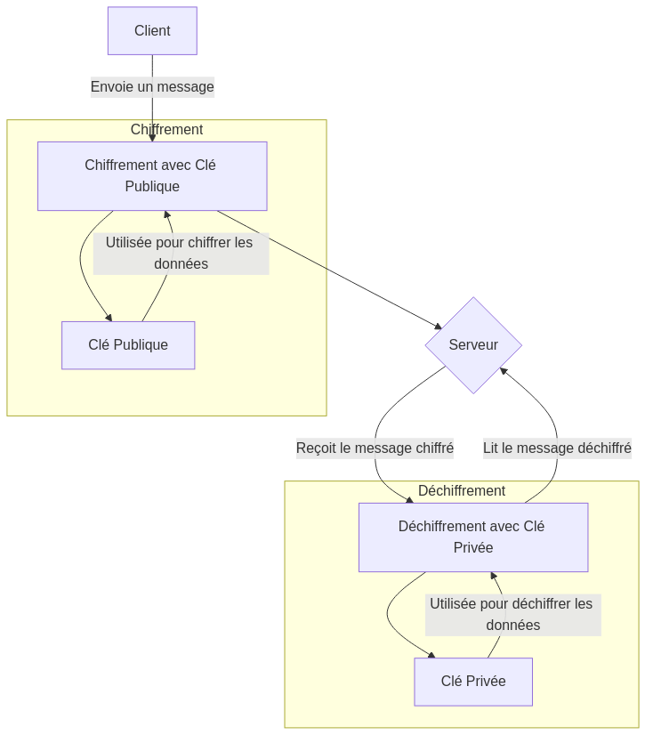
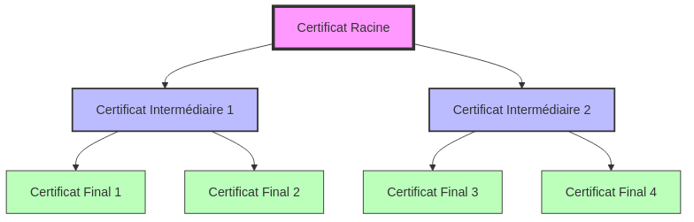

:titre: SSL, OpenSSL et Certbot
:module: Flux entrants
:duree: 120
:description: Utiliser OpenSSL pour générer des certificats SSL
include::../../../../adoc/libs/header-module.adoc[]

ifeval::["{visible-on-html}" !=  "yes"]
:docinfo: shared
:docinfodir: ../../../adoc/libs
endif::[]

== Objectifs pédagogiques
// tag::objectifs[]
* Comprendre le fonctionnement de SSL/TLS
* Savoir générer des certificats SSL avec OpenSSL
* Configurer HAProxy pour utiliser des certificats SSL
// end::objectifs[]

// tag::deroulement[]

== Certificat SSL (Secure Socket Layer)

Fichier de données installé sur un serveur web qui permet d'établir une connexion sécurisée entre le serveur et le client. Il permet de chiffrer les données échangées entre les deux parties.

=== Fonctions principales

* **Chiffrement** : protège les données échangées contre les interceptions
* **Authentification** : garantit l'identité du serveur pour le client
* **Intégrité** : assure que les données n'ont pas été modifiées pendant le transfert

=== Fonctionnement du chiffrement asymétrique

* utilise une paire de clés : 
** une clé publique pour chiffrer les données, partagée à tous les utilisateurs
** une clé privée pour les déchiffrer, conservée secrète par le serveur

include::../../../../adoc/libs/slide-notitle.adoc[]



[NOTE.speaker]
--
Explication du schéma

* **Client** : L'entité qui envoie un message chiffré. Elle utilise la clé publique du serveur pour chiffrer le message.
* **Chiffrement avec Clé Publique** : Le message est chiffré avec la clé publique, qui est partagée et accessible à tout le monde.
* **Serveur** : L'entité qui reçoit le message chiffré. Elle est la seule à posséder la clé privée.
* **Déchiffrement avec Clé Privée** : Le serveur utilise sa clé privée, qui est gardée secrète, pour déchiffrer le message et lire le contenu.
--

== Types de certificats SSL

=== Domaine Validation (DV)

* valide uniquement le contrôle du domaine
* procédure rapide et économique
* recommandé pour les sites personnels et les blogs

=== Organisation Validation (OV)

* valide le contrôle du domaine et l'existence de l'organisation
* offre un niveau de confiance supérieur
* recommandé pour les sites d'entreprises nécessitant un certain niveau de légitimité

=== Extended Validation (EV)

* plus haut niveau de validation
* inclut une vérification rigoureuse de l'identité de l'entreprise
* affiche le nom de l'entreprise dans la barre d'adresse
* recommandé pour les sites e-commerce et les banques

== Structure d'un certficat X.509

* document numérique qui utilise le standard X.509 pour authentifier une entité
* généralement codé en base64 dans un format PEM (Privacy Enhanced Mail)

=== Hiérarchie des certificats



[NOTE.speaker]
--
* **Certificat Racine** : C'est le certificat de l'autorité de certification (CA) racine. Il est auto-signé et se trouve au sommet de la hiérarchie. Les navigateurs et systèmes d'exploitation le reconnaissent comme une entité de confiance.
* **Certificats Intermédiaires** : Ces certificats sont émis par le certificat racine ou par un autre certificat intermédiaire. Ils servent à déléguer l'autorité de signature et à créer une chaîne de certificats qui mènent au certificat racine.
* **Certificats Finaux** : Également appelés certificats de serveur ou certificats d'utilisateur, ce sont les certificats délivrés aux entités finales (comme un serveur web). Ils sont émis par un certificat intermédiaire et nécessitent la chaîne de certificats pour être validés.
--

=== Exemple de certificat

```sh
-----BEGIN CERTIFICATE-----
MIID0DCCArigAwIBAgIBATANBgkqhkiG9w0BAQUFADB/MQswCQYDVQQGEwJGUjET
MBEGA1UECAwKU29tZS1TdGF0ZTEOMAwGA1UEBwwFUGFyaXMxDTALBgNVBAoMBERp
bWkxDTALBgNVBAsMBE5TQlUxEDAOBgNVBAMMB0RpbWkgQ0ExGzAZBgkqhkiG9w0B
CQEWDGRpbWlAZGltaS5mcjAeFw0xNDAxMjgyMDM2NTVaFw0yNDAxMjYyMDM2NTVa
MFsxCzAJBgNVBAYTAkZSMRMwEQYDVQQIDApTb21lLVN0YXRlMSEwHwYDVQQKDBhJ
bnRlcm5ldCBXaWRnaXRzIFB0eSBMdGQxFDASBgNVBAMMC3d3dy5kaW1pLmZyMIIB
IjANBgkqhkiG9w0BAQEFAAOCAQ8AMIIBCgKCAQEAvpnaPKLIKdvx98KW68lz8pGa
RRcYersNGqPjpifMVjjE8LuCoXgPU0HePnNTUjpShBnynKCvrtWhN+haKbSp+QWX
SxiTrW99HBfAl1MDQyWcukoEb9Cw6INctVUN4iRvkn9T8E6q174RbcnwA/7yTc7p
1NCvw+6B/aAN9l1G2pQXgRdYC/+G6o1IZEHtWhqzE97nY5QKNuUVD0V09dc5CDYB
aKjqetwwv6DFk/GRdOSEd/6bW+20z0qSHpa3YNW6qSp+x5pyYmDrzRIR03os6Dau
ZkChSRyc/Whvurx6o85D6qpzywo8xwNaLZHxTQPgcIA5su9ZIytv9LH2E+lSwwID
AQABo3sweTAJBgNVHRMEAjAAMCwGCWCGSAGG+EIBDQQfFh1PcGVuU1NMIEdlbmVy
YXRlZCBDZXJ0aWZpY2F0ZTAdBgNVHQ4EFgQU+tugFtyN+cXe1wxUqeA7X+yS3bgw
HwYDVR0jBBgwFoAUhMwqkbBrGp87HxfvwgPnlGgVR64wDQYJKoZIhvcNAQEFBQAD
ggEBAIEEmqqhEzeXZ4CKhE5UM9vCKzkj5Iv9TFs/a9CcQuepzplt7YVmevBFNOc0
+1ZyR4tXgi4+5MHGzhYCIVvHo4hKqYm+J+o5mwQInf1qoAHuO7CLD3WNa1sKcVUV
vepIxc/1aHZrG+dPeEHt0MdFfOw13YdUc2FH6AqEdcEL4aV5PXq2eYR8hR4zKbc1
fBtuqUsvA8NWSIyzQ16fyGve+ANf6vXvUizyvwDrPRv/kfvLNa3ZPnLMMxU98Mvh
PXy3PkB8++6U4Y3vdk2Ni2WYYlIls8yqbM4327IKmkDc2TimS8u60CT47mKU7aDY
cbTV5RDkrlaYwm5yqlTIglvCv7o=
-----END CERTIFICATE-----
```

=== Exemple de certificat déchiffré

```sh
Certificate:
    Data:
        Version: 3 (0x2)
        Serial Number: 1234567890 (0x499602d2)
    Signature Algorithm: sha256WithRSAEncryption
    Issuer: C=US, O=Example CA, CN=Example Root CA
    Validity
        Not Before: Jan  1 00:00:00 2023 GMT
        Not After : Jan  1 23:59:59 2024 GMT
    Subject: C=US, ST=California, L=San Francisco, O=Example Inc, CN=www.example.com
    Subject Public Key Info:
        Public Key Algorithm: rsaEncryption
        RSA Public-Key: (2048 bit)
    Extensions:
        X509v3 Key Usage: 
            Digital Signature, Key Encipherment
        X509v3 Subject Alternative Name: 
            DNS:www.example.com, DNS:example.com
        X509v3 Basic Constraints: 
            CA:FALSE
    Signature Algorithm: sha256WithRSAEncryption
        Signature Value:
            a1:b2:c3:d4:e5:f6:78:90:12:34:56:78:9a:bc:de:f0:
            12:34:56:78:9a:bc:de:f0:12:34:56:78:9a:bc:de:f0:
            12:34:56:78:9a:bc:de:f0:12:34:56:78:9a:bc:de:f0:
            12:34:56:78:9a:bc:de:f0:12:34:56:78:9a:bc:de:f0
```

=== Explication des champs du certificat

* **Version** : Indique que c'est un certificat X.509 version 3.
* **Numéro de série** : Un identifiant unique attribué par l'autorité de certification.
* **Signature Algorithm** : L'algorithme utilisé pour signer le certificat, ici SHA-256 avec RSA.
* **Issuer (Émetteur)** : L'autorité de certification qui a émis le certificat.

include::../../../../adoc/libs/slide-notitle.adoc[]

* **Validity (Validité)** :
** **Not Before** : La date à partir de laquelle le certificat est valide.
** **Not After** : La date après laquelle le certificat n'est plus valide.
* **Subject (Sujet)** : L'entité que le certificat identifie, comprenant le pays, l'état, la localité, l'organisation et le nom commun.
* **Subject Public Key Info** : Informations sur la clé publique associée, y compris l'algorithme de chiffrement utilisé.

include::../../../../adoc/libs/slide-notitle.adoc[]

* **Extensions** :
** **Key Usage** : Indique les usages autorisés de la clé, comme la signature numérique ou le chiffrement de clé.
** **Subject Alternative Name** : Noms alternatifs pour lesquels le certificat est valide.
** **Basic Constraints** : Indique si le certificat est un certificat autorité (CA) ou non.
* **Signature Value** : La signature numérique du certificat, qui garantit son intégrité et son authenticité.


== OpenSSL

Installer OpenSSL :

```sh
sudo apt update && sudo apt upgrade
sudo apt install openssl
openssl version
```

=== Génération de certificats

* **Clé privée** : générer une clé privée RSA 2048 bits

```sh
openssl genrsa -out example.key 2048
```

* **Demande de signature de certificat (CSR)** : créer un fichier de demande de certificat

```sh
openssl req -new -key example.key -out example.csr
```

* **Auto-signer un certificat** : signer un certificat avec sa propre clé privée

```sh
openssl x509 -req -days 365 -in example.csr -signkey example.key -out example.crt
```

=== Gestion des certificats SSL

* Vérifier un certificat SSL

```sh
openssl x509 -in example.crt -text -noout
```

* Conversion de formats

```sh
openssl x509 -in example.crt -out example.pem -outform PEM
openssl x509 -in example.pem -out example.der -outform DER
```

== Certbot

Certbot est un outil gratuit et open-source pour gérer les certificats SSL/TLS. Il simplifie le processus de configuration et de renouvellement des certificats.

=== Installation de Certbot

```sh
sudo apt update && sudo apt upgrade
sudo apt install certbot
```

=== Génération de certificats SSL avec Certbot

* Générer un certificat SSL pour un domaine

```sh
sudo certbot certonly --standalone -d example.com
```

* Renouveler un certificat SSL

```sh
sudo certbot renew
```

=== Renouvellement automatique

* Créer une tâche cron pour renouveler automatiquement les certificats

```sh
sudo crontab -e
```

Ajouter la ligne suivante :

```sh
0 0 * * * certbot renew
```

== Utiliser un certificat SSL avec HAProxy

* Se rendre dans la configuration de HAProxy

```sh
sudo nano /etc/haproxy/haproxy.cfg
```

* Ajouter les lignes suivantes pour spécifier le certificat SSL

```sh
frontend https
    bind *:443 ssl crt /etc/ssl/example.pem
    mode http
    default_backend servers

backend servers
    server server1 localhost:8080
```

* Redémarrer HAProxy pour appliquer les changements

```sh
sudo systemctl restart haproxy
```

// tag::demo[]

== Démonstration

Sécuriser HAProxy avec un certificat SSL auto-signé.

[NOTE.speaker]
--
Reprendre la démo du module de load balancing pour ajouter la configuration SSL.

On veut un certificat auto-signé donc on utilise OpenSSL plutôt que Certbot. 

* Générer un certificat auto-signé :

```sh
openssl req -x509 -nodes -days 365 -newkey rsa:2048 -keyout /etc/ssl/private/selfsigned.key -out /etc/ssl/certs/selfsigned.crt
```

* Combiner la clé privée et le certificat en un seul fichier :

```sh
cat /etc/ssl/certs/selfsigned.crt /etc/ssl/private/selfsigned.key > /etc/ssl/certs/selfsigned_combined.pem
```

* Configurer HAProxy pour utiliser le certificat SSL :

```sh
frontend http_front
    bind *:443 ssl crt /etc/ssl/certs/selfsigned_combined.pem
    mode http
    default_backend servers

backend servers
    balance roundrobin
    server server1 IP_SERVEUR_A:5173 check
    server server2 IP_SERVEUR_B:5173 check
```

* Redémarrer HAProxy pour appliquer les changements :

```sh
sudo systemctl restart haproxy
```

Tester l'accès au site en HTTPS.
--

// end::demo[]

// end::deroulement[]

== Conclusion
// tag::conclusion[]
* OpenSSL est un outil puissant pour générer des certificats SSL et gérer des clés cryptographiques.
* Les certificats SSL sont essentiels pour sécuriser les communications sur Internet.
* La structure X.509 permet de garantir l'authenticité, l'intégrité et la confidentialité des données.
* Certbot simplifie la gestion des certificats SSL en automatisant le processus de configuration et de renouvellement.
* HAProxy peut être configuré pour utiliser des certificats SSL et sécuriser les connexions entrantes.
// end::conclusion[]