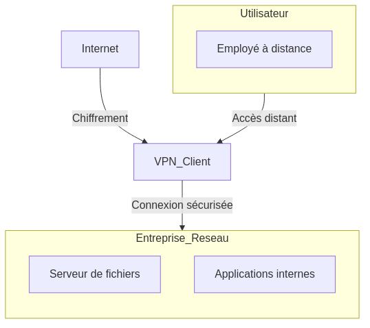
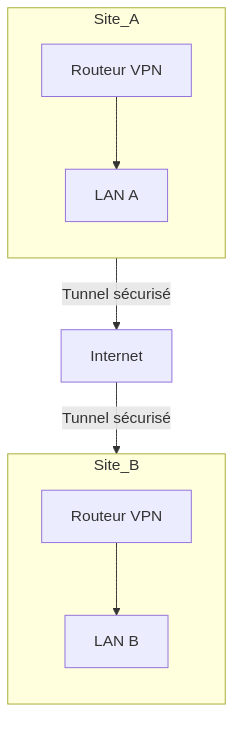
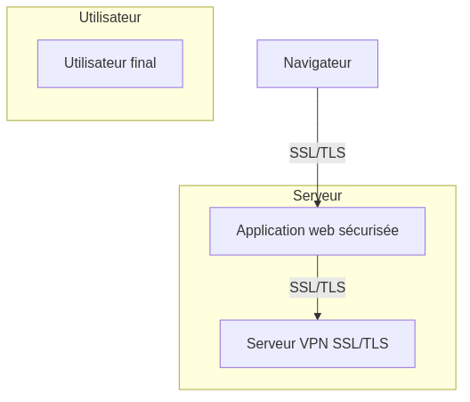
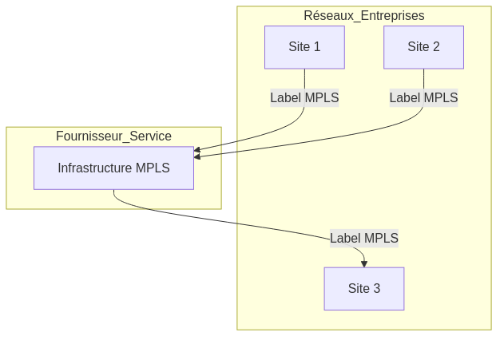

:titre: Introduction aux VPN
:module: Flux entrants
:duree: 60
:description: Comprendre les concepts de base des VPN et leurs applications
include::../../../../adoc/libs/header-module.adoc[]

ifeval::["{visible-on-html}" !=  "yes"]
:docinfo: shared
:docinfodir: ../../../adoc/libs
endif::[]

== Objectifs pédagogiques
// tag::objectifs[]
* Comprendre les concepts de base des VPN
* Connaître les types de VPN et leurs applications
// end::objectifs[]

// tag::deroulement[]

== Concepts de base des VPN

* technologie qui établit une connexion sécurisée et cryptée sur un réseau public (Internet)
* permet aux utilisateurs de partager des données en toute sécurité
* assure la confidentialité et l'intégrité des données échangées comme dans un réseau privé

=== Utilisations principales

* **Confidentialité des données** :  protège la confidentialité des informations échangées sur Internet.
* **Sécurisation des connexions** : sécurise les connexions Internet, surtout lors de l'utilisation de réseaux Wi-Fi publics, en empêchant les interceptions de données.
* **Accès à distance sécurisé** : permet aux utilisateurs d'accéder à distance à des réseaux internes, comme ceux d'une entreprise, de manière sécurisée.

== Fonctionnement d'un VPN

=== Tunnels

* les VPN créent des tunnels sécurisés à travers lesquels les données circulent
* canaux virtuels qui encapsulent les données pour les protéger des interceptions
* le protocole utilisé peut varier :
** PPTP
** L2TP/IPsec
** OpenVPN
** WireGuard

=== Chiffrement

* les données échangées sont chiffrées pour garantir leur confidentialité
* même si elles sont interceptées, elles restent illisibles sans la clé de déchiffrement
* les algorithmes de chiffrement les plus courants sont :
** AES
** 3DES
** Blowfish

=== Authentification

* les VPN utilisent des méthodes d'authentification pour vérifier l'identité des utilisateurs
* les plus courantes sont :
** mot de passe
** certificat
** clé partagée

== VPN d'accès distant

* permet aux utilisateurs de se connecter à un réseau privé depuis un emplacement distant
* utilisé pour le télétravail, l'accès aux ressources internes, etc.

**Applications :**

* **Télétravail** : accès aux fichiers et applications de l'entreprise depuis chez soi
* **Sécurité sur Wi-Fi public** : sécurisation des connexions sur les réseaux Wi-Fi publics

include::../../../../adoc/libs/slide-notitle.adoc[]

[NOTE.speaker]
--
**VPN à Accès Distant** : Les utilisateurs se connectent au réseau de l'entreprise via un client VPN, utilisant Internet pour établir une connexion sécurisée.
--

== VPN site à site

* connecte deux réseaux locaux (LAN) séparés par Internet
* permet une communication sécurisée entre les deux réseaux comme s'ils étaient sur le même réseau local

**Applications :**

* **Interconnexion de sites distants** : communication sécurisée entre les différents sites d'une entreprise
* **Collaboration entre entreprises** : partage de ressources entre deux entreprises

include::../../../../adoc/libs/slide-notitle.adoc[]

[NOTE.speaker]
--
**VPN site à site** : Deux sites distants sont connectés via un tunnel sécurisé sur Internet, utilisant des routeurs VPN pour gérer le trafic entre les réseaux locaux.
--

== VPN SSL/TLS

* utilise les protocoles de cryptage SSL/TLS pour sécuriser les connexions
* souvent utilisé pour les VPN à accès distant
* peut être utilisé via un navigateur web sans installation de logiciel supplémentaire

**Applications :**

* **Accès web sécurisé** : sécurisation des connexions aux applications web
* **Flexibilité et compatibilité** : fonctionne sur tous les appareils

include::../../../../adoc/libs/slide-notitle.adoc[]

[NOTE.speaker]
--
**VPN SSL/TLS** : Un utilisateur utilise un navigateur web pour accéder à des applications sécurisées via SSL/TLS, sans nécessiter de logiciel client VPN spécifique.
--

== VPN MPLS

* utilise le protocole MPLS pour créer des réseaux privés virtuels
* souvent utilisé par les entreprises pour relier leurs différents sites

**Applications :**

* **Réseau d'entreprises étendus** : interconnexion de sites distants
* **Qualité de service** : garantit la qualité des connexions

include::../../../../adoc/libs/slide-notitle.adoc[]

[NOTE.speaker]
--
**VPN MPLS** : Les sites de l'entreprise sont connectés à travers le réseau MPLS d'un fournisseur de services, utilisant des étiquettes MPLS pour garantir un routage efficace et sécurisé.
--

// end::deroulement[]

== Conclusion
// tag::conclusion[]
* Les VPN sont des outils essentiels pour sécuriser les communications sur Internet.
* Ils permettent de créer des connexions sécurisées et cryptées entre des réseaux distants.
* Différents types de VPN existent pour répondre à des besoins spécifiques.
// end::conclusion[]