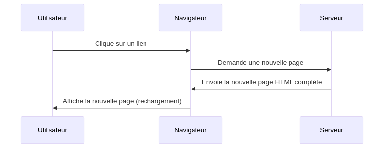
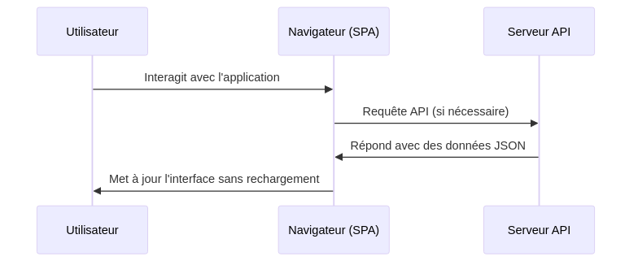

:titre: Client-serveur et Architecture Web Moderne
:module: Frontend
:duree: 60
:description: Comprendre la communication entre le client et le serveur, et les architectures web modernes
include::../../../../adoc/libs/header-module.adoc[]

ifeval::["{visible-on-html}" !=  "yes"]
:docinfo: shared
:docinfodir: ../../../../adoc/libs
endif::[]

== Objectifs pédagogiques
// tag::objectifs[]
* Comprendre les principes de base de l'architecture client-serveur
* Maîtriser les concepts de communication HTTP et d'API REST
* Différencier les applications web traditionnelles des Single Page Applications (SPA)
* Analyser les avantages et inconvénients de chaque approche
// end::objectifs[]

== Communication entre le client et le serveur

=== Architecture client-serveur
* Le client (navigateur) envoie des requêtes au serveur (backend)
  - Protocole HTTP (Hypertext Transfer Protocol)
  - Requêtes : GET, POST, PUT, DELETE, PATCH, OPTIONS
* Le serveur renvoie des réponses (pages HTML, données JSON, fichiers, etc.)

=== Flux de communication détaillé
1. L'utilisateur interagit avec l'interface (clique sur un lien, soumet un formulaire)
2. Le navigateur prépare et envoie une requête HTTP au serveur
3. Le serveur reçoit et traite la requête
4. Le serveur prépare et envoie une réponse HTTP
5. Le navigateur reçoit la réponse et met à jour l'interface utilisateur

=== Exemple de requête et réponse HTTP

Requête :
[source,http]
----
GET /api/users HTTP/1.1
Host: example.com
Accept: application/json
----

Réponse :
[source,http]
----
HTTP/1.1 200 OK
Content-Type: application/json

{
  "users": [
    {"id": 1, "name": "Alice"},
    {"id": 2, "name": "Bob"}
  ]
}
----

=== Les APIs (Application Programming Interfaces)
* Interfaces permettant la communication entre différentes applications
* Les APIs REST : Utilisation des méthodes HTTP pour échanger des données (généralement en JSON)
* Principes REST :
  - Ressources identifiées par des URLs
  - Utilisation des méthodes HTTP pour définir les actions
  - Stateless (sans état)

=== Exemple d'une requête API avec `fetch` en JavaScript
[source,javascript]
----
fetch("https://api.example.com/users")
  .then(response => response.json())
  .then(data => {
    console.log(data);
    // Traitement des données reçues
  })
  .catch(error => console.error('Erreur:', error));
----

=== Démonstration
* Réalisation d'une requête API simple et affichage des données dans la console du navigateur
* Utilisation de l'API publique JSONPlaceholder pour récupérer des données de test

[source,javascript]
----
fetch('https://jsonplaceholder.typicode.com/users')
  .then(response => response.json())
  .then(users => {
    console.log('Utilisateurs:', users);
    // Afficher les utilisateurs dans l'interface
  });
----

[NOTE.speaker]
--
* Expliquer chaque étape de la requête
* Montrer comment inspecter la réponse dans les outils de développement du navigateur
* Discuter des cas d'utilisation courants pour les API dans le développement web moderne
--

== Single Page Applications (SPA) vs applications traditionnelles

=== Applications Traditionnelles (Multi-Page Applications)

* *Fonctionnement* : 
  - Chaque action utilisateur déclenche généralement un rechargement complet de la page
  - Le serveur génère et envoie une nouvelle page HTML complète pour chaque requête

* *Avantages* :
  - SEO naturellement optimisé (chaque page a son propre URL)
  - Simplicité de développement pour des sites simples
  - Moins dépendant de JavaScript pour le fonctionnement de base

* *Inconvénients* :
  - Expérience utilisateur moins fluide (rechargements fréquents)
  - Temps de chargement plus longs entre les actions
  - Charge serveur plus importante (génération de pages complètes)

=== Schéma d'une application traditionnelle

=== Single Page Applications (SPA)

* *Fonctionnement* : 
  - L'application charge une seule page HTML initiale
  - Les mises à jour de contenu se font dynamiquement sans rechargement complet
  - Utilisation intensive de JavaScript pour gérer l'interface et les données

* *Avantages* :
  - Expérience utilisateur fluide et rapide
  - Réduction de la charge serveur pour le rendu (le client fait plus de travail)
  - Possibilité de fonctionnement hors ligne (avec le bon setup)

* *Inconvénients* :
  - Complexité accrue du développement
  - Défis pour le SEO (nécessite des techniques spécifiques comme le SSR)
  - Dépendance forte à JavaScript

=== Schéma d'une Single Page Application

=== Comparaison des approches

[cols="1,1,1", options="header"]
|===
|Aspect |Application Traditionnelle |SPA
|Chargement initial |Plus rapide |Plus lent
|Navigation subséquente |Plus lente |Plus rapide
|SEO |Naturellement bon |Nécessite des techniques spécifiques
|Complexité du développement |Généralement plus simple |Plus complexe
|Expérience utilisateur |Moins fluide |Plus fluide
|Charge serveur |Plus élevée |Moins élevée pour le rendu
|===

== Conclusion

* Le choix entre une application traditionnelle et une SPA dépend des besoins spécifiques du projet
* Les tendances modernes favorisent souvent les SPA pour les applications web complexes et interactives
* La compréhension de ces architectures est cruciale pour les développeurs frontend et les DevOps
* L'évolution constante des technologies web peut introduire de nouvelles approches hybrides

[NOTE.speaker]
--
* Encourager la discussion sur les cas d'utilisation appropriés pour chaque approche
* Mentionner les frameworks populaires pour chaque type d'application (ex: React, Vue, Angular pour SPA)
* Discuter des tendances futures dans le développement web
--
