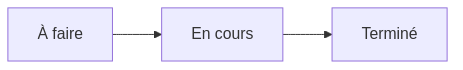

:titre: Initiation à GitHub Projects - Gestion de projet avec Kanban
:module: Git
:duree: 90
:description: Découverte de GitHub Projects et mise en pratique de la méthode Kanban pour la gestion de projets de développement logiciel.
include::../../../../adoc/libs/header-module.adoc[]

ifeval::["{visible-on-html}" !=  "yes"]
:docinfo: shared
:docinfodir: ../../../../adoc/libs
endif::[]

// tag::objectifs[]
* *Comprendre* les fonctionnalités de base de GitHub et GitHub Projects
* *Créer* un tableau Kanban dans GitHub Projects
* *Utiliser* les cartes et les colonnes pour organiser les tâches
* *Appliquer* les principes de base de la méthodologie Kanban
* *Suivre* l'avancement d'un projet à l'aide de GitHub Projects
// end::objectifs[]

// tag::deroulement[]
== Qu'est-ce que Kanban ?

Kanban est une méthode visuelle de gestion de flux de travail, originaire du système de production de Toyota. Le mot "Kanban" signifie "panneau d'affichage" ou "tableau" en japonais.

=== Le tableau Kanban

Un tableau Kanban est un outil visuel simple mais puissant :

- Il se compose de plusieurs colonnes représentant les étapes d'un processus
- Les tâches sont représentées par des cartes qui se déplacent à travers ces colonnes

=== À quoi sert un tableau Kanban ?

Le tableau Kanban sert à :

1. Visualiser le travail : Voir toutes les tâches d'un coup d'œil
2. Limiter le travail en cours : Éviter la surcharge en fixant des limites par colonne
3. Gérer le flux : Suivre et optimiser le déplacement des tâches
4. Identifier les blocages : Repérer rapidement où les tâches s'accumulent

En résumé, Kanban aide les équipes à travailler de manière plus efficace en rendant le travail visible et en encourageant la collaboration.

[NOTE.speaker]
--
Expliquez que GitHub Projects utilise ce concept de tableau Kanban pour aider les équipes de développement à gérer leurs projets de manière visuelle et efficace.
--

== Introduction à GitHub

GitHub est une plateforme d'hébergement de code source offrant de nombreuses fonctionnalités pour le développement collaboratif :

- Contrôle de version avec Git
- Collaboration via Pull Requests
- Suivi des problèmes avec Issues
- Intégration continue avec GitHub Actions
- Gestion de projets avec GitHub Projects

[NOTE.speaker]
--
Expliquez brièvement chaque fonctionnalité et son importance dans le cycle de développement logiciel.
--

== GitHub Projects : Vue d'ensemble

GitHub Projects est un outil intégré permettant de créer, suivre et gérer des projets directement sur GitHub. Il offre plusieurs vues :

- Tableaux Kanban
- Listes de tâches
- Diagrammes de Gantt (vue Timeline)

== Création d'un projet Kanban

Pour créer un nouveau projet Kanban sur GitHub, suivez ces étapes :

1. Connectez-vous à votre compte GitHub
2. Accédez à la page d'accueil de GitHub
3. Cliquez sur le bouton '+' situé en haut à droite de la page
4. Sélectionnez 'New project' dans le menu déroulant
5. Choisissez 'Board' comme template de projet
6. Donnez un nom à votre projet (par exemple, "Mon Premier Projet Kanban")
7. Cliquez sur le bouton 'Create project'

[NOTE.speaker]
--
Démontrez en direct la création d'un nouveau projet Kanban sur GitHub Projects.
--

=== Personnalisation du tableau Kanban

1. Modifier le nom et la description du projet
2. Ajouter des collaborateurs
3. Configurer les colonnes (To Do, In Progress, Done)

[NOTE.speaker]
--
Montrez comment personnaliser le projet en ajoutant une nouvelle colonne (par exemple, "En revue") et en renommant une colonne existante.
--

== Gestion des tâches avec les cartes

image::https://media.tenor.com/ck_0j-KtaMsAAAAC/new-task-attention.gif[]

=== Ajout de cartes

1. Cliquer sur "Add item" dans une colonne
2. Entrer le titre de la tâche
3. Appuyer sur Entrée ou cliquer sur "Add"

=== Personnalisation des cartes

- Ajouter une description détaillée
- Assigner la tâche à un collaborateur
- Définir une date d'échéance
- Ajouter des étiquettes

[NOTE.speaker]
--
Montrez comment convertir une carte en Issue pour bénéficier de fonctionnalités supplémentaires.
--

== Suivi de l'avancement du projet

=== Utilisation des vues

- Vue Kanban (Board)
- Vue Table
- Vue Timeline (diagramme de Gantt)

=== Filtres et recherche

- Filtrer par assigné
- Filtrer par étiquette
- Rechercher des cartes spécifiques

== Bonnes pratiques Kanban avec GitHub Projects

1. Limitez le travail en cours (WIP) dans chaque colonne
2. Déplacez régulièrement les cartes entre les colonnes
3. Utilisez les étiquettes pour catégoriser les tâches
4. Tenez des stand-ups quotidiens devant le tableau Kanban virtuel
5. Réalisez des rétrospectives régulières pour améliorer le processus

// end::deroulement[]

// tag::demo[]
== Démonstration : Gestion d'un projet de développement

[NOTE.speaker]
--
Réalisez une démonstration complète de la gestion d'un petit projet de développement avec GitHub Projects :

1. Créez un nouveau projet Kanban
2. Ajoutez des colonnes personnalisées (ex: Backlog, To Do, In Progress, Review, Done)
3. Créez plusieurs cartes représentant différentes tâches de développement
4. Assignez des tâches à des collaborateurs fictifs
5. Ajoutez des étiquettes et des dates d'échéance
6. Convertissez une carte en Issue
7. Montrez comment déplacer les cartes entre les colonnes
8. Présentez les différentes vues (Board, Table, Timeline)
9. Utilisez les filtres pour trier les tâches
--
// end::demo[]

// tag::exercice[]
== Exercice pratique : Planification d'une mini API Flask de gestion des tâches

Vous allez planifier le développement d'une mini API Flask pour gérer une liste de tâches, en utilisant GitHub Projects pour organiser votre travail.

=== Étape 1 : Création du projet

1. Créez un nouveau dépôt GitHub nommé "flask-task-api"
2. Initialisez un nouveau projet GitHub avec un tableau Kanban
3. Configurez les colonnes : Backlog, À faire, En cours, Test, Terminé

=== Étape 2 : Définition des tâches

Créez des cartes pour les tâches suivantes :

. Configuration initiale du projet Flask
. Création du modèle de données Task
. Ajout de la validation des données d'entrée
. Configuration de la base de données (PostgreSQL)
. Documentation de l'API (avec Swagger ou ReDoc)
. Configuration du déploiement (par exemple, sur Heroku)

=== Étape 3 : Personnalisation des tâches

1. Ajoutez une brève description à chaque tâche
2. Créez des étiquettes simples (ex: "Backend", "Base de données") et appliquez-les
3. Assignez-vous toutes les tâches (ou partagez-les si vous travaillez en groupe)

=== Étape 4 : Priorisation

1. Dans la colonne Backlog, organisez les tâches par ordre de priorité
2. Déplacez les 3 premières tâches dans la colonne "À faire"

=== Étape 5 : Simulation de progression

1. Déplacez la tâche "Initialisation du projet Django" dans "En cours"
2. Après déplacez-la dans "Test"
3. Finalement, déplacez-la dans "Terminé"

=== Étape 6 : Utilisation des vues

1. Passez en vue Table et observez comment les tâches sont présentées
2. Revenez à la vue Board (tableau Kanban)

// end::exercice[]

== Conclusion

// tag::conclusion[]
* Vous avez appris à utiliser GitHub Projects pour créer et gérer un tableau Kanban
* Vous savez comment organiser les tâches, suivre leur progression et collaborer efficacement
* Ces compétences vous permettront de mieux gérer vos projets de développement
* Continuez à explorer les fonctionnalités avancées de GitHub Projects pour optimiser votre workflow
* N'oubliez pas d'intégrer les principes Kanban dans votre processus de développement quotidien
// end::conclusion[]

