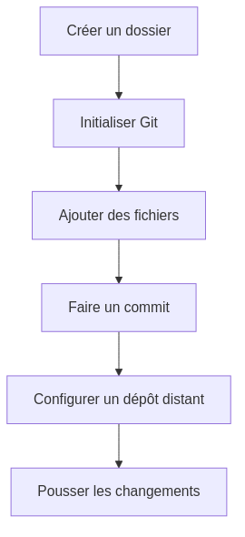
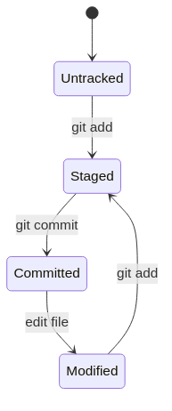

:titre: Introduction à Git
:module: Git    
:duree: 60
:description: Comprendre et appliquer les bases de Git pour la gestion de version de code
include::../../../../adoc/libs/header-module.adoc[]

ifeval::["{visible-on-html}" !=  "yes"]
:docinfo: shared
:docinfodir: ../../../../adoc/libs
endif::[]

// tag::objectifs[]
* Comprendre les concepts fondamentaux de Git et son importance dans le DevOps
* Maîtriser l'initialisation d'un dépôt Git et la gestion des commits
* Apprendre à utiliser les commandes push et pull pour la synchronisation
* Savoir afficher et interpréter l'historique des commits et les différences
* Acquérir des bonnes pratiques pour une gestion de versions efficace
// end::objectifs[]

== 1. Introduction à Git

=== 1.1 Qu'est-ce que Git ?

* Système de contrôle de version distribué
* Créé par Linus Torvalds en 2005
* Essentiel pour le développement collaboratif et le DevOps

[NOTE]
--
Git permet de :
* Suivre les modifications du code
* Collaborer efficacement
* Revenir à des versions antérieures
* Gérer plusieurs versions parallèles (branches)
--

=== 1.2 Importance dans le DevOps

* Facilite l'intégration continue (CI) et le déploiement continu (CD)
* Permet la traçabilité des changements
* Supporte l'Infrastructure as Code (IaC)

== 2. Concepts clés de Git

[cols="1,2", options="header"]
|===
|Concept
|Description

|Dépôt (Repository)
|Espace de stockage du projet et de son historique

|Commit
|Instantané du projet à un moment donné

|Branch
|Version parallèle du code (⚠️ détails dans le cours avancé)

|Merge
|Fusion de branches (⚠️ détails dans le cours avancé)

|Push/Pull
|Synchronisation avec un dépôt distant
|===

== 3. Configuration initiale de Git

[source,bash]
----
# Configuration globale
git config --global user.name "Votre Nom"
git config --global user.email "votre@email.com"

# Vérifier la configuration
git config --list
----

== 4. Mise en place d'un dépôt Git

=== 4.1 Initialisation et premiers commits

[source,bash]
----
mkdir mon-projet && cd mon-projet
git init
echo "# Mon Projet" > README.md
git add README.md
git commit -m "Initial commit: ajout du README"
----

=== 4.2 Vérification du statut et de l'historique

[source,bash]
----
git status
git log --oneline
----

== 5. Travailler avec des dépôts distants

=== 5.1 Ajout d'un dépôt distant

[source,bash]
----
git remote add origin https://github.com/utilisateur/depot.git
git push -u origin main
----

=== 5.2 Cloner un dépôt existant

[source,bash]
----
git clone https://github.com/utilisateur/depot.git
----

== 6. Gestion des modifications

=== 6.1 Cycle de vie des fichiers dans Git

=== 6.2 Afficher les différences

[source,bash]
----
# Différences non stagées
git diff

# Différences stagées
git diff --staged

# Différences entre commits
git diff commit1 commit2
----

== 7. Bonnes pratiques

* Commiter fréquemment et avec des messages clairs
* Utiliser des branches pour les nouvelles fonctionnalités
* Réaliser des revues de code avant de merger
* Maintenir un historique propre (rebase si nécessaire)
* Utiliser .gitignore pour exclure les fichiers non pertinents

== 8. Exercice pratique

=== Objectif
Créer un petit projet, le versionner avec Git, et simuler une collaboration.

=== Étapes
1. Initialisez un nouveau dépôt Git
2. Créez un fichier `index.html` avec un contenu basique
3. Ajoutez et committez ce fichier
4. Modifiez `index.html`, ajoutez un fichier `style.css`
5. Committez ces changements
6. Affichez l'historique des commits et les différences

=== Bonus
Simulez une collaboration en créant une branche, en y apportant des modifications, puis en la fusionnant avec la branche principale.

[NOTE.speaker]
--
* Encouragez les participants à expérimenter avec différentes commandes Git
* Discutez des scénarios courants rencontrés dans le développement réel
* Soulignez l'importance de Git dans le workflow DevOps
--

== Conclusion

* Récapitulatif des concepts clés de Git
* Importance de la pratique régulière pour maîtriser Git
* Prochaines étapes : exploration des fonctionnalités avancées (branching, merging, etc.)

== Ressources supplémentaires

* Documentation officielle de Git : https://git-scm.com/doc
* Git Cheat Sheet : https://education.github.com/git-cheat-sheet-education.pdf
* Tutoriels interactifs : https://learngitbranching.js.org/
