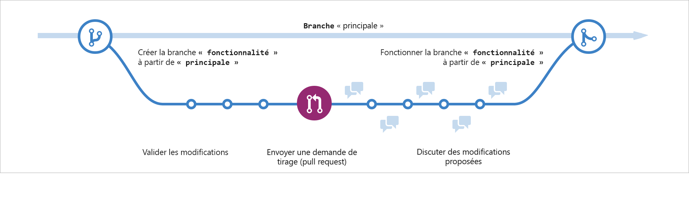

:titre: Utilisation avancée de Git
:module: Git
:duree: 120
:description: Maîtriser les fonctionnalités avancées de Git
include::../../../../adoc/libs/header-module.adoc[]

ifeval::["{visible-on-html}" !=  "yes"]
:docinfo: shared
:docinfodir: ../../../../adoc/libs
endif::[]

// tag::objectifs[]
* *Analyser* et *appliquer* les concepts avancés de gestion de branches
* *Évaluer* et *résoudre* les erreurs courantes dans Git
* *Créer* et *utiliser* des hooks Git pour automatiser les tâches
// end::objectifs[]

// tag::deroulement[]
== 1. Gestion avancée des branches

image::https://media.tenor.com/DJh4tAOkvbMAAAAC/so-funny.gif[]

=== 1.1 Stratégies de branche

* *GitFlow* : Modèle de branche pour les projets avec des cycles de release réguliers
* *GitHub Flow* : Approche simplifiée pour le déploiement continu
* *Trunk-Based Development* : Stratégie favorisant l'intégration continue

[NOTE.speaker]
--
Ce diagramme Mermaid illustre les étapes clés du GitHub Flow :

1. La branche principale `main` avec un commit initial.
2. Création d'une branche `feature` à partir de `main`.
3. Plusieurs commits sur la branche `feature`.
4. Merge de la branche `feature` dans `main` (représentant une pull request approuvée).
5. Un tag `v1.0` sur `main` après le merge (représentant un déploiement).
6. Création d'une branche `hotfix` pour une correction rapide.
7. Merge du `hotfix` dans `main`.
8. Un nouveau tag `v1.1` sur `main` après le hotfix (représentant un nouveau déploiement).
--

=== 1.2 Branches de fonctionnalités

[source,bash]
----
# Créer une branche de fonctionnalité
git checkout -b feature/new-login-page

# Travailler sur la fonctionnalité
git add .
git commit -m "Implement new login page design"

# Pousser la branche sur le dépôt distant
git push -u origin feature/new-login-page
----

[NOTE.speaker]
--
Expliquez chaque étape du processus :

1. `git checkout -b feature/new-login-page`
   - Cette commande crée une nouvelle branche nommée "feature/new-login-page" et bascule dessus.
   - Le préfixe "feature/" est une convention courante pour identifier les branches de fonctionnalités.

2. `git add .`
   - Ajoute tous les fichiers modifiés dans le répertoire courant à la zone de staging.
   - Utile quand on a modifié plusieurs fichiers pour une fonctionnalité.

3. `git commit -m "Implement new login page design"`
   - Crée un nouveau commit avec les changements stagés.
   - Le message de commit doit être clair et descriptif de la fonctionnalité implémentée.

4. `git push -u origin feature/new-login-page`
   - Pousse la nouvelle branche sur le dépôt distant (origin).
   - L'option `-u` configure le suivi de la branche distante, ce qui facilite les futurs push/pull.

Insistez sur l'importance de travailler sur des branches séparées pour chaque fonctionnalité, ce qui facilite la revue de code et l'intégration progressive des changements.
--

=== 1.2 Techniques avancées de fusion et rebasage

=== Merge vs Rebase

[cols="1,1", options="header"]
|===
|Merge
|Rebase

|Préserve l'historique
|Linéarise l'historique

|Crée un commit de fusion
|Réécrit les commits

|Idéal pour les branches publiques
|Préférable pour les branches privées
|===

=== Merge avec stratégies

[source,bash]
----
# Merge 
git merge feature/new-login-page

# Squash merge
git merge --squash feature
git commit -m "Merge feature branch"
----

[NOTE.speaker]
--
Expliquez ces deux types de merge différents :

1. `git merge feature/new-login-page`
   - C'est un merge standard (aussi appelé "true merge" ou "merge commit").
   - Crée un nouveau commit de merge qui a deux parents : la branche courante et la branche 'feature/new-login-page'.
   - Préserve l'historique complet de la branche 'feature/new-login-page'.
   - Utile pour maintenir un historique détaillé du développement.

2. `git merge --squash feature/new-login-page` suivi de `git commit -m "Merge feature/new-login-page branch"`
   - Le `--squash` combine tous les changements de la branche 'feature/new-login-page' en un seul ensemble de modifications.
   - Ne crée pas automatiquement un commit de merge.
   - La deuxième commande crée un nouveau commit avec tous ces changements combinés.
   - Résultat : un seul commit contenant toutes les modifications de la branche 'feature/new-login-page'.

Points clés à souligner :
- Le merge standard maintient l'historique complet mais peut rendre le graphe de commits plus complexe.
- Le squash merge simplifie l'historique en condensant tous les changements en un seul commit.
- Le squash merge perd l'historique détaillé des commits individuels de la branche feature/new-login-page.
- Le choix entre ces méthodes dépend de la politique de gestion des branches de l'équipe et des besoins du projet.

Encouragez les participants à réfléchir aux avantages et inconvénients de chaque approche dans différents scénarios de développement.
--

=== Rebase interactif

[source,bash]
----
git rebase -i HEAD~3
----

== 2. Gestion des erreurs et Git Revert

=== 2.1 Utilisation de Git Revert

[source,bash]
----
# Annuler le dernier commit
git revert HEAD

# Annuler un commit spécifique
git revert abc123

# Revert d'une plage de commits
git revert HEAD~3..HEAD
----

[NOTE.speaker]
--
Expliquez les différentes façons d'utiliser `git revert` :

1. `git revert HEAD`
   - Cette commande annule les changements du dernier commit.
   - Elle crée un nouveau commit qui fait l'inverse des modifications du dernier commit.
   - Utile pour corriger rapidement une erreur dans le dernier commit sans modifier l'historique.

2. `git revert abc123`
   - Annule les changements d'un commit spécifique identifié par son hash (abc123 ici).
   - Crée un nouveau commit qui inverse les modifications de ce commit particulier.
   - Pratique pour annuler un commit spécifique sans affecter les commits suivants.

3. `git revert HEAD~3..HEAD`
   - Cette commande annule une plage de commits, ici les 3 derniers.
   - Crée un nouveau commit pour chaque commit annulé dans la plage.
   - Utile pour annuler plusieurs commits récents en une seule opération.

Points importants à souligner :
- `git revert` est sûr pour les branches partagées car il ne modifie pas l'historique existant.
- Chaque revert crée un nouveau commit, préservant ainsi la traçabilité des changements.
- Contrairement à `git reset`, `revert` est l'option recommandée pour annuler des changements sur des branches publiques.

Encouragez les participants à utiliser `git revert` avec précaution et à bien comprendre quels changements seront annulés avant de l'exécuter, surtout lors de l'annulation de plusieurs commits.
--

=== 2.2 Comparaison avec Git Reset

[cols="1,1,1", options="header"]
|===
|Commande
|Effet sur l'historique
|Utilisation recommandée

|git revert
|Ajoute un nouveau commit
|Branches publiques

|git reset
|Modifie l'historique
|Branches privées uniquement
|===

=== 2.3 Techniques avancées de résolution de conflits

* Utilisation de `git mergetool`
* Configuration d'outils visuels (e.g., Meld, KDiff3)

[source,bash]
----
# Utiliser la version de la branche courante
git checkout --ours conflicted_file.txt

# Utiliser la version de l'autre branche
git checkout --theirs conflicted_file.txt

# Marquer comme résolu
git add conflicted_file.txt
----

== 3. Hooks Git et automatisation

=== 3.1 Types de hooks côté client

* pre-commit
* prepare-commit-msg
* post-commit

=== 3.2 Exemple de hook pre-commit

[source,bash]
----
#!/bin/sh
# .git/hooks/pre-commit

# Vérifier le style du code
npm run lint

# Exécuter les tests unitaires
npm test

# Si l'une des commandes échoue, annuler le commit
if [ $? -ne 0 ]; then
  echo "Les vérifications pré-commit ont échoué. Commit annulé."
  exit 1
fi
----

=== 3.3 Création d'un hook 

* Les hooks sont des scripts situés dans le répertoire .git/hooks de votre dépôt Git.
* Créez des fichiers nommés pre-commit, prepare-commit-msg, et post-commit dans ce répertoire.
* Assurez-vous que les scripts sont exécutables en utilisant la commande suivante :
+
[source,bash]
----
chmod +x .git/hooks/pre-commit
chmod +x .git/hooks/prepare-commit-msg
chmod +x .git/hooks/post-commit
----

// end::deroulement[]

// tag::demo[]
== Démonstration 1 : Gestion avancée des branches

[NOTE.speaker]
--
1. Créer un nouveau dépôt Git
2. Implémenter la stratégie GitFlow
3. Créer une branche de fonctionnalité
4. Effectuer un merge avec squash
5. Réaliser un rebase interactif
--

== Démonstration 2 : Gestion des erreurs et Git Revert

[NOTE.speaker]
--
1. Introduire intentionnellement une erreur dans un commit
2. Utiliser git revert pour annuler le commit erroné
3. Créer un conflit et le résoudre en utilisant différentes stratégies
4. Montrer la différence entre git revert et git reset
--

== Démonstration 3 : Configuration et utilisation des hooks Git

[NOTE.speaker]
--
1. Créer un hook pre-commit pour vérifier le style du code
2. Implémenter un hook prepare-commit-msg pour ajouter un préfixe aux messages de commit
3. Créer un hook post-commit pour notifier une intégration continue
4. Tester les hooks avec différents scénarios de commit
--

// end::demo[]

// tag::exercice[]
== Exercice 1 : Stratégies de branche

1. Créez un nouveau dépôt Git
2. Implémentez la stratégie GitHub Flow
3. Créez une branche de fonctionnalité, effectuez quelques commits
4. Réalisez un merge de cette branche dans main en utilisant un squash merge

== Exercice 2 : Gestion des erreurs

1. Dans votre dépôt, introduisez volontairement une erreur dans un fichier et committez
2. Utilisez git revert pour annuler ce commit
3. Créez un conflit entre deux branches et résolvez-le en utilisant git mergetool

== Exercice 3 : Hooks Git

1. Créez un hook pre-commit pour exécuter des tests unitaires avant chaque commit
2. Ajoutez un hook prepare-commit-msg pour ajouter un préfixe aux messages de commit
3. Testez les hooks en effectuant des commits avec et sans erreurs

// end::exercice[]

== Conclusion

// tag::conclusion[]
* La maîtrise des stratégies de branchement permet une meilleure organisation du travail en équipe
* La compréhension des outils comme git revert et git reset est cruciale pour gérer efficacement les erreurs
* Les hooks Git offrent une puissante capacité d'automatisation et de contrôle qualité
* Ces techniques avancées de Git sont essentielles pour les DevOps et les développeurs expérimentés
* La pratique régulière de ces concepts est nécessaire pour les maîtriser pleinement
// end::conclusion[]
