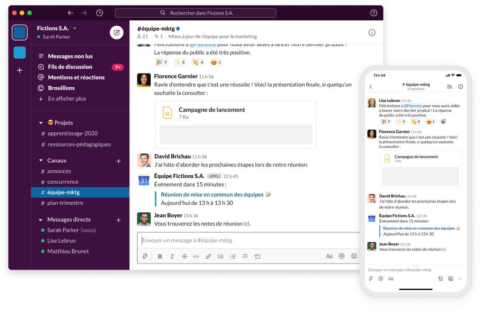
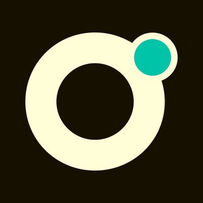
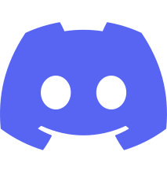

:titre: Outils de communication
:module: Onboarding
:duree: 45
:description: Comprendre les outils de communication pour collaborer
include::../../../../adoc/libs/header-module.adoc[]

ifeval::["{visible-on-html}" !=  "yes"]
:docinfo: shared
:docinfodir: ../../../../adoc/libs
endif::[]

== Objectifs pédagogiques
// tag::objectifs[]
* Comprendre l'utilité de Slack et Discord
* Savoir utiliser les canaux et les fils de discussion sur Slack
* Connaître les bonnes pratiques de communication
// end::objectifs[]

// tag::deroulement[]
== Slack c’est quoi ?

image::./assets/slack.png[,300,]

Wikipédia : Slack est une plateforme de communication collaborative propriétaire ainsi qu'un logiciel de gestion de projets
Chez O’clock :

* The Outil de communication en dehors des cours
* des canaux, avec chacun un thème précis
* création de votre compte dans l'atelier qui suit

=== Les canaux

* #général : canal principal, pour les annonces à la promo
* #classe : les messages liés aux cours
* #entraide : pour poser vos questions et répondre à d'autres
* #sav : pour faire des demandes de SAV

=== Le formulaire SAV

* dans le canal #sav
* il y a le lien du formulaire pour faire une demande de SAV

=== Message vs Fil de discussion

* message pour lancer un sujet, poser une question
* fil de discussion (thread), pour répondre au sujet/question
* utiliser les fils de discussion autant que possible !
* ⚠️⚠️⚠️ les messages s'effacent après 30jrs

=== 👮👮‍♀️

Comme dans la salle de classe, on veut tous une bonne ambiance, mais pas au dépend des autres, donc :

* Courtoisie et respect sont attendus 🙏
* Hors-sujets autorisés, mais dans les canaux dédiés 😉
* Vous êtes tous dans le même bateau 🛳️
* Demandez de l'aide quand nécessaire 🆘
* Aidez vos collègues quand vous le pouvez 💪

=== Application de bureau

* à installer (ne pas utiliser la version web)
* activez les notifications ! (possible de filtrer)
* ce sera notre moyen de contact avec vous

🪟 (Windows) : https://slack.com/intl/fr-fr/downloads/windows

🍎 (Mac) : https://slack.com/intl/fr-fr/downloads/mac

🐧 (Linux) : https://slack.com/intl/fr-fr/downloads/linux

=== Le Slack Pro

* Pour l'après-formation
* Qui se prépare dès aujourd'hui
* Inscription au slack pro en fin de journée
* avec tous les alumni O'clock (anciens apprenants)
* gestion du passage de la certification
* entraide pour les CV, portfolio
* publication d'évènement emploi locaux
* publication d'offres de partenaires
* https://join.slack.com/t/oclock-pro/signup

== Discord c'est quoi ?

* Wikipédia : _Discord est un logiciel propriétaire gratuit de VoIP et de messagerie instantanée_
* VoIP = Voice over Internet Protocol
* Logiciel pour communiquer à l'oral principalement, en vidéo et à l'écrit
* Dans notre cas ce sera surtout pour se parler

=== Le discord O'Clock

* inscrivez-vous ! : https://oclock.io/discord
* téléchargez l'application desktop sur votre hôte

=== Obtenir les droits étudiants

* dans la liste des membres (à droite)
* chercher notre bot dénommé...
* ... _Big Brother_ 🤖
* cliquer dessus
* envoyer un message
* !chaussons + mot de passe

=== Les salons vocaux

* salons publics
* salons privés

=== Salons publics

* il y en a moult
* c'est surtout pour le travail de groupe
* (les ateliers, les challenges, les projets)

=== Astuce

* CTRL + K puis !NOM_DU_SALON pour retrouver un salon par son nom rapidement

// end::deroulement[]
