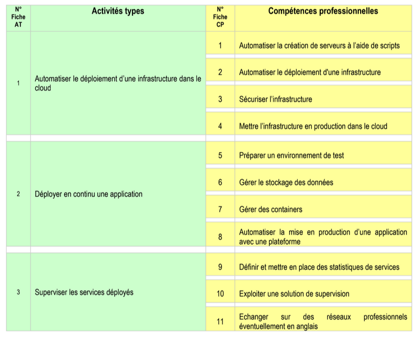

:titre: Présentation du titre professionnel
:module: Onboarding
:duree: 30
:description: Modalités et informations sur le titre pro
include::../../../../adoc/libs/header-module.adoc[]

ifeval::["{visible-on-html}" !=  "yes"]
:docinfo: shared
:docinfodir: ../../../../adoc/libs
endif::[]

== Objectifs pédagogiques
// tag::objectifs[]
* Comprendre le titre professionnel Administrateur système DevOps
* Connaître les modalités de validation du titre
* Savoir comment remplir le dossier professionnel
// end::objectifs[]

== 📜 Titre professionnel Administrateur système DevOps

=== 🎓 Validation du TP

* **Trois blocs de compétences (Activités Types) - avec 3 ou 4 CP**
* Validation partielle ou absence de validation
* 1 an pour le repasser et 3 essais

=== 📗📙 REAC & RE

https://drive.google.com/file/d/1hUEaMaLmjmsxJESsNt_1rdeZ8XMN4lXC/view?usp=sharing[REAC ↔ RÉFÉRENTIEL EMPLOI ACTIVITES COMPETENCES]

https://drive.google.com/file/d/1UAURyuHMfokffS7AyUkCDIMrGyCXHMN-/view?usp=sharing[RE ↔ RÉFÉRENTIEL D'ÉVALUATION]

== 🔍 Vue synoptique de l'emploi-type

=== 1️⃣ Activité Type 1

**Automatiser le déploiement d’une infrastructure dans le cloud**

* Automatiser la création de serveurs à l'aide de scripts

_Serveur Linux, Ansible_

* Automatiser le déploiement d'une infrastructure

_Terraform_

* Sécuriser l'infrastructure

_Réseaux, pares-feux, cloud_

* Mettre l'infrastructure en production dans le cloud

_Admin sys, cloud_

=== 2️⃣ Activité Type 2

**Déployer en continu une application**

* Préparer un environnement de test

_Conteneurs, pipelines CI/CD_

* Gérer le stockage des données

_Git, Docker, Fargate, Kubernetes, cloud_

* Gérer des containers

_Docker, Fargate, Kubernetes_

* Automatiser la mise en production d'une application avec une plateforme

_Ansible, pipelines CI/CD_

=== 3️⃣ Activité Type 3

**Superviser les services déployés**

* Définir et mettre en place des statistiques de services

_Admin sys, Docker, Fargate, Kubernetes_

* Exploiter une solution de supervision

_Admin sys, Fargate, Kubernetes_

* Echanger sur des réseaux professionnels éventuellement en anglais

_tout au long de la formation, surtout pendant le projet de fin !_

== 📝 Le dossier professionnel

* Doit valider toutes les compétences
* Sert à démontrer vos compétences mises en pratique individuellement
* Pour chaque Activité Type, vous utiliserez au mini 1 et au maxi 3 réalisations
* Vous pouvez être succinct dans vos explications
* Soyez pertinents dans vos choix

== 📝 Le dossier de projet

* Un à trois projet(s) qui couvre(nt) les compétences obligatoires
* Vous DEVEZ savoir défendre les choix de chaque membre de l'équipe
* Si vous trouvez ça pertinent, mettez le dedans ! Il doit faire entre 30 et 50 pages (hors annexe, sommaire et page de garde)
* Sert à démontrer vos connaissances et compétences mises en oeuvre en équipe
* Le dossier de projet devra être imprimé et remis à votre jury le jour J !

=== 🆘 Comment ça se remplit ?

Pensez à profiter des journées asynchrones pour faire avancer vos dossiers.

Au fur et à mesure des saisons, on vous invite fortement à mettre de côté les projets qui vous semblent pertinents pour le dossier professionnel, cela vous évitera un tri à faire en fin de formation.

== De l'aide de France Travail ? 🤔

https://www.francetravail.fr/candidat/vos-recherches/les-aides-financieres/recherche-demploi---laide-au-dep.html[Recherche d'emploi - L'aide au déplacement)

image::./assets/france-travail.png[]

## Des tips !

* Entraidez-vous ! Mais attention, entraide ne veut pas dire copier 😜
* Travaillez à votre rythme
* Pensez à cette matrice d’Eisenhower :

image::./assets/matrice-eisenhower.png[]