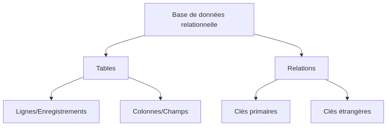

:titre: Introduction à SQL pour les DevOps
:module: SQL
:duree: 120
:description: Découverte des concepts de base de SQL pour les professionnels DevOps.
include::../../../../adoc/libs/header-module.adoc[]

ifeval::["{visible-on-html}" !=  "yes"]
:docinfo: shared
:docinfodir: ../../../../adoc/libs
endif::[]

// tag::objectifs[]
* *Comprendre* les concepts fondamentaux des bases de données relationnelles
* *Expliquer* la structure et la syntaxe de base des requêtes SQL
* *Appliquer* les commandes SQL de base pour la manipulation des données
* *Analyser* les besoins en gestion de données dans un contexte DevOps
// end::objectifs[]

// tag::deroulement[]
== Introduction aux bases de données relationnelles

Les bases de données relationnelles sont un composant essentiel de nombreuses applications et systèmes. Elles permettent de stocker, organiser et récupérer des données de manière structurée.

=== Concepts clés

- *Table* : Structure qui organise les données en lignes et colonnes
- *Colonne* : Définit un type de données spécifique (ex: nom, date, nombre)
- *Ligne* : Représente un enregistrement unique dans la table
- *Clé primaire* : Identifiant unique pour chaque enregistrement
- *Clé étrangère* : Établit une relation entre deux tables

== Introduction à SQL

SQL (Structured Query Language) est le langage standard pour interagir avec les bases de données relationnelles.

=== Types de commandes SQL

1. DDL (Data Definition Language) : CREATE, ALTER, DROP
2. DML (Data Manipulation Language) : SELECT, INSERT, UPDATE, DELETE
3. DCL (Data Control Language) : GRANT, REVOKE

== Commandes SQL de base

=== SELECT

La commande SELECT est utilisée pour récupérer des données d'une ou plusieurs tables.

.Syntaxe de base
[source,sql]
----
SELECT colonne1, colonne2 FROM nom_table WHERE condition;
----

=== INSERT

INSERT est utilisé pour ajouter de nouvelles données dans une table.

.Syntaxe de base
[source,sql]
----
INSERT INTO nom_table (colonne1, colonne2) VALUES (valeur1, valeur2);
----

=== UPDATE

UPDATE permet de modifier des données existantes dans une table.

.Syntaxe de base
[source,sql]
----
UPDATE nom_table SET colonne1 = nouvelle_valeur WHERE condition;
----

=== DELETE

DELETE est utilisé pour supprimer des enregistrements d'une table.

.Syntaxe de base
[source,sql]
----
DELETE FROM nom_table WHERE condition;
----

== Importance de SQL dans le DevOps

Dans le contexte DevOps, la compréhension de SQL est cruciale pour :

1. Gestion des configurations
2. Analyse des logs
3. Monitoring et reporting
4. Automatisation des tâches de maintenance des bases de données

// end::deroulement[]

// tag::demo[]
== Démonstration 1 : Création et interrogation d'une table

[NOTE.speaker]
--
Nous allons créer une table simple et effectuer quelques requêtes de base.

1. Créer une table :
+
[source,sql]
----
CREATE TABLE employes (
    id INT PRIMARY KEY,
    nom VARCHAR(50),
    poste VARCHAR(50),
    salaire DECIMAL(10, 2)
);
----

2. Insérer des données :
+
[source,sql]
----
INSERT INTO employes (id, nom, poste, salaire) VALUES
(1, 'Alice', 'Développeur', 75000),
(2, 'Bob', 'Admin Système', 70000),
(3, 'Charlie', 'DevOps Engineer', 85000);
----

3. Sélectionner toutes les données :
+
[source,sql]
----
SELECT * FROM employes;
----

4. Sélectionner avec une condition :
+
[source,sql]
----
SELECT nom, salaire FROM employes WHERE salaire > 70000;
----
--

== Démonstration 2 : Mise à jour et suppression de données

[NOTE.speaker]
--
Nous allons maintenant modifier et supprimer des données dans notre table.

1. Mettre à jour un enregistrement :
+
[source,sql]
----
UPDATE employes SET salaire = 80000 WHERE nom = 'Alice';
----

2. Vérifier la mise à jour :
+
[source,sql]
----
SELECT * FROM employes WHERE nom = 'Alice';
----

3. Supprimer un enregistrement :
+
[source,sql]
----
DELETE FROM employes WHERE nom = 'Bob';
----

4. Vérifier la suppression :
+
[source,sql]
----
SELECT * FROM employes;
----
--

// end::demo[]

// tag::exercice[]
== Exercice 1 : Création et interrogation d'une table

Créez une table `projets` avec les colonnes suivantes :
- id (entier, clé primaire)
- nom (chaîne de caractères)
- date_debut (date)
- statut (chaîne de caractères)

Insérez au moins 3 projets dans cette table, puis écrivez une requête pour sélectionner tous les projets dont le statut est "En cours".

== Exercice 2 : Mise à jour et jointure

1. Ajoutez une colonne `id_responsable` (entier) à la table `projets`.
2. Mettez à jour quelques projets avec des id_responsable.
3. Écrivez une requête pour joindre les tables `projets` et `employes` afin d'afficher le nom du projet et le nom du responsable.

== Exercice 3 : Requêtes avancées

Écrivez une requête SQL pour trouver :
1. Le salaire moyen des employés.
2. Le nombre de projets par statut.
3. Le nom du projet le plus récent (basé sur la date de début).

TIP: Utilisez les fonctions d'agrégation comme AVG(), COUNT(), et MAX().
// end::exercice[]

== Conclusion

// tag::conclusion[]
* Vous avez appris les bases de SQL et son importance dans le contexte DevOps.
* Vous pouvez maintenant effectuer des opérations CRUD (Create, Read, Update, Delete) de base sur une base de données.
* Ces compétences vous aideront dans la gestion des configurations, l'analyse des logs et l'automatisation des tâches liées aux bases de données dans votre travail DevOps.
* Continuez à pratiquer et à explorer des requêtes plus complexes pour améliorer vos compétences en SQL.
// end::conclusion[]
