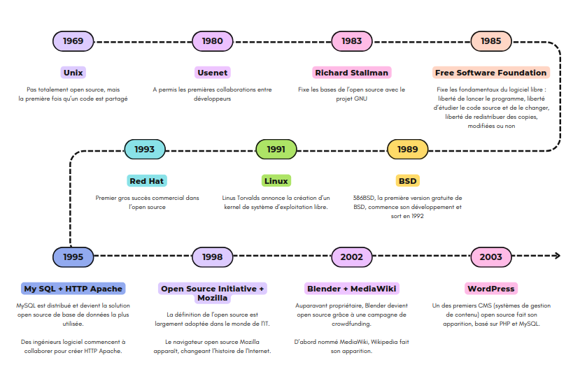
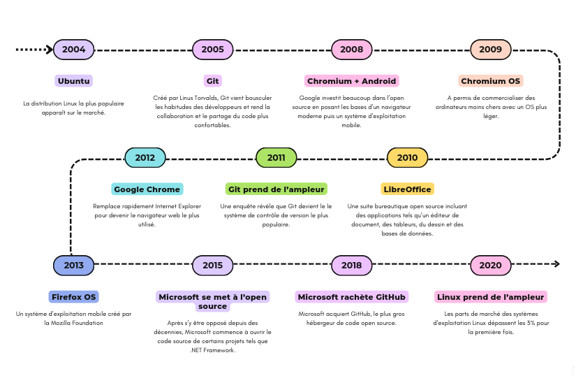

:titre: Introduction à Linux
:module: Système
:duree: 45
:description: Histoire de Linux et commandes de base
include::../../../../adoc/libs/header-module.adoc[]

ifeval::["{visible-on-html}" !=  "yes"]
:docinfo: shared
:docinfodir: ../../../../adoc/libs
endif::[]

== Objectifs pédagogiques
// tag::objectifs[]
* Comprendre l'intérêt de Linux pour un DevOps
* Connaître quelques commandes de base
// end::objectifs[]

// tag::deroulement[]
== C'est quoi un OS ?

* chef d'orchestre d'un ordinateur
* gère les ressources matérielles, exécute les programmes
* permet aux utilisateurs d'interagir avec l'ordinateur

== Histoire de l'open source

=== Histoire de l'open source - suite

== Pourquoi Linux ?

[cols="1,1"]
|===

a|
* **Flexibilité et Personnalisation**
* **Open Source**
* **Stabilité et Performance**
* **Ligne de Commande Puissante**
* **Large Écosystème d'Outils**
a|
* **Compatibilité avec le Cloud**
* **Automatisation**
* **Communauté Active**
* **Sécurité**

|===

[NOTE.speaker]
--
1. **Flexibilité et Personnalisation** : Linux offre une grande flexibilité et permet aux DevOps de personnaliser l'ensemble de l'environnement selon leurs besoins spécifiques, ce qui est crucial pour les pipelines DevOps.
2. **Open Source** : Linux est open source, ce qui signifie que le code source est disponible pour tous. Cela permet aux DevOps de personnaliser, de modifier et d'adapter le système à leurs exigences.
3. **Stabilité et Performance** : Linux est réputé pour sa stabilité et sa performance, ce qui est crucial pour les opérations DevOps nécessitant une exécution en continu sans interruption.
4. **Ligne de Commande Puissante** : La ligne de commande de Linux offre une puissance et une flexibilité exceptionnelles, permettant aux DevOps d'automatiser des tâches complexes et de gérer efficacement les configurations.
5. **Large Écosystème d'Outils** : Linux dispose d'une vaste gamme d'outils open source pour le développement, le déploiement, la surveillance, la gestion des configurations et plus encore, qui s'intègrent parfaitement dans les flux de travail DevOps.
6. **Compatibilité avec le Cloud** : De nombreux services cloud (comme AWS, Azure, Google Cloud) sont basés sur Linux. Les compétences acquises en travaillant avec Linux sont facilement transférables vers la gestion des ressources cloud.
7. **Automatisation** : Linux offre de nombreuses options d'automatisation, ce qui est au cœur des pratiques DevOps. Les scripts et les outils d'automatisation peuvent être facilement mis en œuvre sur Linux.
8. **Communauté Active** : La vaste communauté Linux fournit un soutien, des forums, des didacticiels et des ressources abondantes, ce qui est précieux pour les DevOps en cas de problèmes ou de questions.
9. **Sécurité** : Linux est réputé pour sa sécurité, ce qui est crucial pour les DevOps qui travaillent sur des environnements sensibles et qui doivent protéger les données et les systèmes.
--

=== Les distributions Linux

* versions complètes de l'OS Linux avec différents composants logiciels et interfaces
* sont adaptées à diverses utilisations, du développement au serveur
* Exemples : Ubuntu, Fedora, CentOS

=== Logiciel libre

GNU/Linux est composé uniquement de logiciels libres. Cela signifie plusieurs choses.

- Les logiciels libres et ceux qui les ont développés ne contrôlent pas ses utilisateurs.
- Le but des logiciels libres ne doit pas être malveillant envers ses utilisateurs.
- Le code des logiciels est consultable et même modifiable, sans besoin de notifier les auteurs.

=== La Free Software Foundation

La *Free Software Foundation* propose 4 règles pour définir ce que doit être un logiciel libre :

1. La liberté d’exécuter le programme, pour tous les usages ;
2. La liberté d’étudier le fonctionnement du programme et de l’adapter à ses besoins ;
3. La liberté de redistribuer des copies du programme (ce qui implique la possibilité aussi bien de donner que de vendre des copies) ;
4. La liberté d’améliorer le programme et de distribuer ces améliorations au public, pour en faire profiter toute la communauté.

=== Ce que le logiciel libre n'est pas

- Forcément gratuit, son développement peut être soutenu financièrement.
- Open-source. Ce qui est open-source peut tout de même être malveillant envers ses utilisateurs.

Pour aller plus loin :

- https://fr.wikipedia.org/wiki/Logiciel_libre#/media/Fichier:Carte_conceptuelle_du_logiciel_libre.svg[Wikipédia - Schéma conceptuel du logiciel libre]
- https://www.gnu.org/philosophy/free-software-even-more-important.html[GNU.org - Le logiciel libre est encore plus essentiel maintenant]
- https://www.gnu.org/philosophy/open-source-misses-the-point.html[GNU.org - En quoi l’open source perd de vue l’éthique du logiciel libre]

== Utilisation

* en entreprise, on doit pouvoir dialoguer avec le serveur web du projet qu'on développe
* la plupart du temps, les machines seront sur Linux
* il faut donc apprendre à communiquer avec
* chaque logiciel a des commandes spécifiques

=> manuel accessible via `man nom_du_logiciel`

Exemple : `man git`

[NOTE.speaker]
--
C’est aussi de là que vient l’expression https://fr.wikipedia.org/wiki/RTFM_(expression)[RTFM - Wikipédia] !
--

=== Se déplacer dans le système de fichiers

* `pwd` permet de savoir où l'on se trouve
* `ls` permet de lister les fichiers et dossiers du répertoire courant
* `cd chemin/vers/le/répertoire/cible` permet de se déplacer dans un autre dossier
* il y en a plein d'autres, on va les voir au fur et à mesure

[NOTE.speaker]
--
⚠️ Attention, dans le terminal comme dans le code, la casse est très importante : +PwD+ ne fonctionnera pas !
--

== Commandes Linux de base

[cols="1,1"]
|===

a|
- `ls` : Liste les fichiers et dossiers.
- `cd` : Change de répertoire.
- `pwd` : Affiche le répertoire courant.
- `mkdir` : Crée un nouveau dossier.
- `rm` : Supprime des fichiers.
- `rm`dir : Supprime des dossiers.
a|
- `cp` : Copie des fichiers.
- `mv` : Déplace des fichiers.
- `cat` : Affiche le contenu d'un fichier.
- `nano` ou `vim` ou `emacs` : Édite un fichier en mode texte.
- `chmod` : Modifie les permissions d'accès aux fichiers.

|===

== Packaging

On utilise un gestionnaire de paquets (ex: APT sur Debian)

* `sudo apt show git` : pour en savoir plus sur un paquet
* `sudo apt install git` : pour installer un paquet
* `sudo apt remove git` : pour supprimer un paquet
* `sudo apt update` : pour mettre à jour la liste des paquets
* `sudo apt upgrade` : pour mettre à jour les paquets eux-mêmes

Plus d'infos : https://doc.ubuntu-fr.org/apt-cli[Ubuntu - APT CLI]

[NOTE.speaker]
--
Pourquoi `sudo` ? Pour certaines opérations sensibles, il est nécessaire de spécifier `sudo`. Pour cela, l'utilisateur doit posséder les droits pour utiliser `sudo`.
--

=== Mettre à jour sa machine

* 1. Mettre à jour les informations des paquets

`sudo apt update`

* 2. Mettre à jour les paquets

`sudo apt upgrade`

* 3. Nettoyer les paquets inutilisés (facultatif)

`sudo apt autoremove`

=== Terminal Linux vs Powershell

* ce sont tous deux des interfaces en ligne de commande
* sur Linux, avec bash, on utilise les commandes vues précédemment
* sur Windows, on utilise Powershell qui est un langage à part entière, basé sur des objets et scripts
// end::deroulement[]

== Conclusion
// tag::conclusion[]
* Compréhension de l'intérêt de Linux pour un DevOps
* Connaissance de quelques commandes de base
// end::conclusion[]