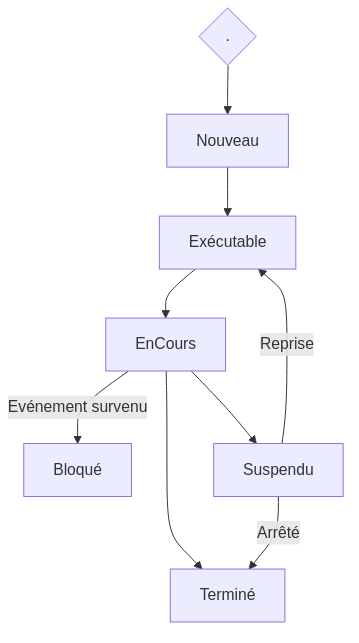

:titre: Gestion des processus
:module: Système
:duree: 60
:description: Explication des processus sous Linux et comment les gérer efficacement avec des outils de gestion de processus.

include::../../../../adoc/libs/header-module.adoc[]

ifeval::["{visible-on-html}" !=  "yes"]
:docinfo: shared
:docinfodir: ../../../../adoc/libs
endif::[]

// tag::objectifs[]
// Sous forme de liste à puce, en utilisant la taxonomie de Bloom
* **Comprendre** les processus sous Linux.
* **Appliquer** les commandes de gestion des processus 
* **Analyser** l'impact des processus sur le système.
// end::objectifs[]

// tag::deroulement[]
== Qu'est-ce qu'un processus ?

Un processus est une instance d'un programme en cours d'exécution. Chaque processus possède son propre espace mémoire et est géré par le noyau.

[NOTE.speaker]
--
Un processus est une entité active dans le système informatique, capable d'exécuter des instructions et d'interagir avec les ressources matérielles et logicielles du système.
--

.Les types de processus :
* **Processus parent** : Un processus qui en crée un autre.
* **Processus enfant** : Un processus créé par un autre processus.
* **Daemon** : Un processus qui s'exécute en arrière-plan pour effectuer des tâches spécifiques.
* **Zombie** : Un processus terminé mais dont les informations restent dans la table des processus.

[NOTE.speaker]
--
Un processus peut être actif, suspendu ou terminé. Il peut aussi devenir un zombie lorsque le parent ne récupère pas correctement ses informations de terminaison. Les daemons sont des processus qui fonctionnent en arrière-plan pour des tâches comme la gestion des services.
--

=== Cycle de vie d'un processus

Le cycle de vie d'un processus sous Linux inclut plusieurs étapes :

* **Création** : Lorsqu'un processus parent crée un processus enfant.
* **Prêt** : Le processus est prêt à être exécuté.
* **Exécution** : Le processus utilise le CPU et les ressources pour accomplir ses tâches.
* **Attente** : Le processus est suspendu en attendant une ressource (comme l'I/O).
* **Terminaison** : Le processus se termine et devient un zombie si ses ressources ne sont pas immédiatement libérées.

[NOTE.speaker]
--
Le cycle de vie d'un processus commence par sa création à partir d'un autre processus (généralement via la fonction `fork()`), puis passe par des états d'exécution, d'attente de ressources et, finalement, de terminaison. Le noyau de Linux assure la gestion des transitions entre ces états via un ordonnanceur.
--

=== Schema

[NOTE.speaker]
--
* Nouveau : Processus créé mais non chargé en mémoire.
* Exécutable : Processus prêt à être exécuté et chargé en mémoire.
* EnCours : Processus en cours d'exécution par le CPU.
* Bloqué : Processus en attente d'une ressource (I/O, etc.) avant de reprendre.
* Suspendu : Processus temporairement arrêté et prêt à reprendre.
* Terminé : Processus terminé et prêt à être nettoyé.
--

== Gestion des processus

* `ps` : Affiche la liste des processus en cours. ¹
* `top` : Affiche les processus en cours en temps réel. ²
* `kill` : Envoie un signal à un processus, typiquement pour le terminer. ³
* `bg` et `fg` : Reprend un processus en arrière-plan ou le ramène au premier plan. ⁴
* `jobs` : Affiche les processus en arrière-plan lancés par le shell courant. ⁵

[NOTE.speaker]
--
. La commande ps permet d'afficher une liste des processus actifs sur le système, offrant des détails comme l'ID du processus (PID), le temps CPU utilisé et l'état du processus.
. Utilisé pour surveiller les processus en temps réel, top présente une vue dynamique des processus actifs, triés par utilisation des ressources CPU, mémoire, etc.
. kill est utilisé pour envoyer des signaux à des processus, permettant de les interrompre ou de les contrôler selon les besoins.
. bg reprend un processus arrêté en arrière-plan tandis que fg le ramène au premier plan d'exécution.
. La commande jobs montre les processus actifs en arrière-plan lancés à partir du shell actuel, avec leurs numéros d'identification pour la gestion ultérieure.
--

=== `ps` : Liste des processus

`ps` : Affiche la liste des processus en cours.

* Description : La commande `ps` permet d'afficher des informations sur les processus actifs sur le système.
* Utilisation : `ps -aux` est une utilisation courante pour afficher tous les processus en cours, y compris ceux des autres utilisateurs (a), avec des informations détaillées (u) et dans un format étendu (x).

.Vue exhaustive de l'état actuel du système
[source, shell]
----
ps -aux
----

[NOTE.speaker]
--
`ps` inclu le PID, le temps CPU utilisé, l'utilisateur propriétaire et l'état. Cette commande est essentielle pour diagnostiquer les performances du système et identifier les processus consommateurs de ressources.
--

=== `top` : Surveillance en temps réel

`top` : Affiche les processus en cours en temps réel.

* Description : La commande `top` permet de surveiller les processus actifs en temps réel, triés par utilisation des ressources.
* Utilisation : En tapant simplement `top` dans un terminal, on obtient une mise à jour continue des processus actifs avec des détails tels que l'utilisation CPU, la mémoire utilisée, etc.

.Surveillance en temps réel des processus
[source, shell]
----
top
----

[NOTE.speaker]
--
`top` inclu des détails comme l'ID du processus (PID), le pourcentage d'utilisation CPU, la mémoire utilisée et d'autres informations pertinentes.
--

=== `kill` : Terminaison de processus

`kill` : Envoie un signal à un processus pour le terminer.

* Description : La commande `kill` est utilisée pour envoyer des signaux à des processus, généralement pour les terminer.
* Utilisation : `kill [PID]` où `[PID]` est l'identifiant numérique du processus que l'on souhaite affecter. Par exemple, `kill 1234` enverra le signal par défaut (SIGTERM) au processus avec l'ID 1234.

.Terminer un processus spécifique
[source, shell]
----
kill [PID]
----

=== `bg` et `fg` : Gestion des processus

`bg` et `fg` : Reprend un processus en arrière-plan ou le ramène au premier plan.

* Description : Les commandes `bg` et `fg` permettent de gérer les processus en arrière-plan et au premier plan.
* Utilisation :
** `bg [job_id]` : reprend un processus arrêté ou en pause en arrière-plan. Par exemple, `bg %1` reprend le premier processus en arrière-plan.
** `fg [job_id]` : ramène un processus en arrière-plan au premier plan. Par exemple, `fg %1` ramène le premier processus en arrière-plan au premier plan.

[source, shell]
----
bg [job_id]
fg [job_id]
----

=== `jobs` : Liste des processus en arrière-plan

`jobs` : Affiche les processus en arrière-plan lancés par le shell courant.

* Description : La commande `jobs` permet d'afficher les processus en arrière-plan lancés à partir du shell actuel.
* Utilisation : En tapant simplement `jobs` dans un terminal, on obtient une liste des processus en arrière-plan avec leurs numéros d'identification.

.Liste des processus en arrière-plan
[source, shell]
----
jobs
----

// tag::demo[]
== Démonstration

Utilisation des commandes de gestion des processus

[NOTE.speaker]
--
. Ouvrir un terminal.
. Exécuter la commande ps -aux pour afficher tous les processus en cours.
. Lancer une application en arrière-plan (par exemple, nano &).
. Utiliser la commande jobs pour voir les processus en arrière-plan.
. Reprendre le processus en avant-plan avec fg [job_id].
. Lancer de nouveau une application en arrière-plan (par exemple, nano &).
. Utiliser la commande kill pour terminer le processus.
--
// end::demo[]

// tag::exercice[]
== Exercice 1

.Objectifs de l'exercice :
* Lister les processus en cours d'exécution et identifier ceux appartenant à l'utilisateur courant.
* Terminer un processus spécifique à l'aide de la commande `kill`.

[NOTE.speaker]
--
1. Utiliser `ps aux` pour lister tous les processus.
2. Filtrer les processus appartenant à votre utilisateur avec `ps aux | grep $USER`.
3. Identifier un processus à terminer et utiliser `kill PID` pour l'arrêter.
--
// end::exercice[]

== Théorie des priorités

* Chaque processus se voit attribuer une priorité
* La priorité est un nombre ou une valeur représentant son importance relative par rapport aux autres processus en cours d’exécution
* Attribution des priorités : 
** différents algorithmes pour attribuer des niveaux de priorité aux processus.
** priorités statiques (définies à l'avance) 
** priorités dynamiques (changées en fonction de la charge du système).
* Impact sur l'ordonnancement : 
** Priorité plus élevée => exécution plus fréquente donc plus de temps CPU
** Peut influencer la réactivité du système et la performance globale
* Gestion des priorités : 
** pour optimiser les performances
** pour garantir le bon fonctionnement des applications critiques

[NOTE.speaker]
--
Chaque processus en cours d'exécution sur un système Linux est attribué une priorité, représentant son importance relative par rapport aux autres processus.

Cette valeur détermine l'ordre dans lequel les processus seront exécutés par l'ordonnanceur du système d'exploitation.

Il existe différents algorithmes pour attribuer des niveaux de priorité aux processus, incluant des priorités statiques définies à l'avance et des priorités dynamiques ajustées en fonction de la charge du système.

Les processus avec une priorité plus élevée ont tendance à recevoir plus de temps CPU et sont exécutés plus fréquemment, influençant ainsi la réactivité du système et sa performance globale.

Les administrateurs système ajustent les priorités pour optimiser les performances du système et assurer le bon fonctionnement des applications critiques, en s'assurant que les ressources sont allouées de manière efficace et équitable.
--

=== Niveaux de priorité

|===
|OS|Niveaux de priorité|Description

|Linux|De -20 à 19|Plus le nombre est bas, plus la priorité est élevée

|Mac OS|De -20 à 20|Plus le nombre est bas, plus la priorité est élevée

|Windows|De 0 à 31|Plus le nombre est bas, plus la priorité est élevée
|===

=== Ajuster la priorité

`renice` : Permet de modifier la manière dont les processus sont ordonnancés par le système d’exploitation

* Description : `renice` permet de modifier la priorité de l'exécution des processus en cours d'exécution sur les systèmes Unix et Linux. Cela peut être utile pour ajuster les performances du système en donnant plus ou moins de temps CPU à certains processus.
* Utilisation : Pour ajuster la priorité d'un processus spécifique, utiliser la commande `renice` suivie de l'option `-n` et du nouveau niveau de priorité, ainsi que de l'identifiant du processus (PID) du processus cible.

[source, shell]
----
renice -n [priorité] -p [PID]
----

[NOTE.speaker]
--
Par exemple, `renice -n 10 -p 1234` augmentera la priorité du processus avec PID 1234.
--

// tag::demo[]
=== Démonstration

Utilisation des commandes de gestion des processus

[NOTE.speaker]
--
. Ouvrir un terminal.
. Lancer 2 applications en arrière-plan (par exemple, sleep 600 &).
. Trouver le PID avec la commande ps aux | grep sleep
. Utiliser renice pour modifier les priorités des processus
. Observer les différences de valeurs impactées dans les processus grâce à top
. Montrer qu’on peut trier par PID avec Shift + P dans top
--

// tag::exercice[]
== Exercice 2

* Démarrer le processus `sleep 60` avec une priorité modifiée basse
* Changer la priorité d'un processus existant.

[NOTE.speaker]
--
1. Lancer une commande avec `nice` en définissant une priorité plus faible (`nice -n 10 sleep 60`).
2. Utiliser `ps aux | grep sleep` pour identifier le PID du processus.
3. Augmenter la priorité du processus avec `renice -n -5 -p PID`.
4. Utiliser `top` pour observer le changement de priorité.
--
// end::exercice[]

// end::deroulement[]

== Conclusion

// tag::conclusion[]
* **Compréhension des processus sous Linux** : Qu'est-ce qu'un processus, son cycle de vie, et les différents types (parent, enfant, daemon, zombie).
* **Maîtrise des commandes de gestion des processus** : Savoir utiliser `ps` pour lister les processus, `top` pour surveiller en temps réel, et `kill` pour terminer des processus.
* **Gestion avancée des processus** : Modification de la priorité d'un processus avec `nice` et `renice`, et impact sur les performances du système.
* **Analyse des processus** : Savoir analyser les processus et leur impact sur le système en utilisant les outils appropriés.
// end::conclusion[]