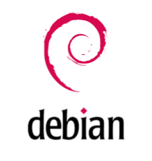
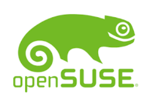

:titre: Machine virtuelle
:module: Système
:duree: 180
:description: Présentation rapide des distributions Linux majeures et création d'une machine virtuelle avec VirtualBox.
include::../../../../adoc/libs/header-module.adoc[]

// https://docs.google.com/presentation/d/1UzAjwu_GXCCsuSZNQ_Q4APJoyQ4IOHBRE5ul83QRYbk/edit#slide=id.g2eaff0f5f65_0_18

ifeval::["{visible-on-html}" !=  "yes"]
:docinfo: shared
:docinfodir: ../../../../adoc/libs
endif::[]

// tag::objectifs[]
* **Comprendre** les distributions Linux et leurs particularités
* **Appliquer** un VM sur sa machine
// end::objectifs[]

// tag::deroulement[]
== Les distributions Linux

Les distributions Linux sont des variantes du système d'exploitation Linux, chaque distribution étant une combinaison unique du noyau Linux et d'un ensemble de logiciels. Voici quelques distributions populaires :

* Debian est connue pour sa stabilité et sa robustesse.
* Ubuntu est basée sur Debian et est très populaire pour les débutants.
* Fedora est souvent à la pointe des dernières technologies.
* CentOS est réputée pour sa stabilité en environnement serveur.
* Arch Linux est destinée aux utilisateurs avancés avec une approche de système minimaliste.

🔗 https://eylenburg.github.io/linux_comparison.htm[Comparaison des distributions Linux]

[NOTE.speaker]
--
Les distributions Linux sont des versions spécifiques du système d'exploitation Linux, chacune combinant le noyau Linux avec un ensemble unique de logiciels adaptés à différents besoins et utilisateurs.

* Debian est connue pour sa stabilité et sa robustesse, en étant largement utilisée comme base pour d'autres distributions en raison de ses processus stricts de vérification et de mise à jour des logiciels.
* Ubuntu, basée sur Debian, est très populaire pour les débutants, grâce à sa facilité d'utilisation, à son large éventail de logiciels disponibles et à son support communautaire actif.
* Fedora est souvent à la pointe des dernières technologies, privilégiant l'innovation et l'intégration rapide de nouvelles fonctionnalités dans son système d'exploitation.
* CentOS est réputée pour sa stabilité en environnement serveur, en fournissant des mises à jour de sécurité à long terme et un support robuste, idéal pour les infrastructures critiques.
* Arch Linux est destinée aux utilisateurs avancés avec une approche de système minimaliste, offrant un contrôle total sur la configuration du système et l'installation de logiciels, adaptée aux besoins spécifiques des utilisateurs expérimentés.
--

=== Debian

**Besoins : **

* stabilité, 
* robustesse, 
* serveurs, 
* environnement de production

**Caractéristiques : **

* Longs cycles de publication, 
* vaste dépôt de logiciels, 
* très peu de mises à jour non essentielles, 
* idéal pour un environnement de serveur où la stabilité est cruciale.

[NOTE.speaker]
--
Debian est une distribution Linux renommée, idéale pour les environnements nécessitant stabilité et robustesse, tels que les serveurs et les environnements de production.

* Stabilité : Debian est reconnue pour sa fiabilité à long terme et sa capacité à maintenir des systèmes opérationnels sans interruptions majeures.
* Robustesse : Sa structure solide et ses processus de vérification rigoureux garantissent une performance constante même dans des conditions exigeantes.
* Serveurs : Adaptée spécifiquement aux besoins des serveurs, Debian offre une sécurité et une gestion des ressources optimales.
* Environnement de production : Utilisée largement dans les environnements de production pour sa capacité à gérer des charges de travail critiques de manière fiable.
* Longs cycles de publication : Les versions Debian suivent des cycles de publication longs, assurant une stabilité continue sans changements fréquents.
* Vaste dépôt de logiciels : Le dépôt Debian contient une large gamme de logiciels et de packages maintenus par la communauté, permettant une flexibilité dans les configurations.
* Très peu de mises à jour non essentielles : Les mises à jour sont soigneusement sélectionnées pour minimiser les interruptions et maintenir la cohérence du système.
* Idéal pour un environnement de serveur où la stabilité est cruciale : En raison de ses caractéristiques, Debian est particulièrement recommandée pour les serveurs où la fiabilité et la sécurité sont des priorités absolues
--

=== Ubuntu

**Besoins : **

* utilisation quotidienne, 
* débutants, 
* utilisateurs personnels, 
* environnements de développement

**Caractéristiques : **

* basée sur Debian, mais plus facile à utiliser, 
* cycles de publication réguliers (tous les six mois), 
* large communauté de soutien, 
* excellente documentation, 
* choix populaire pour les développeurs grâce à sa compatibilité avec de nombreux outils et logiciels.

[NOTE.speaker]
--
Ubuntu est une distribution Linux largement utilisée, particulièrement adaptée aux débutants et aux utilisateurs recherchant une plateforme stable pour une utilisation quotidienne ou le développement.

* Utilisation quotidienne : Ubuntu est idéale pour une utilisation quotidienne grâce à son interface conviviale et ses applications préinstallées.
* Débutants : Elle est souvent recommandée aux débutants en raison de sa facilité d'installation et de son support communautaire accessible.
* Utilisateurs personnels : Adaptée aux besoins des utilisateurs individuels cherchant une alternative open source fiable pour leurs besoins quotidiens.
* Environnements de développement : Populaire parmi les développeurs pour son support étendu d'outils et de langages de programmation.
* Basée sur Debian, mais plus facile à utiliser : Ubuntu hérite de la stabilité de Debian tout en améliorant l'accessibilité et l'expérience utilisateur.
* Cycles de publication réguliers (tous les six mois) : Les versions d'Ubuntu sont régulièrement mises à jour pour inclure les dernières fonctionnalités et améliorations.
* Large communauté de soutien : Bénéficiant d'une vaste communauté active, Ubuntu offre un support technique et des forums d'entraide robustes.
* Excellente documentation : L'abondance de guides et de documentations disponibles facilite l'apprentissage et la résolution de problèmes pour les utilisateurs.
* Choix populaire pour les développeurs grâce à sa compatibilité avec de nombreux outils et logiciels : La compatibilité étendue d'Ubuntu en fait une plateforme de choix pour les environnements de développement variés.
--

=== Fedora

**Besoins : **

* dernières technologies, 
* développeurs, 
* testeurs

**Caractéristiques : **

* cycle de publication rapide, 
* souvent à la pointe des technologies, 
* excellent pour les développeurs qui veulent les dernières fonctionnalités, 
* sponsorisé par Red Hat, 
* excellent support pour les containers et le cloud computing.

[NOTE.speaker]
--
Fedora est une distribution Linux réputée pour sa focalisation sur les dernières technologies, ce qui en fait un choix privilégié pour les développeurs et les testeurs.

* Dernières technologies : Fedora est conçue pour ceux qui souhaitent expérimenter avec les technologies les plus récentes et les innovations en cours de développement.
* Développeurs : Elle est particulièrement appréciée des développeurs en raison de son support étendu pour les outils de développement et les langages de programmation modernes.
* Testeurs : Idéale pour les testeurs qui veulent évaluer et contribuer aux nouvelles fonctionnalités avant leur adoption plus large.
* Cycle de publication rapide : Fedora suit un cycle de publication rapide, introduisant fréquemment de nouvelles versions avec des fonctionnalités actualisées.
* Souvent à la pointe des technologies : En étant à l'avant-garde des innovations, Fedora permet aux utilisateurs d'accéder rapidement aux nouvelles avancées technologiques.
* Excellent pour les développeurs qui veulent les dernières fonctionnalités : Avec un écosystème riche en outils de développement, Fedora est parfaitement adaptée aux besoins des développeurs modernes.
* Sponsorisé par Red Hat : Fedora bénéficie du soutien de Red Hat, ce qui garantit une base solide et des normes élevées en matière de qualité et de sécurité.
* Excellent support pour les containers et le cloud computing : Grâce à sa focalisation sur les technologies émergentes, Fedora offre un support robuste pour les environnements de containers et de cloud computing.
--

=== CentOS

**Besoins : **

* serveurs, 
* environnements de production, 
* stabilité à long terme

**Caractéristiques : **

* rebuild de Red Hat Enterprise Linux (RHEL), 
* cycle de vie long, 
* grande stabilité, 
* largement utilisé dans les environnements de serveur et de production.

[NOTE.speaker]
--
CentOS est une distribution Linux reconstruite à partir de Red Hat Enterprise Linux (RHEL), réputée pour sa stabilité à long terme et son utilisation répandue dans les environnements de serveurs et de production.

* Serveurs : Centrée sur les besoins des serveurs, CentOS offre une plateforme robuste et fiable pour gérer des charges de travail critiques.
* Environnements de production : Adaptée aux exigences strictes des environnements de production, garantissant une performance constante et sécurisée.
* Stabilité à long terme : Recherchée pour sa capacité à maintenir la stabilité du système sur des périodes prolongées, essentielle pour les applications critiques.
* Rebuild de Red Hat Enterprise Linux (RHEL) : En étant un clone de RHEL, CentOS bénéficie de la même robustesse et compatibilité avec les logiciels RHEL.
* Cycle de vie long : Offre des cycles de support étendus, assurant la disponibilité de mises à jour de sécurité et de maintenance à long terme.
* Grande stabilité : CentOS est réputée pour sa fiabilité et sa résistance aux erreurs, assurant une continuité opérationnelle critique pour les applications serveur.
* Largement utilisé dans les environnements de serveur et de production : Choix populaire pour les infrastructures IT en raison de sa fiabilité et de sa capacité à supporter des charges de travail intensives.
--

=== Arch Linux

**Besoins : **

* Utilisateurs avancés, 
* personnalisation, 
* apprentissage approfondi de Linux

**Caractéristiques : **

* approche minimaliste, 
* philosophie KISS (Keep It Simple, Stupid), 
* installation et configuration manuelles, 
* offre une grande flexibilité et contrôle, 
* rolling release (mise à jour continue sans réinstallation).

[NOTE.speaker]
--
Arch Linux est une distribution Linux destinée aux utilisateurs avancés qui recherchent une personnalisation poussée et un apprentissage approfondi de Linux.

* Utilisateurs avancés : Arch Linux est conçue pour ceux qui ont une bonne connaissance de Linux et qui souhaitent un contrôle total sur leur système.
* Personnalisation : Elle permet une personnalisation exhaustive, adaptée aux besoins spécifiques de chaque utilisateur.
* Apprentissage approfondi de Linux : Par son approche manuelle, elle offre une excellente opportunité pour comprendre en profondeur le fonctionnement interne de Linux.
* Approche minimaliste : Arch Linux propose une installation de base minimale, permettant aux utilisateurs d'ajouter uniquement les composants dont ils ont besoin.
* Philosophie KISS (Keep It Simple, Stupid) : Elle suit une philosophie de simplicité, évitant les configurations par défaut complexes et superflues.
* Installation et configuration manuelles : L'installation et la configuration se font manuellement, donnant aux utilisateurs une connaissance détaillée et un contrôle total de leur système.
* Offre une grande flexibilité et contrôle : Cette distribution permet aux utilisateurs de configurer leur système exactement comme ils le souhaitent, sans logiciels préinstallés inutiles.
* Rolling release (mise à jour continue sans réinstallation) : Arch Linux utilise un modèle de mise à jour continue, évitant ainsi les réinstallations périodiques et garantissant l'accès aux dernières versions de logiciels.
--

=== Linux Mint

**Besoins : **

* utilisateurs débutants, 
* migration depuis Windows

**Caractéristiques : **

* basée sur Ubuntu, mais avec un environnement de bureau traditionnel plus proche de Windows, 
* facile à utiliser, 
* excellente compatibilité matérielle, 
* idéal pour les nouveaux utilisateurs Linux.

[NOTE.speaker]
--
Linux Mint est une distribution Linux particulièrement adaptée aux débutants et à ceux qui migrent depuis Windows, offrant une transition douce vers l'environnement Linux.

* Utilisateurs débutants : Linux Mint est idéale pour les nouveaux utilisateurs grâce à son interface conviviale et son approche simplifiée de l'utilisation de Linux.
* Migration depuis Windows : Conçue pour faciliter la transition des utilisateurs de Windows, elle offre une expérience familière et intuitive.
* Basée sur Ubuntu, mais avec un environnement de bureau traditionnel plus proche de Windows : Linux Mint propose un bureau qui rappelle celui de Windows, rendant l'adaptation plus facile pour les nouveaux venus.
* Facile à utiliser : Son interface utilisateur intuitive et bien conçue permet une utilisation sans tracas, même pour ceux qui découvrent Linux.
* Excellente compatibilité matérielle : Linux Mint est réputée pour sa capacité à fonctionner sur une grande variété de matériel sans nécessiter de configurations complexes.
* Idéal pour les nouveaux utilisateurs Linux : En combinant simplicité d'utilisation, compatibilité et une interface familière, Linux Mint est une excellente porte d'entrée dans le monde de Linux.
--

=== openSUSE

**Besoins : **

* utilisateurs professionnels, 
* serveurs, 
* développement

**Caractéristiques : **

* offre deux versions :
    ** Leap pour la stabilité (idéal pour les serveurs)
    ** Tumbleweed pour les rolling releases (idéal pour les développeurs), 
* outils de gestion robustes comme YaST.

[NOTE.speaker]
--
OpenSUSE est une distribution Linux adaptée aux utilisateurs professionnels, aux serveurs et aux développeurs, offrant des options flexibles selon les besoins de stabilité ou de mise à jour continue.

* Utilisateurs professionnels : OpenSUSE est conçue pour répondre aux exigences des professionnels avec des outils avancés et une gestion simplifiée.
* Serveurs : Idéale pour les environnements serveur nécessitant une stabilité et une sécurité robustes.
* Développement : Fournit une plateforme riche pour les développeurs avec des versions constamment mises à jour et des outils de développement puissants.
* Offre deux versions :
* Leap pour la stabilité (idéal pour les serveurs) : La version Leap d'OpenSUSE est conçue pour les utilisateurs qui privilégient la stabilité et la fiabilité à long terme.
* Tumbleweed pour les rolling releases (idéal pour les développeurs) : La version Tumbleweed suit un modèle de rolling release, permettant aux développeurs d'accéder aux dernières mises à jour et fonctionnalités sans attendre les nouvelles versions stables.
* Outils de gestion robustes comme YaST : OpenSUSE inclut YaST, un outil de gestion système puissant et convivial, facilitant la configuration et l'administration du système.
--

=== Elementary OS

**Besoins : **

* utilisateurs à la recherche d'une belle interface utilisateur, 
* alternative macOS

**Caractéristiques : **

* inspiré de macOS, 
* esthétique soignée et simple, 
* basé sur Ubuntu, 
* conçu pour être facile à utiliser, 
* idéal pour ceux qui privilégient l'esthétique et l'expérience utilisateur.

[NOTE.speaker]
--
Elementary OS est une distribution Linux conçue pour les utilisateurs recherchant une belle interface utilisateur et une alternative à macOS.

* Utilisateurs à la recherche d'une belle interface utilisateur : Elementary OS se distingue par son design élégant et sa présentation soignée, offrant une expérience visuelle agréable.
* Alternative macOS : Idéale pour ceux qui souhaitent une alternative à macOS, Elementary OS propose une interface et une expérience utilisateur similaires.
* Inspiré de macOS : Son design et son interface utilisateur s'inspirent fortement de macOS, rendant la transition facile pour les anciens utilisateurs de mac.
* Esthétique soignée et simple : Elementary OS met l'accent sur une esthétique minimaliste et épurée, privilégiant une expérience utilisateur harmonieuse.
* Basé sur Ubuntu : Tirant parti de la robustesse et de la compatibilité d'Ubuntu, il offre une base solide et fiable.
* Conçu pour être facile à utiliser : Elementary OS est conçu pour être intuitif et facile à prendre en main, même pour les nouveaux utilisateurs de Linux.
* Idéal pour ceux qui privilégient l'esthétique et l'expérience utilisateur : Cette distribution est parfaite pour les utilisateurs qui accordent une grande importance à l'apparence et à la fluidité de leur interface.
--

== En résumé

* Stabilité et serveurs : Debian, CentOS
* Utilisateurs quotidiens et débutants : Ubuntu, Mint
* Dernières technologies et développeurs : Fedora, OpenSUSE (Tumbleweed)
* Personnalisation et utilisateurs avancés : Arch Linux
* Esthétique et expérience utilisateur : Elementary OS

[NOTE.speaker]
--
Stabilité et serveurs : Debian et CentOS sont idéales pour les environnements nécessitant une stabilité et une fiabilité à long terme, particulièrement adaptées aux serveurs et aux environnements de production.
Utilisateurs quotidiens et débutants : Ubuntu et Mint offrent des interfaces conviviales et une grande facilité d'utilisation, ce qui les rend parfaites pour les nouveaux utilisateurs de Linux et une utilisation quotidienne.
Dernières technologies et développeurs : Fedora et OpenSUSE Tumbleweed sont à la pointe des dernières innovations technologiques, faisant d'elles des choix privilégiés pour les développeurs et ceux qui veulent les fonctionnalités les plus récentes.
Personnalisation et utilisateurs avancés : Arch Linux est destinée aux utilisateurs avancés qui recherchent une personnalisation poussée et un contrôle total sur leur système.
Esthétique et expérience utilisateur : Elementary OS se distingue par son design élégant et épuré, offrant une expérience utilisateur esthétique et agréable, idéale pour ceux qui privilégient l'apparence et la fluidité.
--

== Création d'une machine virtuelle

=== Pourquoi choisir Debian ?

* Distribution stable grâce à l’intégration de paquets testés
* Cycles de publication longs qui garantissent une stabilité des serveurs et des environnements de production
* Vaste dépôt de logiciels disponible

🔗 https://www.debian.org/index.fr.html[Site officiel de Debian]

🔗 https://www.debian.org/doc/[Documentation de Debian]

[NOTE.speaker]
--
Debian est réputée pour sa stabilité, obtenue en intégrant uniquement des paquets qui ont été rigoureusement testés et validés. Les longs cycles de publication de Debian assurent une fiabilité et une sécurité accrues, essentielles pour les serveurs et les environnements de production.

Debian offre un dépôt de logiciels très étendu, permettant aux utilisateurs d'accéder facilement à une large gamme d'applications et d'outils.
--

=== VirtualBox

VirtualBox est un logiciel de virtualisation open source qui permet de créer et de gérer des machines virtuelles sur un ordinateur hôte. Il est disponible pour Windows, macOS, Linux et Solaris.

🔗 https://www.virtualbox.org/[Site officiel de VirtualBox]

🔗  https://www.virtualbox.org/wiki/Downloads[Téléchargement de VirtualBox]

[NOTE.speaker]
--
Grâce à VirtualBox, les utilisateurs peuvent expérimenter différentes distributions Linux en toute sécurité sans modifier ou endommager leur système principal.
--
// end::deroulement[]

// tag::demo[]
== Démonstration

Création d'une machine virtuelle Debian avec VirtualBox.

👀 Regardez pour le moment, vous le referez juste après

[NOTE.speaker]
--
Téléchargement de l'ISO Debian : Aller sur le site officiel de Debian, sélectionner la version stable, et télécharger l'image ISO.

**Création de la machine virtuelle dans VirtualBox :**

* Ouvrir VirtualBox.
* Cliquer sur "Nouvelle" pour créer une nouvelle VM.
* Nommer la VM et choisir "Linux" et "Debian (64-bit)".
* Allouer la mémoire (recommandé : 1024 Mo ou plus).
* Créer un disque dur virtuel (VDI, taille dynamique, recommandé : 20 Go).

**Configuration de la machine virtuelle :**

* Aller dans les paramètres de la VM, sous "Système", et désactiver le disquette.
* Sous "Stockage", attacher l'ISO Debian au contrôleur IDE.

**Installation de Debian :**

* Démarrer la VM.
* Suivre les instructions de l'installateur Debian (choix de la langue, configuration du réseau, partitionnement, installation des paquets de base, etc.).
* ⚠️ Ne pas installer d’environnement desktop, tout doit se faire avec le terminal
* Installer le serveur SSH et les utilitaires de base du système à l’étape d’installation des outils
* Redémarrer la VM après l'installation et se connecter au système.

**Configuration d’un dossier partagé**

* Éteindre la VM si elle est lancée
* Dans la configuration de la VM, se rendre dans “Dossiers partagés” puis créer un nouvel item
    ** Chemin du dossier : un dossier de la machine hôte
    ** Nom du dossier : par exemple partage, sera utile dans fstab par la suite
    ** Point de montage : laisser vide
    ** Cocher “Montage automatique” et “Configuration permanente”
* Lancer la VM, créer un dossier pour le montage (ex: /mnt/host) et ajouter la ligne suivante dans /etc/fstab

`nom_dossier	/mnt/host	vboxsf		defaults,uid=1000,gid=1000		0	0`

* Vérifier le bon fonctionnement du partage

**Configuration SSH**

Cette manipulation permet de se connecter en SSH depuis son terminal hôte, ce qui peut éviter la latence éventuelle du display de la VM. 
De plus cela permet de simuler la manipulation à distance d’un serveur Linux.

* Se rendre dans la configuration VirtualBox de la machine virtuelle Debian
* Dans l’onglet “Réseau” puis “Adapter 1”, cliquer sur “Avancé” puis sur “Redirection de ports”
* Ajouter une règle :
** Nom : ssh
** Protocole : TCP
** IP hôte : (vide)
** Port hôte : 3022
** IP invité : (vide)
** Port invité : 22
* Valider les changements
* On peut désormais se connecter à la machine virtuelle avec la commande ssh -p 3022 user@localhost
* Astuce : Maintenir Shift en cliquant sur “Démarrer” dans VirtualBox, permet de démarrer la VM sans la fenêtre de display
--
// end::demo[]

// tag::exercice[]
== Exercice

. Créer une machine virtuelle sur VirtualBox, qui va être utile pour l’apprentissage de Linux
. Installer Debian sur cette nouvelle VM
. Configurer la VM pour un accès SSH fonctionnel
. (bonus) : trouver un moyen de se connecter grâce à une clé SSH plutôt qu’une paire login / password

Pour la clé SSH : il faut générer une clé si ce n’est pas déjà fait avec ssh-keygen puis il faut utiliser la commande ssh-copy-id
// end::exercice[]

== Conclusion

// tag::conclusion[]
* Compréhension des différentes distributions Linux et de leurs particularités
* Capacité à choisir une distribution adaptée à ses besoins
* Capacité à utiliser VirtualBox pour créer des machines virtuelles
* Connaissance des étapes nécessaires pour installer Debian dans une machine virtuelle

[NOTE.speaker]
--
Ce module couvre les compétences nécessaires pour gérer et administrer des systèmes Linux de manière efficace et sécurisée.

* Apprenez à connaître les spécificités et les avantages des principales distributions Linux pour mieux répondre aux besoins variés des utilisateurs et des environnements de travail.
* Développez la compétence de sélectionner la distribution Linux la plus appropriée en fonction des exigences spécifiques et des objectifs de chaque projet.
* Maîtrisez l'utilisation de VirtualBox pour créer et gérer des machines virtuelles, facilitant ainsi les tests et l'expérimentation avec différentes distributions Linux.
* Apprenez les étapes détaillées pour installer Debian dans une machine virtuelle, depuis le téléchargement de l'image ISO jusqu'à la configuration initiale du système.
--
// end::conclusion[]
