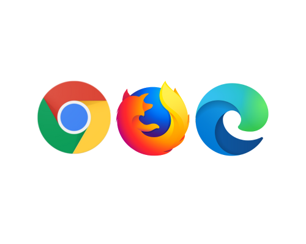
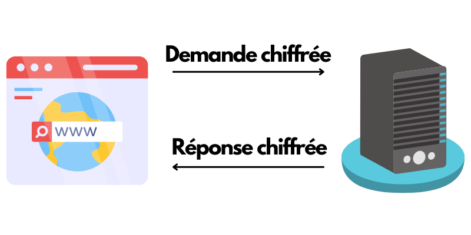
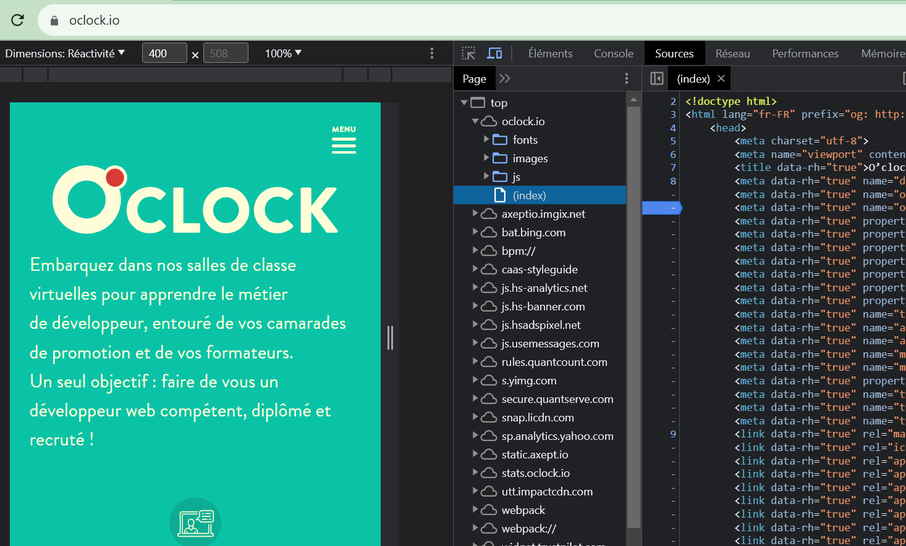
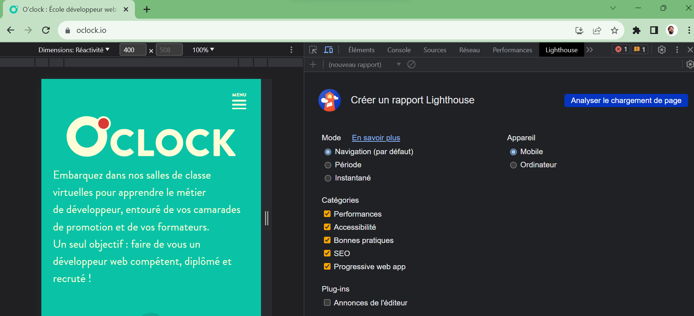

:titre: Introduction à Internet et au Web
:module: Wev
:duree: 45

:description: Comprendre les bases d'Internet et du Web
include::../../../../adoc/libs/header-module.adoc[]

ifeval::["{visible-on-html}" !=  "yes"]
:docinfo: shared
:docinfodir: ../../../../adoc/libs
endif::[]

== Objectifs pédagogiques
// tag::objectifs[]
* Comprendre ce qu'est internet
* Comprendre ce qu'est le web
* Découvrir les grandes composantes du web
* Découvrir les outils pour le dev front
// end::objectifs[]

== Internet

Internet est un réseau mondial interconnecté.

* Envoi de mail (SMTP, POP)
* Envoi de fichier (FTP)
* Web (HTTP)

[NOTE.speaker]
--
On utilise sur Internet différents protocoles pour communiquer. Dont ceux présentés dans la slide qui sont les plus connus à ce jour.
--

=== Internet : Histoire

Internet a été créé dans les années 60 comme un projet de recherche appelé ARPANET.

[NOTE.speaker]
--
ARPANET (Advanced Research Projects Agency Network) était le premier réseau informatique à commutation de paquets, développé par l'Agence pour les projets de recherche avancée de défense (ARPA, aujourd'hui connue sous le nom de DARPA) aux États-Unis. Il a été créé à la fin des années 1960 en réponse au besoin de développer un système de communication robuste et résilient qui permettrait aux chercheurs et scientifiques de partager des informations et de collaborer sur des projets de recherche, même en cas de destruction partielle du réseau.

ARPANET a été conçu pour connecter les ordinateurs de différentes universités et centres de recherche, permettant ainsi le transfert de données par le biais de la commutation de paquets. Ce concept de commutation de paquets est l'une des bases fondamentales d'Internet moderne, où les données sont divisées en petits paquets qui peuvent être envoyés séparément à travers le réseau et reconstitués à leur destination.

ARPANET a été mis en service en 1969, reliant initialement quatre nœuds, à savoir l'Université de Californie à Los Angeles (UCLA), l'Université de Californie à Santa Barbara (UCSB), l'Université de l'Utah et le Stanford Research Institute (SRI). Au fil du temps, ARPANET s'est développé et a servi de fondation à l'Internet que nous connaissons aujourd'hui, permettant une expansion massive de la communication et de l'échange d'informations à l'échelle mondiale.
--

=== Internet : Histoire

Dans les années 1990, l'avènement du World Wide Web a popularisé Internet

[NOTE.speaker]
--
Le World Wide Web signifie la toile (d'araignée) mondiale abrégé par WWW. 
--

== World Wide Web (www)

* C'est ce que l'on appelle le web

[NOTE.speaker]
--
Le Web permet de consulter, avec un navigateur, des pages accessibles sur des sites, en utilisant des hyperliens qui permettent de lier les pages web entre elles.
--

=== Web : Histoire

* Inventé au CERN par Tim Berners-Lee

[NOTE.speaker]
--
Le CERN est le l'Organisation Européenne pour la Recherche Nucléaire, institué en 1952.
Entre 1989 et 1990, Tim Berners-Lee, rejoint par Robert Cailliau, conçoivent et développent un système d'information hypertexte, le World Wide Web. 
--

=== Navigateurs

* Pour accéder au web on utilise un navigateur web.

[NOTE.speaker]
--
Le navigateur est un logiciel installé sur l'ordinateur qui permet de lire et de consulter du contenu sur le Web (des pages WEB). 
On donne quelques exemples dans la slide suivante.
--

=== Navigateurs

[NOTE.speaker]
--
Ici on retrouve les logos des navigateurs les plus connus. Dont celui que vous utilisez le plus, à savoir Google Chrome. On retrouve également celui de Mozilla, Firefox et le navigateur de Microsoft, Edge.
--

=== Lien hypertexte

Elément interactif dans une page web qui redirige vers une autre ressource en ligne.

=== Web : Fonctionnement

Le web fonctionne en permettant aux utilisateurs d'accéder à des informations et de communiquer en utilisant des protocoles de communication standardisés et en reliant les ressources par des liens hypertexte.

[NOTE.speaker]
--
Les informations affichées aux utilisateurs sont les pages web consultées.
Nous voyons dans les slides suivantes les protocoles utilisées.
--

== Protocole HTTP

Fondement de la communication sur le web, permettant le transfert de données entre les clients et les serveurs.

=== Protocole HTTP

image::./assets/ProtocoleHttp.png[Légende de l'image]

[NOTE.speaker]
--
Le navigateur envoi une requête sur le serveur, composée d'une partie entête (header) ainsi qu'une partie message (body) pour lui adressé sa demande.
Le serveur répond ensuite au client et toutes les données sont transmises au navigateur.
Le navigateur affiche ensuite ces données à l'utilisateur.
Il est à noter que le message de requête et celui de réponse sont transmises en clair à travers le réseau.
--

=== Protocole HTTPS

Version sécurisée du protocole HTTP, utilise le chiffrement pour protéger les données échangées entre les clients et les serveurs sur le web.

=== Protocole HTTPS

[NOTE.speaker]
--
Le cheminement est le même que pour le protocole HTTP. La seule différence ici est que les données sont cryptées à travers le réseau.
--

== Outils sur le navigateur

Outils pour les dév : F12

[NOTE.speaker]
--
On peut ouvrir l'inspecteur du navigateur en appuyant sur la touche F12 du clavier, ou en faisant un clic droit sur une page, suivi d'un clic gauche sur Inspecter.
On voit la démonstration dans la slide suivante.
--

== Outils sur le navigateur

image::./assets/outils_navigateurs.gif[Outils navigateurs]

[NOTE.speaker]
--
La démonstration montre l'ouverture de l'outil inspecteur dans le navigateur Google Chrome.
--

=== Démonstration

F12

[NOTE.speaker]
--
Etape 1 : Aller sur un site :

* Ouvrir Chrome et aller sur un site (celui d’O’clock ?)

Etape 2 : Dev Tools :

* Ouvrir les dev tools avec F12. Montrer les différentes façon d’ouvrir les dev tools : F12, clic droit et inspecter, Ctrl + Maj + I Montrer qu’il est possible de déplacer les dev tools (Dock side)
--

== Elements

image::./assets/elements.png[Outils Elements]

[NOTE.speaker]
--
On montre ici qu'en sélectionnant un élément dans la page, et lorsqu'on clique droit et qu'on clique sur inspecter, l'inspecteur s'ouvre directement sur l'élement sélectionné dans la page.
--

=== Démonstration

Elements

[NOTE.speaker]
--
Etape 1 : ouvrir les dev tools :

* F12
* Ctrl + Maj + I
* Clic droit et inspecter

Etape 2 : Explication interface inspecteur d’éléments :

* Partie gauche prermet d’inspecter le code HTML des éléments visibles sur la page et d’en selectionner 1
* Parti droite permet de voir le code CSS mit en place pour l’élément selectionné
* On utilisera l’outil dès qu’on attaquera HTML & CSS

Etape 3 : Selectionner un élément :

* On selectionne un élément HTML depuis les dev tools. On remarque que sur le panneau gauche on voit le CSS de cet élément.
* On selectionne un élément depuis le rendu de la page vec l’outil de selection ou le raccourcis Ctrl + Maj + C

Etape 4 : Changer 2, 3 trucs :

* Utiliser l’inspecteur pour changer des petites choses sur le rendu (du texte, des couleurs, etc) Leur expliquer que ça ne modifie pas vraiment le site (ça serait catastrophique), mais que ça modifie uniquement dans leur navigateur ! Top pour tester des trucs rapidement ! ✨
--

== Console

image::./assets/console.png[Outils Console]

[NOTE.speaker]
--
On découvre ici l'onglet console de l'inspecteur.
--

=== Démonstration 

Console

[NOTE.speaker]
--
Etape 1 : ouvrir les dev tools :

* F12
* Ctrl + Maj + I
* Clic droit et inspecter

Etape 2 : Explication interface Console :

* Une console pour afficher les messages d'erreurs, les logs, les avertissements, etc
* On peut aussi écrire du code JS directement dans la console
--

== Sources

[NOTE.speaker]
--
On découvre ici l'onglet Sources de l'inspecteur.
--

=== Démonstration

Sources

[NOTE.speaker]
--
Etape 1 : ouvrir les dev tools :

* F12
* Ctrl + Maj + I
* Clic droit et inspecter

Etape 2 : Explication interface Sources :

* A gauche : un panel pour visualiser et naviger entre les différents fichiers sources (site, extensions et autres scripts)
* Au milieur : le code source du fichier selectionner
* A droite : l’outils de debugger
* On utilisera l’outil dès qu’on attaquera JS

Etape 3 : Explication de l’outil :

* Naviguer dans l’arborescence de dossiers/fichiers et ouvrir un ou deux fichiers sources (html, css, js, assets, etc)
* Pas fait pour modifier du code
* A utiliser pour debugger
--

== Sécurité

image::./assets/securite.png[Outils Securité]

[NOTE.speaker]
--
On découvre ici l'onglet Sécurité de l'inspecteur.
--

=== Démonstration

Sécurité

[NOTE.speaker]
--
Etape 1 : ouvrir les dev tools :

* F12
* Ctrl + Maj + I
* Clic droit et inspecter

Etape 2 : Explication interface Sécurité :

* Une overview permettant de voir si le site a un certificat HTTPS
* On peut visualiser ce certificat

Etape 3 : Explication d’un certificat HTTPS :

* Il faut faire la demande auprès d’une Autorité de Certification (AC)
* Une fois la demande validée par l’AC, celle-ci délivre un certificat HTTPS
* Vous devez le récupérer et l’installer sur vos serveurs, puis lier à votre site web
* L’identité du site est maintenant validé, garantit la confidentialité des données, sécurise les échanges de données entre un serveur et un client et ça rassure les internautes
--

== Lighthouse

[NOTE.speaker]
--
On découvre ici l'onglet Lighthouse de l'inspecteur.
--

=== Démonstration

Lighthouse

[NOTE.speaker]
--
Etape 1 : ouvrir les dev tools :

* F12
* Ctrl + Maj + I
* Clic droit et inspecter

Etape 2 : Explication interface Lighthouse : 

* Un onglet pour générer un rapport sur les perf, le seo, les bonnes pratiques et l’accessibilté du site consulté
* On test l’outils et on explique ce qu’on a sous les yeux
--

== Conclusion

* Vous savez ce qu'est Internet
* Vous savez ce qu'est le web
* Vous savez ce qu'est le protocole HTTP & HTTPS
* Vous savez qu'il existe des outils de dev sur le navigateur
