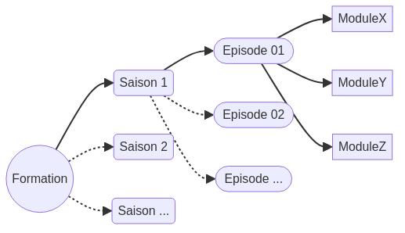
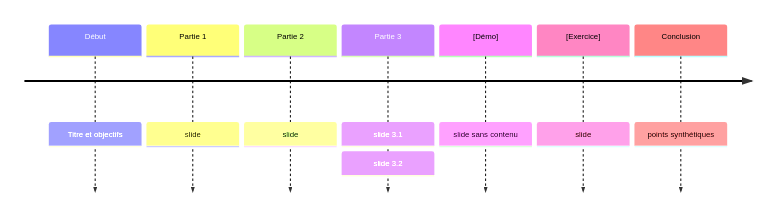

:titre: Présentation
:module: DocAsCode
:duree: 30
:description: Comprendre la structure et les capacités de DocAsCode pour O'clock
include::../../../adoc/libs/header-module.adoc[]

ifeval::["{visible-on-html}" !=  "yes"]
:docinfo: shared
:docinfodir: ../../../../adoc/libs
endif::[]

// tag::objectifs[]
* **Se rappeler** des capacities de la plateforme DocAsCode
* **Comprendre** la plateforme DocAsCode
// end::objectifs[]

// tag::deroulement[]
== Doc as Code

Plateforme de documentation écrite avec du code (asciidoc) générant, grace à asciidoctor, différents formats :

* pages web
* pdf
* slides

[NOTE.speaker]
--
Si on compare Asciidoc à Markdown, Asciidoc est plus complet et plus puissant. Il permet de faire des choses plus complexes. Un peu comme l'opposition entre HTML et PHP.
--

=== Le langage

AsciiDoc est un langage de balisage léger, facile à lire et à écrire. 

link:https://asciidoctor.org/docs/asciidoc-syntax-quick-reference/[Référence rapide de la syntaxe AsciiDoc]

== Avantages

- Environnement en devcontainer
- Entièrement versionné par git
- Hébergé sur Github Pages
- Génération automatique avec Github Actions
- Toutes les capacités de Markdown en mieux

[NOTE.speaker]
--
Les devcontainer permettent, avec VsCode, de travailler dans un environnement isolé et préconfiguré. Cela permet de ne pas avoir à installer des outils sur sa machine, ni même lancer la moindre commande pour démarrer.

Le build se fait au premier démarrage et à chaque modification de fichier .adoc.
--

== Structuration

Les cours sont structurés comme d'habitude en suivant le triptyque Saison, Episode, Module.



[NOTE.speaker]
--
Ils sont calqués sur la charte éditoriale d'O'clock.

Chaque éléments est résumé par des objectifs pédagogiques.
--

=== Les fichiers

Les fichiers AsciiDoc sont des fichiers textes avec l'extension `.adoc`. Il existe plusieurs types de fichiers :

* Saisons : index.adoc ou overview.adoc
* Épisodes : index.adoc
* Modules : [modulename].adoc
* Autres (accueil ou sommaire)

[NOTE.speaker]
--
Les noms des fichiers ne doivent pas contenir d'espaces, d'accents ou de caractères spéciaux.
--

=== Templates

La structure est primordiale pour l'homogénéité des supports de cours et le fonctionnement des scripts de génération.

```adoc
\include::../../../templates/module.adoc[]
```

[NOTE.speaker]
--
Des templates sont présents dans le dossier `/templates` pour chaque type de fichier.
--

=== Objectifs pédagogiques

Définis par la taxonomie de Bloom :

. **Se rappeler** ; niveau basique de mémorisation de termes ou de concepts
. **Comprendre** ; pouvoir reformuler
. **Appliquer** ; utilisation dans des situations concrètes
. **Analyser** ; décomposition en éléments, identification de relations et de l'importance de chacun
. **Évaluer** ; jugement sur la base de critères ou de normes
. **Créer** ; combinaison d'éléments pour former un tout cohérent et novateur

[NOTE.speaker]
--
La taxonomie de Bloom est un cadre pédagogique qui classe les objectifs pédagogiques en six niveaux hiérarchiques. Elle permet de définir des objectifs pédagogiques clairs et précis.

L'objectif `Créer` ne s'applique pas vraiment à nos formations, mais il est bon de le connaître.
--

== Les différents supports

=== Saisons

* Titre*
* Description courte*
* Objectifs pédagogiques* : grands objectifs de la saison
* Liste des notions abordées
* Prérequis : actions à réaliser par le formateur avant le début de la saison
* Résumé : synthèse de la saison et des points d'attention
* Déroulement : liste des épisodes

[NOTE.speaker]
--
* apparaissent sur la page de la saison
--

=== Episodes

* Titre*
* Description courte*
* Objectifs pédagogiques* : grands objectifs de l'épisode
* Prérequis : actions à réaliser par le formateur avant le début de l'épisode
* Déroulement : liste des modules

[NOTE.speaker]
--
* apparaissent sur la page de la saison
--

=== Modules

* Titre
* Groupe d'appartenance
* Durée
* Description courte
* Objectifs pédagogiques
* Démo*
* Exercices*
* Conclusion

[NOTE.speaker]
--
Les modules `Dockerfile` et `dockercompose` sont regroupés sous `docker`, qui est ni plus ni moins qu'un dossier.

* Facultatif, sous forme de ressources externes ou d'un pas à pas en `Note.speaker`.
--

== Contenu d'un module

Un module est une partie d'un épisode. Il doit : 

* être consultable sous forme de slide
    ** contenu visible synthétique
    ** note speaker (visible dans les autres formats)
* comporter des assets au format mermaid, draw.io ou des media externes
* avoir des objectifs pédagogiques
* avoir une conclusion

[NOTE.speaker]
--
Les assets draw.io peuvent être modifiés directement dans le repo grâce à l'extension VsCode. Les diagrammes mermaid sont générés automatiquement.
--

=== Formats de sortie

L'essentiel de la conception de contenus se fera dans les modules. 

Ils sont convertis en PDF et Slides en plus de l'HTML.

[NOTE.speaker]
--
En local, les PDF ne sont pas générés automatiquement pour des raisons de performances. On peut lancer manuellement la commande avec `./build.sh -o pdf` ou `./build.sh -o pdf -p /chemin/vers/le/fichier.adoc`.
--

=== Découpage du contenu

Un module est une partie d'un épisode. Il doit contenir au maximum 3 niveaux de titres :

* Le titre principal (`=`)
* Les titres de chaque partie (`==`) : défilement horizontal
* Les titres de sous-parties (`===`) : défilement vertical



[NOTE.speaker]
--
Les parties "Démo" et "Exercices" sont optionnelles. Le contenu des slides peut être vide si la ressource est externe.
--

=== Diagramme

Les diagrammes sont générés automatiquement à partir de fichiers link:https://mermaid.js.org/[mermaid].

```mermaid
include::./assets/structure.mmd[]
```

On peut les inclure dans les fichiers asciidoc avec la syntaxe suivante :

```adoc

```

[NOTE.speaker]
--
L'extension RunOnSave s'occupe de générer le png à chaque modification du fichier .mmd.
--

=== Draw.io

Pour les dessins plus complexes, on peut utiliser link:https://www.draw.io/[draw.io].


```adoc

```

[NOTE.speaker]
--
Les fichiers .drawio sont directement éditables dans le repo à l'aide de l'extension. Ils sont ensuite exportés en png et inclus dans les fichiers asciidoc.
--

// end::deroulement[]


== Conclusion

// tag::conclusion[]
Doc As Code permet : 

* de rédiger des supports de cours comme du code
* de générer des supports de cours en différents formats

Ascidoc :

* est un langage proche du markdown
* permet de structurer le contenu

Repo Github et devcontainer permettent :

* de travailler dans un environnement isolé et préconfiguré
* de versionner les supports de cours
* de les héberger sur Github Pages
// end::conclusion[]
